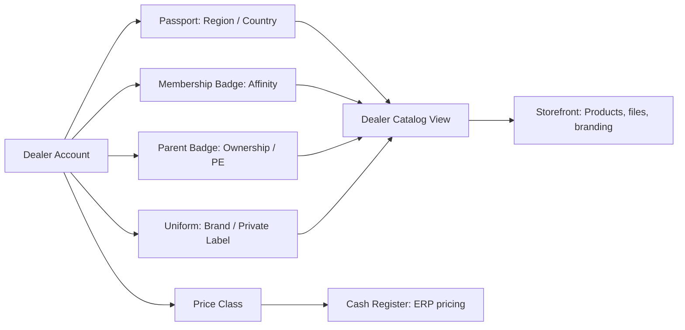
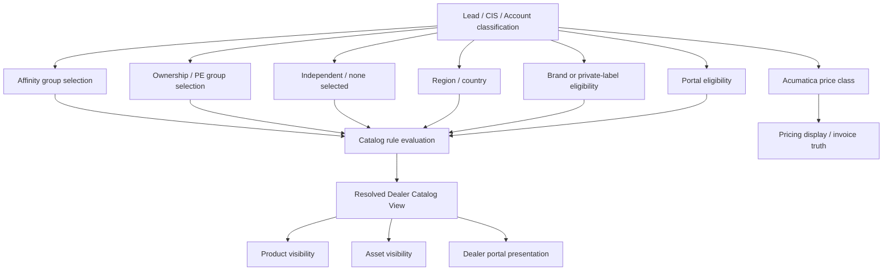
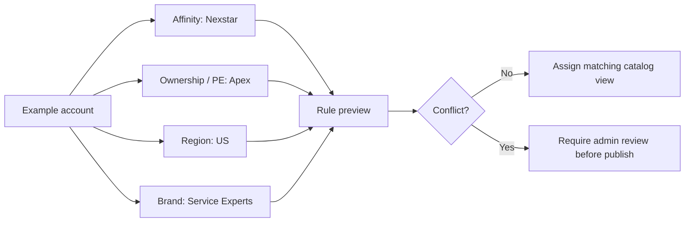
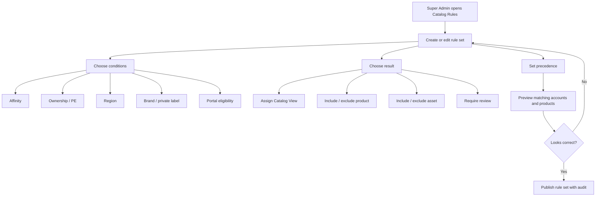

# Dealer Catalog Rules And UX Playbook

Date: 2026-05-02

This playbook explains the dealer group / catalog-view concepts in plain language, defines the flexible rule-builder direction, and records the UX standard we should use across Pulse modules.

## Plain-English Model

Think of each dealer account as having a few labels. Pulse should not force those labels into one field.

| Concept | Plain meaning | Example | What it should affect |
| --- | --- | --- | --- |
| Affinity group | A network, buying group, coaching group, franchise, or membership relationship | Nexstar, CertainPath, EGIA, Service Experts if confirmed as this kind of group | Catalog eligibility, reporting, possible default catalog view |
| Ownership / PE group | A parent-company or private-equity ownership overlay | Southern Air, Apex, Redwood, Apollo, or another confirmed parent/PE group | Overlay rules, reporting, possible catalog override |
| Independent | No confirmed affinity group and no confirmed ownership / PE overlay | A standalone dealer | Default independent / standard catalog path |
| Brand / private label | The name, logo, files, and product presentation shown to the dealer | EnviroAire, Service Experts branded assets | Product copy, images, brochures, spec sheets, portal presentation |
| Dealer Catalog View | The final resolved experience Pulse shows | Standard US Dealers, Canada Dealers, Service Experts Dealers | Which products/files/copy are visible |
| Price class | ERP pricing tier | A1 Generic or another Acumatica class | Pricing only, not catalog visibility |

## Simple Analogy

Use the "passport + badges + storefront" explanation:

- The account is the person.
- Affinity is a membership badge.
- Ownership / PE is a parent-company badge.
- Region is the passport country.
- Private label is the uniform/logo.
- Dealer Catalog View is the storefront Pulse opens for that account.
- Price class is the cash-register pricing rule from Acumatica.

An account can wear more than one badge. Example: a dealer can be `Nexstar` and also part of an ownership group. That is a hybrid account. Pulse should preserve both badges, then resolve the correct storefront.

## Concept Relationship Diagram

The important point is that affinity, ownership, region, and brand are inputs. They are not the final dealer-facing catalog by themselves.

## Hybrid Account Diagram

Hybrid means the account carries more than one business classification. We should not flatten that into one text value.

## Super Admin Rule Builder Diagram

The future rule UI should let admins change business rules without code changes.

## Confirmed Development Rule

Do not hardcode final business precedence in hidden code.

The current schema supports flexible setup because it keeps:

- raw affinity and ownership selections on leads, CIS, and accounts
- governed affinity and ownership reference tables
- a persisted `DealerCatalogView`
- `CatalogInclusion` rows that connect product presentations to catalog views
- separate price-class / ERP boundaries

The next rule slice should add a super-admin rule-management layer on top, not replace the current schema.

Implementation status as of May 2, 2026:

- `CatalogRuleSet` and `CatalogRule` are now persisted in Pulse with draft, active, and retired states.
- Conditions stay flexible so Dynamic can confirm final rules later without another schema redesign.
- Rule outputs are normalized to active `DealerCatalogView` rows, or explicit `Require Review`.
- Preview-before-publish is implemented against account affinity, ownership/PE, independent, region, and portal eligibility context.
- Publish now requires a clean preview: no sampled unmatched accounts and no review-required accounts.
- Preview now summarizes affected catalog views with sampled account count, products shown, ready products, linked files, and missing setup count.
- The Super Admin UI now offers guided rule templates for affinity, ownership/PE, independent, and review-required cases.
- Product/file include/exclude rules remain a later slice; the first shipped slice assigns catalog views and blocks ambiguous cases for review.

## Target Flexible Rule Builder

Create a Super Admin screen called `Catalog Rules`.

Recommended flow:

1. Choose the rule purpose:
   - show products
   - show files/assets
   - choose branded presentation
   - block publish when context is ambiguous
2. Choose conditions:
   - affinity group is / is not
   - ownership / PE group is / is not
   - region / country is
   - brand / private-label is
   - account is portal eligible
   - account is independent
3. Choose result:
   - assign Dealer Catalog View
   - include / exclude product presentation
   - include / exclude asset
   - require manual review
4. Set precedence:
   - account override
   - private label
   - brand
   - ownership / PE
   - affinity
   - region
   - independent
   - standard fallback
5. Preview impact:
   - how many accounts match
   - sample accounts
   - products visible
   - assets visible
   - conflicts / ambiguous accounts
6. Publish with audit:
   - draft
   - review
   - active
   - retired

## UX Standard For Complex Pulse Modules

Dynamic AQS users have shown frustration when screens expose technical setup too early. Pulse should default to task-first screens and hide advanced setup until needed.

Use this standard:

- Start every module with a work queue or task hub, not a blank setup form.
- Use business words in navigation: `Catalog Views`, `Products`, `Files`, `Ready To Publish`; avoid schema words like resolver, manifest, inclusion, payload.
- Show the next action clearly: `Review`, `Add Files`, `Fix Missing Asset`, `Publish`.
- Put create/edit forms in drawers or modals when they are secondary to the list.
- Use progressive disclosure: essentials first, advanced fields collapsed.
- Use inline validation after a user touches a field, and remove errors as soon as the field is fixed.
- Make empty states actionable: explain what to do next with one primary action.
- Keep rule-building behind Super Admin permissions.
- Provide preview-before-publish for anything that changes dealer visibility, pricing display, routing, or public/customer-facing links.
- Keep audit and provenance visible in detail panels, not in the main workflow path.

## Product Management UX Direction

Recommended primary flow:

1. Pick `Dealer Catalog View`.
2. See products for that view.
3. Attach or review files.
4. Fix readiness blockers.
5. Publish to Dealer Portal.

Avoid starting Product Management on categories, families, or raw product creation. Those are setup areas.

## Digital Assets UX Direction

Recommended primary flow:

1. Search or upload assets.
2. Select asset type and audience.
3. Attach to products or catalog views.
4. Create share links for TM/prospect/customer use.
5. Review delivery health.

Bulk upload should be a modal or wizard with drag-and-drop, metadata defaults, row-level validation, and post-upload review.

## Module-Wide Navigation Direction

Use a consistent pattern:

- Left navigation: module
- Secondary tabs: task areas
- Main pane: list / queue
- Right pane or drawer: detail / edit
- Modal wizard: bulk upload, imports, high-risk publish, complex rule creation

This keeps Pulse usable for field and ops users while still giving Super Admins the depth they need.

## Open Decisions

These must be confirmed before we claim final dealer-catalog rules are complete:

- Is Service Experts an affinity group, private-label brand, ownership group, customer class, or a resolved catalog view made from multiple inputs?
- Which ownership / PE groups are active for Phase 1?
- Should Independent be a visible catalog view or only a fallback classification?
- What is the exact conflict order when affinity, ownership, region, and brand all match?
- Which catalog views should be included in the first dealer-portal pilot?
- Which price classes are active for portal display, and when should Acumatica own their refresh?

## First Super-Admin Rule Slice

Build after the current Product/Digital Assets UI polish:

1. Add `CatalogRuleSet` and `CatalogRule` models.
2. Add draft/active/retired lifecycle and audit events.
3. Add condition JSON for rule expressions, but keep rule outputs normalized to `DealerCatalogView`.
4. Add a preview endpoint that evaluates rules against sample accounts without publishing.
5. Add a Super Admin UI with simple condition rows and impact preview.
6. Add regression coverage for precedence and ambiguous-context warnings.
