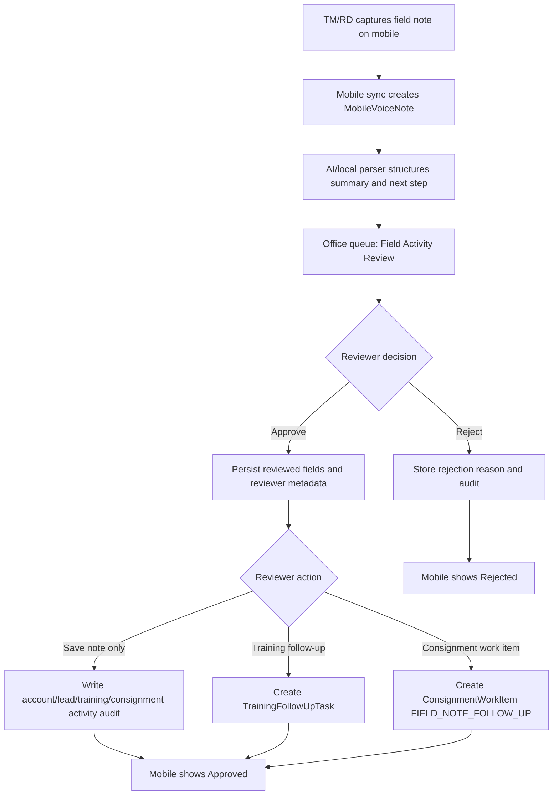

# Field Activity Review Loop

Date: 2026-05-24

Updated: 2026-05-25

## What Landed

- Added an office-facing `Field Activity Review` workspace at `/customers/field-activity`.
- Added a separate voice-note review lifecycle: `pending_review`, `approved`, and `rejected`.
- Kept AI processing health separate from office review status.
- Added review queue APIs for list, detail, and approve/reject decisions.
- Added reviewer metadata, review notes, rejection reason, writeback target, and writeback timestamp to `MobileVoiceNote`.
- Approval now writes audited Pulse CRM activity for account and lead notes.
- Approval can now explicitly create a Training follow-up task for training-session notes.
- Approval can now explicitly create a Consignment field-note work item for consignment-site notes.
- Account `Activity & Document Review` now includes approved mobile field notes.
- Lead activity timelines now include approved mobile field notes.
- Training session summaries now surface reviewed field notes and follow-up counts.
- Consignment site detail now surfaces reviewed field notes and work-item status.
- Mobile voice-note cards now show office review state instead of treating AI `structured` status as approval.

## Flow

## Safety Boundary

The LLM still does not directly update official CRM activity. A human reviewer must approve the note first.

Approved account and lead notes write Pulse-owned audit activity so the account/lead timelines show reviewed field intelligence. Training-session and consignment-site notes can now create Pulse-owned follow-up work only when the office reviewer explicitly chooses that action.

## Parked Intentionally

| Item | Why Parked | Resume When |
| --- | --- | --- |
| Automatic LLM-to-CRM writeback | Human review is required before field notes become official activity | Dynamic approves an automation policy |
| Automatic training/consignment task creation from AI text | Reviewer intent is still required; Pulse should not turn every AI next step into work | Dynamic approves a no-review automation policy |
| Offline audio drafts/background upload | Needs encrypted media storage, retention, and conflict policy | Native media policy is approved |
| Audio retention/deletion workflow | Legal/privacy retention is not confirmed | Retention policy is approved |
| Acumatica note/activity sync | External system access/mappings are parked | Acumatica sandbox and certified mappings are available |

## Verification

- `pnpm --filter @pulse/contracts build`
- `pnpm --filter @pulse/db build`
- `pnpm --filter @pulse/api build`
- `node --test --test-concurrency=1 apps/api/test/mobile-voice-notes.regression.test.mjs`
- `node --test --test-concurrency=1 apps/api/test/mobile-voice-notes.review.regression.test.mjs`
- `pnpm --filter @pulse/mobile test`
- `pnpm --filter @pulse/mobile typecheck`
- `pnpm --filter @pulse/crm-web typecheck`
- `pnpm --filter @pulse/crm-web lint`
