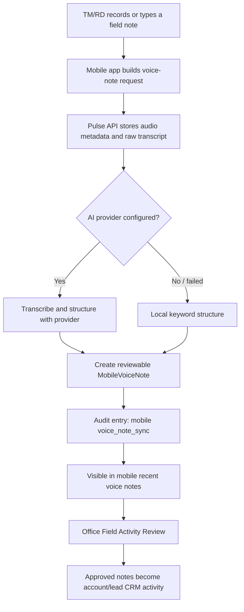

# Mobile Voice Notes + LLM Structuring Slice

Date: 2026-05-24

## What Landed

- Added a native Expo `Voice Notes` tab in `apps/mobile`.
- Added microphone permission configuration for iOS and Android through `expo-audio`.
- Added a mobile capture workflow:
  - record audio
  - type or edit transcript text
  - attach the note to a CRM account or keep it general
  - sync to Pulse CRM
- Added `/api/v1/mobile/voice-notes`:
  - `POST` creates a CRM voice-note record
  - `GET` lists the current mobile user's recent notes
- Added `MobileVoiceNote` relational storage with:
  - raw transcript
  - audio storage metadata
  - LLM/provider metadata
  - structured summary, next step, sentiment, tags, and JSON payload
  - reviewable processing status
  - audit trail
- Added provider-neutral AI configuration:
  - disabled by default unless `PULSE_VOICE_NOTES_OPENAI_API_KEY` or `OPENAI_API_KEY` is present
  - optional OpenAI transcription and structuring adapter
  - default structuring model is `gpt-5.5` through the Responses API with Structured Outputs
  - default transcription model is `gpt-4o-transcribe`
  - deterministic local keyword fallback when the provider is disabled or unavailable

## CRM Safety Boundary

The LLM does not directly overwrite account, lead, training, or consignment notes. It creates a reviewable `MobileVoiceNote` record inside Pulse CRM.

The follow-up Field Activity Review slice added human approval for account/lead activity writeback. This is still human-governed writeback, not automatic LLM writeback.

Items still requiring Dynamic signoff:

- retention policy for recorded audio
- training-session and consignment-site follow-up/task rules
- whether any future AI-structured notes can become official activity automatically

## Flow

## Parked Intentionally

| Item | Why Parked | Resume When |
| --- | --- | --- |
| Automatic account/lead activity writeback | Human review is required before writeback | Dynamic approves automation rules |
| Training/consignment writeback depth | Follow-up/task ownership is not signed off | Dynamic confirms task/writeback rules |
| Offline audio draft storage | SecureStore must not hold large binary audio | Native encrypted media store and retention policy are approved |
| Background upload/retry for audio | Current mobile sync queue is text/metadata-safe only | Background sync and conflict rules are implemented |
| Audio retention/deletion workflow | Legal/privacy retention is not confirmed | Retention policy is approved |
| Real transcription QA | Needs provider key and audio fixture set | Provider credentials and sample field recordings are available |

## Verification

- `pnpm --filter @pulse/api build`
- `node --test --test-concurrency=1 apps/api/test/mobile-voice-notes.regression.test.mjs`
- `pnpm --filter @pulse/mobile typecheck`
- `pnpm --filter @pulse/mobile test`
- `pnpm --filter @pulse/mobile build`

Live provider smoke:

- Ran a one-off OpenAI-backed voice-note structuring smoke against the test database using a temporary shell environment variable.
- Result: provider `openai`, model `gpt-5.5`, status `structured`, account context preserved, structured summary/next step/tags returned, and `MOBILE_VOICE_NOTE` audit count was `1`.
- Re-ran a provider-only smoke after upgrading from Chat Completions JSON mode to Responses API Structured Outputs; `gpt-5.5` returned a structured CRM-safe note with account/entity extraction.
- The provider key was not written to repo files, docs, tests, or environment files.
