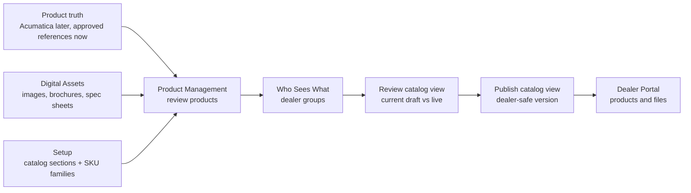
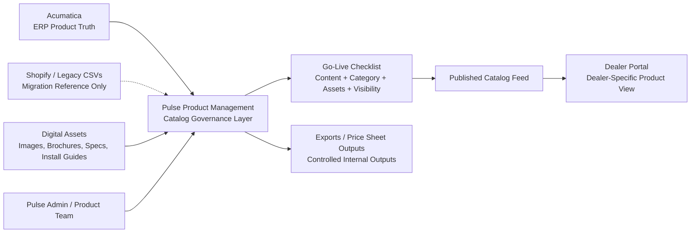
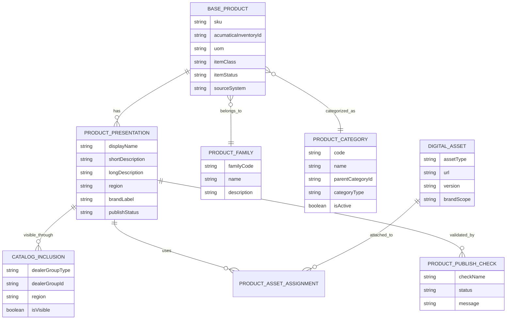
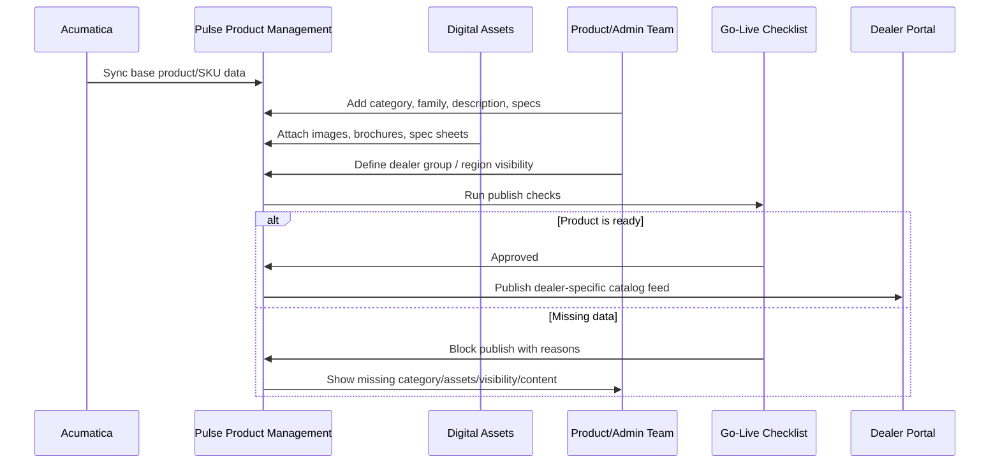
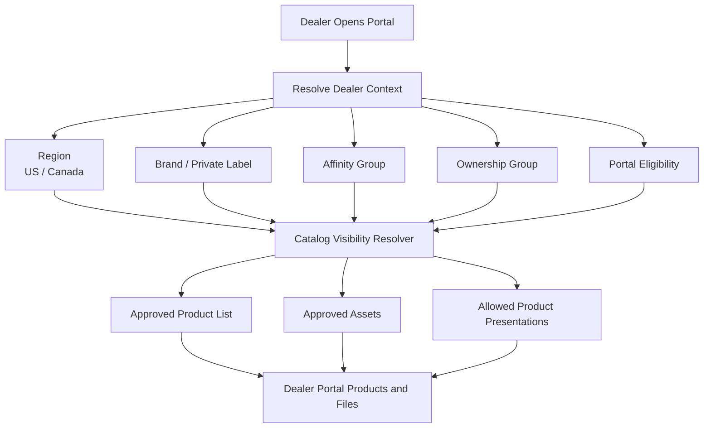
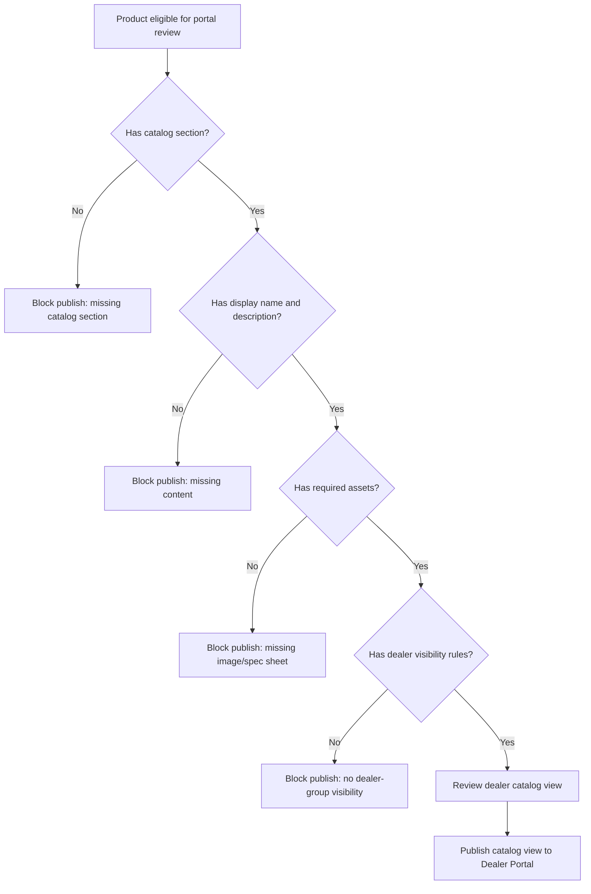
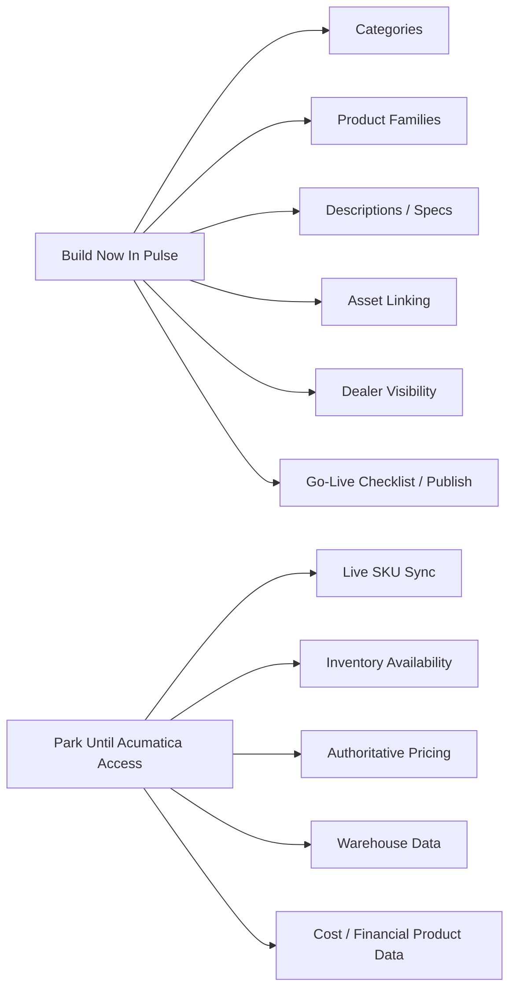

# Product Management End-To-End PRD

## Document Control

| Field | Value |
|---|---|
| Module | Product Management / Dealer Catalog Governance |
| Status | Active development PRD |
| Date | 2026-05-01 |
| Owner | Product / Marketing / Architecture |
| Development Repo | `dynamic-aqs-pulse-platform` |
| Requirements Sources | Session 11 Product Management, Session 12 Widen, Product Management PRDs, Product Model source-of-truth guide |

## Executive Summary

Pulse Product Management is the governed catalog layer between Acumatica, Digital Assets, internal teams, and the Dealer Portal. It must not become a second ERP. Acumatica owns formal item identity, item status, item class, UOM, inventory, warehouse, costing, and pricing truth. Pulse owns business-facing product content, product categories, product families, presentation overlays, dealer visibility, asset linkage, readiness checks, and publish state.

The central product rule is: a product is not a Shopify row. Pulse should model Acumatica sellable items, product families, and dealer/brand/region presentations separately so private-label and region-specific catalog behavior can be managed without cloning product truth.

## Plain-Language Product Management Playbook

Product Management answers one business question:

> Which approved products, copy, files, and catalog sections should each dealer group see?

It is easier to explain the module as four jobs:

| Job | UI language | What it means | What it is not |
|---|---|---|---|
| Review products | Products needing review | Fix missing content, files, catalog section, SKU family, and dealer-group visibility gaps so the product becomes eligible for a dealer catalog view. | It is not the final ERP product master. |
| Organize the catalog | Catalog sections and SKU families | Catalog sections are where products appear when dealers browse. SKU families group sibling/variant-like SKUs. | These do not decide dealer access. |
| Decide who sees what | Dealer groups / Who Sees What | A dealer group is the resolved catalog audience for affinity, ownership/PE, independent/hybrid, region, brand, and portal eligibility rules. | It is not a price class and does not change product identity. |
| Publish safely | Need info / Need files / Need visibility / Ready to publish | Product rows become eligible first; live dealer catalog versions are published from Who Sees What after the dealer-group review is clean. | It is not order placement, inventory, invoicing, or payment. |

This is why the UI must keep the first screen focused on products needing review. Setup, source-file review, and parked integrations remain available, but they should not be the first thing a product user has to understand.

## Source-Of-Truth Boundaries

| Area | Source Of Truth | Pulse Responsibility | Parked Dependency |
|---|---|---|---|
| SKU / Inventory ID | Acumatica | Store linked identity and sync status | Real Acumatica sync until sandbox/API mappings are certified |
| UOM / item class / stock status | Acumatica | Read-only display and validation metadata | Final mapping and item lifecycle semantics |
| Pricing / price class | Acumatica | Hold price-class references only; no accountless neutral pricing | Pricing sync and representative account validation |
| Legacy/prototype product CSVs | Legacy reference files only | Preview, parse, compare, and produce mapping/review reports; do not apply as production product truth | Final import/apply mode is parked until Acumatica product identity, item status, UOM, and item-class mappings are certified |
| Product category | Pulse | Governed CRM/catalog taxonomy | Category steward approval and migration review |
| Product family | Pulse | Group sibling sellable SKUs and variant-like products | Final product steward review |
| Product presentation | Pulse | Display names, copy, specs, region and brand overlays | Marketing approval workflow details |
| Product assets | Pulse Digital Assets | Link images, brochures, spec sheets, install guides, videos | Curated Widen/Dropbox manifest |
| Dealer visibility | Pulse | Group-first catalog inclusion resolver | Final precedence rules for brand, region, ownership, affinity, portal eligibility |
| Dealer portal catalog | Pulse publish feed | Publish only approved, context-resolved catalog views | Portal product browse/order scope |

## Operating Model

## Data Model

## Product Category Requirements

Product categories are Pulse-governed catalog/navigation taxonomy, not a direct copy of Shopify category/tag fields and not the same thing as Acumatica item class.

Required category behavior:

| Requirement | Description | Priority |
|---|---|---|
| Category hierarchy | Support parent/child category relationships for catalog navigation. | P0 |
| Category code | Stable unique code for import, API, and reporting. | P0 |
| Stewarded labels | Category name, description, sort order, and active state are business-governed fields. | P0 |
| Migration candidates | Shopify categories/tags may be imported as suggestions, not canonical truth. | P0 |
| Product assignment | A product has one primary category and may have additional category/tag assignments where approved. | P0 |
| Region applicability | Category can be available globally or scoped to US/Canada/other approved regions. | P1 |
| Reporting readiness | Category is a governed reporting dimension and must not live only in JSON. | P0 |

## Product Lifecycle

## Parked Data Migration Boundary

The shared product CSV/prototype data can be used now for discovery, dry-run preview, mapping review, duplicate/conflict detection, and asset-reference identification. It must not be used as the final production import source yet.

This slice is explicitly parked because Acumatica remains the source of truth for SKU/Inventory ID, item class, UOM, item status, sellable state, price class, and future inventory/pricing validation. Loading CSV rows directly into final product records before Acumatica mappings are certified would risk creating duplicate SKU truth, wrong lifecycle state, incorrect category/family assumptions, and dealer catalog records that later disagree with ERP.

Allowed now:

| Activity | Status | Notes |
|---|---|---|
| CSV/profile parsing | Active | Read source rows and show preview only. |
| Mapping review | Active | Propose SKU/name/category/family/region/asset mappings with confidence and gaps. |
| Duplicate/conflict report | Active | Flag SKU conflicts, missing identifiers, US/Canada differences, and Shopify-only rows. |
| Final product apply/import | Parked | Resume only after Acumatica sandbox access, certified product endpoint behavior, representative sample records, and signed source-of-truth mappings are available. |
| Pricing/inventory validation | Parked | ERP-owned and unavailable until Acumatica integration is certified. |

## Dealer Visibility Resolver

Group-first workflow is required. Product users should choose or preview dealer/account context before assigning products or assets so the wrong branded/private-label content is not published.

## Go-Live Checklist

This is not a separate workflow engine. It is a lightweight publish validation service that blocks incomplete or unsafe product records from becoming dealer-visible.

Minimum checks:

| Check | Blocker | Notes |
|---|---:|---|
| Base product linked or marked manual/legacy reference | Yes | Acumatica link may be parked during build-now phase. |
| Primary category assigned | Yes | Category is a reporting and navigation dimension. |
| Product family assigned where required | No | Recommended for sibling/variant-like SKUs. |
| Display name and short description complete | Yes | Required for dealer portal visibility. |
| Required primary image attached | Yes | Required for portal product cards. |
| Required spec/brochure attached when category requires it | Yes | Category can drive asset requirements. |
| Dealer visibility/inclusion rule exists | Yes | Prevents accidental global exposure. |
| Wrong-brand warning resolved | Yes | Must be resolved before publish. |

## Functional Requirements

| ID | Requirement | Acceptance Criteria | Priority |
|---|---|---|---|
| PM-001 | Product catalog list | Search/filter by SKU, name, category, family, brand, region, publish status, Acumatica status. | P0 |
| PM-002 | Product detail | Show base identity, presentation fields, categories, family, visibility, assets, and go-live checks. | P0 |
| PM-003 | Product categories | Admin can create, edit, archive, sort, and nest categories. | P0 |
| PM-004 | Product families | Admin can group related sellable SKUs into a family without cloning ERP truth. | P0 |
| PM-005 | Product presentation | Marketing/product users can manage display copy, specs, brand/region labels, and status. | P0 |
| PM-006 | Dealer visibility | Admin can scope products by region, brand/private label, affinity group, ownership group, and portal eligibility. | P0 |
| PM-007 | Product asset linking | Users can attach approved Digital Assets by type and scope. | P0 |
| PM-008 | Wrong-brand warning | System warns and blocks publish for mismatched product/asset brand scope unless resolved by authorized user. | P0 |
| PM-009 | Go-live checklist | System shows pass/fail readiness and blocks unsafe publish. | P0 |
| PM-010 | Publish feed | Dealer Portal consumes approved Pulse catalog views, not raw ERP rows or prototype seed data. | P0 |
| PM-011 | Publish audit | Product publish/unpublish changes are audited with actor, timestamp, and before/after state. | P0 |
| PM-012 | Legacy import references | Shopify/CSV import stores source metadata and migration confidence without treating Shopify as product truth. | P1 |
| PM-013 | Export/output center | Generate controlled product/asset packs after catalog and asset scope is approved. | P2 |

## Build Now Versus Parked

## Delivery Slices

| Slice | Scope | Output |
|---|---|---|
| PM0 | PRD, traceability, source-of-truth boundaries | This document plus requirements map. |
| PM1 | Schema, contracts, permissions | Explicit Product/Digital Asset tables, RBAC actions, shared contracts. |
| PM2 | API foundation | Product list/detail/category/family/presentation/visibility/readiness endpoints. |
| PM3 | CRM web workspace | Product Management, Product Detail, Products needing review, Catalog sections, SKU families, Who Sees What, Files, readiness checks. |
| PM4 | Digital Assets linkage | Link approved assets, brand/dealer group warnings, stable asset URLs. |
| PM5 | Publish feed | Approved catalog read model for Dealer Portal. |
| PM6 | Acumatica sync | Resume when sandbox credentials, mappings, sample data, and replay/reconciliation rules are approved. |

## End-State Mental Model

```mermaid
flowchart TB
    A["Product Management Module"]
    A --> B["What is the product?"]
    B --> B1["Base Product from Acumatica"]
    B --> B2["Product Family"]
    B --> B3["Product Category"]
    A --> C["How should it appear?"]
    C --> C1["Name"]
    C --> C2["Description"]
    C --> C3["Specs"]
    C --> C4["Brand / Region Presentation"]
    A --> D["Who can see it?"]
    D --> D1["Dealer Group"]
    D --> D2["Region"]
    D --> D3["Brand / Private Label"]
    D --> D4["Portal Eligibility"]
    A --> E["What files belong to it?"]
    E --> E1["Images"]
    E --> E2["Brochures"]
    E --> E3["Spec Sheets"]
    E --> E4["Install Guides"]
    A --> F["Is it ready?"]
    F --> F1["Content Complete"]
    F --> F2["Category Assigned"]
    F --> F3["Assets Attached"]
    F --> F4["Visibility Defined"]
    F --> F5["Approved for Portal"]
```

## Open Decisions

| ID | Decision | Owner | Impact |
|---|---|---|---|
| PM-Q01 | Final category stewardship owner and approval workflow | Product + Marketing | Category admin permissions and workflow. |
| PM-Q02 | Dealer visibility precedence when region, brand, ownership, affinity, and account-level overrides conflict | Product + Sales Ops | Catalog resolver and publish checks. |
| PM-Q03 | Minimum required assets by category | Marketing + Product | Go-live checklist rules. |
| PM-Q04 | Acumatica product field mapping and active/inactive semantics | Acumatica SME + Architecture | Real sync and publish confidence. |
| PM-Q05 | Whether Export Center is P1 or stays P2 | Product + Marketing | Delivery sequencing. |
