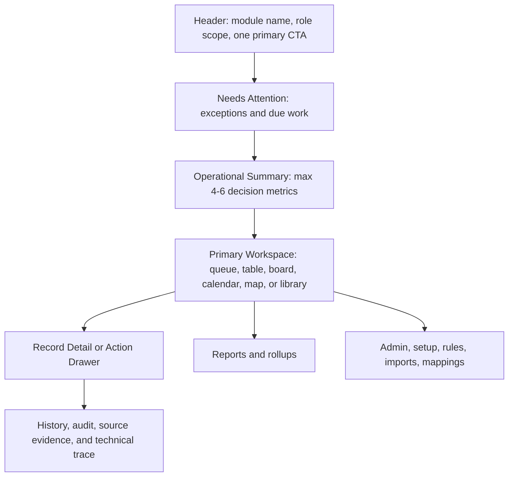

# UX-01 Cross-Module Optimization Plan

Date: 2026-05-26

Status: `Slice E implemented - CRM/dealer automated and visual QA passed; mobile device visual QA pending`

## Goal

Finish the Role-Based Workbench Optimization by applying one simple rule across every developed CRM and dealer/mobile surface:

> The first screen should tell the user what needs action now, then let them drill into detail only when they choose.

This goal exists because the Territory cleanup proved the issue is systemic. Leads, Training, Product Management, Digital Assets, Consignment, Accounts, Admin, Dealer Portal, Calendar, and Mobile still show variations of the same anti-pattern: metrics, setup forms, technical dependency notes, reports, and detailed action surfaces compete with the actual work queue.

## Research Anchors

- Salesforce Lightning Design System recommends record lists, tables, tile lists, and interactive cards based on the user task, and notes that large record sets are appropriate for scannable tables with sorting/filtering rather than heavy card stacks: https://winter-20.lightningdesignsystem.com/guidelines/displaying-data/
- Salesforce Lightning Design System rules/filter guidance says complex logic should feel readable and confidence-building, not like users are manipulating implementation internals: https://spring-20.lightningdesignsystem.com/guidelines/rules-filters-logic/
- Salesforce empty-state guidance says empty states should explain what is happening and what the user can do next without overwhelming them: https://winter-20.lightningdesignsystem.com/guidelines/empty-state/
- USWDS table guidance recommends minimizing columns, using tables only for tabular data, and moving paragraph-like cell content into conventional page sections or accordions: https://designsystem.digital.gov/components/table/
- IBM progressive disclosure guidance recommends revealing only essentials first, avoiding repeated assistance patterns, and building a guided journey rather than a scavenger hunt: https://www.ibm.com/docs/en/technical-content?topic=practices-progressive-disclosure
- Microsoft card guidance recommends concise titles, consistent interactions, contrast compliance, and one clear interaction on constrained cards: https://learn.microsoft.com/en-us/sharepoint/dev/spfx/viva/design/designing-card
- Baymard distinguishes catalog/category orientation from product-list browsing; this supports separating Product Management setup/catalog structure from Dealer Portal product browsing: https://baymard.com/learn/ecommerce-category-page

## Requirement Anchors

- Pulse UX goal already states that role-based workbenches should answer "What do I need to do next?" and keep reports, setup, migration trace, integration health, and rule configuration available without dominating the operator view.
- Dynamic AQS discovery repeatedly emphasized simpler UI, fewer barriers, fewer keystrokes, and better adoption.
- Territory PRD makes territory ownership the visibility kernel; simplification must preserve scope rather than flattening permissions.
- Dealer Portal PRD calls for a simple account-aware portal and explicitly parks fake prices, orders, invoices, payments, and shipments until integrations are real.
- Product PRD says Product Management is a governed catalog layer, not a second ERP.
- Widen replacement PRD says Digital Assets should focus on governed library/search/share behavior.
- Consignment discovery from Samantha and Currie emphasizes simple, transparent TM audit flows, with back-office reconciliation available separately.

## Cross-Module Workbench Contract

Every module default page should follow this order unless the workflow has a documented reason to differ:

Default-visible budget:

- One primary CTA.
- Two or fewer secondary visible actions. Put the rest behind `More`, a modal, or an action menu.
- Four to six first-screen metrics maximum.
- One Needs Attention lane per module.
- One primary work surface before reports/admin.
- No repeated parked-dependency warnings across multiple first-screen panels.
- No raw enum keys, provider IDs, source IDs, storage keys, rule-order fields, Widen IDs, Acumatica internals, or UAT language in default operator copy.

## Agent Audit Summary

| Area | Current UX Status | Main Finding | Required Next Action |
| --- | --- | --- | --- |
| Leads | Needs code cleanup | `/leads` nav says Pipeline but defaults to Overview; Overview duplicates action cards; pipeline can expose raw stage keys. | Default to Pipeline, remove duplicate Overview priority, use human stage labels. |
| Calendar | Mostly aligned | CTA/filter structure is improved, but detail copy says `Open source record` and right rail may duplicate attention content. | Rename to linked-record language and verify right-rail density in screenshots. |
| Training | Needs code cleanup | No first-screen primary CTA, no first-screen attention lane, and header copy mentions internal setup/Pulse shell. | Add Schedule/Record primary CTA, add top Needs Attention lane, rewrite user-facing copy. |
| Territory | Improved but still dense | First viewport still exceeds metric budget when top KPI cards and routing metrics combine; posture panels may still appear too early. | Collapse secondary posture into Performance Details and make Needs Attention the drill-down entry. |
| Consignment | Mostly aligned | Work Queue appears first, but default Mailbox tab repeats the queue; Acumatica/ERP language leaks in tables/modal. | Keep one queue surface; move repeated ERP boundary into advanced/handoff detail. |
| Product Management | Needs code cleanup | Who Sees It, Categories, and Families are form-first; navigation language conflicts with tab labels. | Make list/queue first; create/edit in modal; standardize Dealer Visibility wording. |
| Digital Assets | Mostly aligned | Library default is good, but Share Sets are form-first and selected asset detail is too dense. | Make Share Sets list-first; split selected asset detail into Share, Usage, Details, Replace, History. |
| Accounts | Mostly aligned list, dense detail | Account detail repeats UAT/ERP dependency language early and has too many top-level tabs. | Move ERP/UAT copy to advanced boundary; group secondary tabs under More. |
| Admin | Functional but generic | Add User and Import Users both feel primary; shortcuts and audit compete on default surface. | Keep Add User primary; put Import in More; add Admin Needs Attention lane. |
| Dealer Portal | Biggest remaining UX debt | Dashboard sends everyone to Account Center first; catalog filters are heavy; parked commerce warnings repeat. | Role-sensitive primary CTA; compact filters; one quiet Account Health explanation. |
| Mobile | Better, still cluttered | Today screen starts with system status and six quick actions before priorities; field copy exposes Widen/offline internals. | Put priorities first, collapse quick actions, hide implementation copy. |

Slice D implementation evidence is captured in `docs/UX_01_WORKBENCH_SLICE_D_IMPLEMENTATION_2026-05-26.md`. Slice E detail/progressive-disclosure evidence is captured in `docs/UX_01_WORKBENCH_SLICE_E_IMPLEMENTATION_2026-05-26.md`. Automated web/mobile QA passed, and the latest CRM/dealer Playwright screenshot pack is captured under `output/playwright/ux-01-slice-e/`. Mobile device screenshots remain pending.

## Slice D - Default Workbench Cleanup

Purpose: make each default module route match the workbench contract without changing backend behavior.

Implementation evidence:

- `docs/UX_01_WORKBENCH_SLICE_D_IMPLEMENTATION_2026-05-26.md`

Scope:

1. Leads
   - Make Pipeline the default for `/leads`.
   - Remove or demote Overview duplicate cards.
   - Replace raw status/stage keys with human labels.

2. Training
   - Add one primary action: Schedule Session or Record Training depending on permission/context.
   - Add a first-screen Needs Attention lane for overdue proof, due recertification, no-shows, and exceptions.
   - Rewrite header/setup copy for Dynamic users.

3. Territory
   - Keep top KPIs plus Needs Attention, but move secondary posture panels into `Performance Details`.
   - Turn watchlists into drill-down queues or compact linked rows, not standalone repeated action stacks.

4. Consignment
   - Remove default duplicate queue behavior between Work Queue and Mailbox.
   - Replace repeated `ERP parked`, `Acumatica pending`, and `Warehouse Boundary` first-screen wording with one quiet handoff note.
   - Move manual warehouse reference into advanced optional setup.

5. Product Management
   - Make Dealer Visibility / Who Sees It list-first.
   - Move Add Dealer View, Create Category, and Create Family into modal or collapsed setup.
   - Standardize navigation and tab labels.

6. Digital Assets
   - Make Share Sets list-first.
   - Split selected asset detail into task sections.
   - Keep Widen/source trace in Advanced Import or technical trace only.

7. Accounts/Admin/Dealer Portal/Mobile
   - Accounts: reduce account-detail tabs and move UAT/ERP copy out of first cards.
   - Admin: one primary CTA, Add User; Import Users under More; default to admin attention.
   - Dealer Portal: role-sensitive dashboard CTA, compact catalog filters, one account-health dependency note.
   - Mobile: priorities before action launcher; collapse quick actions; remove Widen/offline implementation copy.

Acceptance criteria:

- Every default route has one primary CTA.
- Every default route has one Needs Attention or Today lane where applicable.
- Every default route stays within four to six first-screen metrics.
- Setup/admin/import/migration/technical trace appears after daily work or behind progressive disclosure.
- Dealer-facing pages do not reference internal Product Management readiness or repeated parked commerce warnings.
- Mobile Today shows field priorities before optional utilities.
- Playwright e2e remains green.
- Browser/Playwright screenshot pack exists under `output/playwright/ux-01-slice-d/`.
- Mobile iOS/Android screenshot evidence is explicitly pending and must be closed before UX-01 completion.

## Slice E - Detail Drawer And Progressive Disclosure Cleanup

Purpose: make dense detail pages and selected-record panels feel task-based.

Scope:

- Product detail becomes review/readiness first, with explicit actions for `Edit content`, `Attach file`, and `Edit visibility`.
- Digital Asset detail becomes task sections: Share, Usage, Details, Replace File, History.
- Customer detail groups Profile, Contacts, Locations as primary and moves Training, Payment Methods, Dealer Portal, Activity & Docs into More or contextual cards.
- Calendar right rail shows one current focus, not duplicated Today/Upcoming surfaces.
- Admin audit moves under Audit Monitor unless an item needs immediate action.

Acceptance criteria:

- Selected-record detail surfaces answer: `what is this`, `what is wrong`, `what can I do`.
- History/source/audit sections are available but not first visual priority.
- Tables have fewer grouped columns and row actions instead of wide command clusters.

Implementation evidence:

- `docs/UX_01_WORKBENCH_SLICE_E_IMPLEMENTATION_2026-05-26.md`
- `output/playwright/ux-01-slice-e/`

## Slice F - Visual QA And Production Readiness Signoff

Purpose: prove the UI is simpler with screenshots and role-based flow testing.

Scope:

- Capture screenshots for internal roles: Super Admin, Ops/CSR, TM, RD, Product/Marketing Admin. CRM web default-route screenshots are currently captured for the implemented Slice D route set.
- Capture Dealer Portal screenshots for admin, purchasing, accounting, viewer, affinity, ownership/PE, independent, and hybrid personas. Dealer Portal screenshots are currently captured for dashboard/catalog/account persona coverage.
- Capture mobile iOS and Android screenshots for Today, Route, More, Voice Notes, Training, Consignment, Assets, and Sync Status.
- Run Playwright e2e and targeted UX screenshot assertions.
- Update UX goal checklist and progress tracker with pass/fail evidence.

Acceptance criteria:

- CRM/dealer screenshot proof set exists under `output/playwright/ux-01-slice-e/`.
- Mobile screenshot proof set exists before UX-01 closure.
- UX-01 checklist is updated honestly.
- Any default page exceeding the budget has a documented exception or a follow-up issue.
- No unsupported external-dependency flow is made to look complete.

## Non-Goals

- Do not implement Acumatica product import, order placement, final prices, invoices, payment collection, shipments, route optimization, true offline media sync, or migration hardening in this UX slice.
- Do not remove backend-wired features. Reposition them behind the correct workbench layer.
- Do not flatten role/territory/dealer visibility to simplify UI.

## Recommended Execution Order

1. Slice D first because it fixes the pages Dynamic users see immediately.
2. Slice E second because dense detail pages matter after users select a record.
3. Slice F third because screenshot QA should verify the final state, not an intermediate layout.

This is a better next goal than adding new module functionality because the developed version is already broad. The biggest adoption risk now is that users cannot quickly see what to do.
