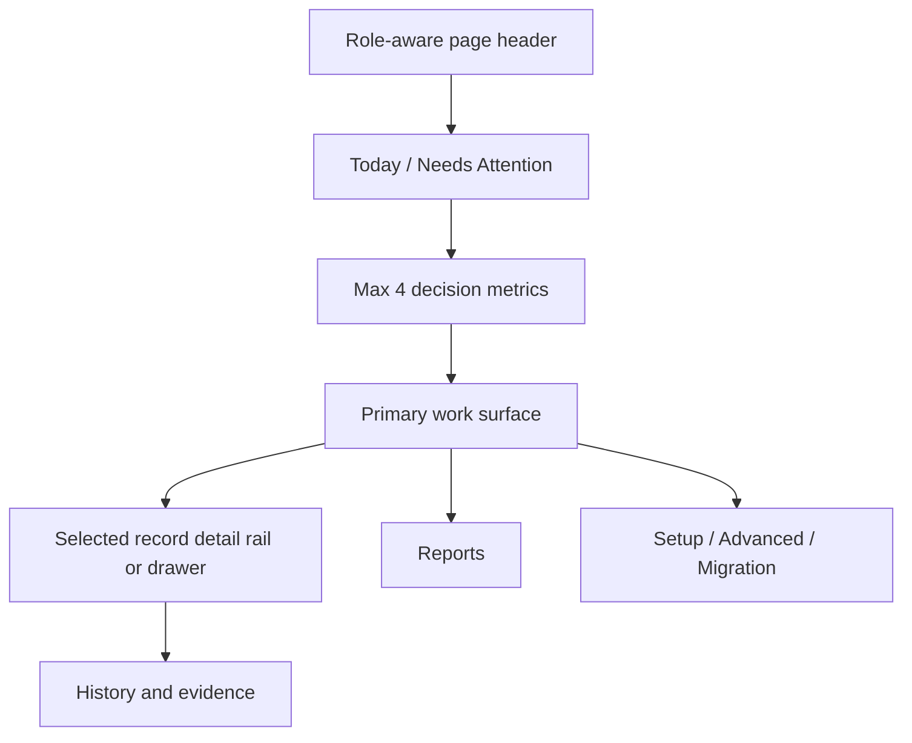

# UX-03 Cross-Module Clarity Goal

Date: 2026-05-31

Status: `In Progress - Slice C Territory Table Consolidation QA passed`

## Goal

Make every developed Pulse CRM, Dealer Portal, and Mobile module feel like a practical role workbench instead of a dense data dashboard.

Each default screen should answer three questions in this order:

1. What needs my attention?
2. What is the next safe action?
3. Where do I go for detail, reports, setup, or evidence?

This continues UX-01 and UX-02. Those slices proved the first-screen budget. UX-03 targets the remaining real-use clutter: duplicated entry points, dense detail pages, inconsistent labels, raw implementation vocabulary, and module-specific UI patterns that make the system feel harder than the business process.

## Research Basis

External UX guidance reviewed:

- [Salesforce Lightning Design System layout guidance](http://spring-20.lightningdesignsystem.com/guidelines/layout/): know the use case, prioritize content, and group related content before choosing page layout.
- [Nielsen Norman Group usability heuristics](https://media.nngroup.com/media/articles/attachments/Heuristic_Summary1-compressed.pdf?trk=public_post_comment-text): remove irrelevant information because every extra unit competes with the relevant work, and keep users oriented with visible state.
- [Material Design data-table guidance](https://m2.material.io/go/design-data-tables/): organize rows for scanning, keep data tools near the table, right-align numeric columns, and keep row actions predictable.
- [GOV.UK table guidance](https://www.gov.uk/guidance/content-design/tables/): if a table has a lot of data, split it into smaller tables or pages where possible; avoid overly complex tables.
- Carbon data-table guidance: keep single-row actions and batch actions distinct; when batch mode is active, row menus should not compete with selected-item actions.
- USWDS data-visualization guidance: limit each visualization to one central idea and no more than two or three concepts.
- USWDS table guidance: keep tables simple, use short plain-language headers, normalize columns, and avoid long-form content inside cells.
- USWDS complex-form pattern: reduce cognitive load through progressive disclosure and clear step-by-step progression.
- Baymard form research: extensive multi-column forms draw attention in multiple directions and increase misreading/skipped-field risk.
- 2026-05-31 Slice C continuation refresh: progressive disclosure research reinforced hiding advanced/source-review evidence until needed; Salesforce Lightning page guidance reinforced showing information/actions only at the relevant process stage; Salesforce datatable guidance reinforced row-level actions and predictable table behavior; Atlassian message guidance reinforced using section/inline/empty states instead of noisy banners and decorative badges.

Internal evidence reviewed:

- Requirements and meeting artifacts under `/Users/clustox1/Documents/Currie/dynamic-aqs-crm/Meetings`
- PRDs, requirements maps, UX docs, and tracker under `docs/`
- Current CRM web module routes and components under `apps/crm-web/src`
- Current mobile app screens and tests under `apps/mobile`
- Existing Playwright UX artifacts under `output/playwright/ux-02/` and `output/playwright/ux-02-depth/`

## Agent Audit Summary

| Agent lane | Scope | Main finding |
| --- | --- | --- |
| Requirements and meetings | Meetings, PRDs, requirements maps | Dynamic/Currie repeatedly wants simplicity, role-first work, honest parked dependencies, and no ERP/provider plumbing in default screens. |
| Internal CRM modules | Leads, accounts, territory, training, consignment, products, assets, admin | First-screen budgets mostly pass, but detail pages, tables, duplicate actions, and label drift still create friction. |
| Dealer portal and catalog visibility | Dealer portal, product visibility, asset sharing, catalog rules | Dealers should see `Your product catalog`; internal users should use `Dealer Catalog View`; affinity/ownership/PE/independent should stay inside `Who sees it` admin logic. |
| Mobile app | Today, route, leads/OCR, accounts, voice notes, assets, training, consignment, notifications, sync | Mobile is functional, but field users need one ranked `Next best action` across Today, Notifications, and Sync Status. |
| Design system | Workbench, navigation, tabs, metrics, tables, badges, empty states | The shared `Workbench` primitives exist but are not adopted deeply enough; many modules still hand-roll tables, detail rails, badges, and empty states. |
| QA/evidence | Playwright specs, route coverage, visual/depth reports | Existing gates are useful, but missing route inventory, responsive, keyboard/focus, accessibility, and deployed persona UAT gates. |

## 2026-05-31 Re-Audit Summary

Five targeted scouts reviewed Product, Training, Territory, Admin, and QA/evidence surfaces during this continuation pass.

| Scout lane | Finding | Next action |
| --- | --- | --- |
| Product admin/source review | Admin readiness repeats the real Product & Readiness table; source preview summarizes data but does not show sample products. | Remove duplicate admin readiness table and render source preview as a review-only shared table. |
| Training ops queues | Passive recertification, coaching, and overdue cadence queues still use raw tables. | Convert passive queues to `WorkbenchTable` with typed all-clear states. |
| Territory registry/lead transfer | Territory registry lacks admin row actions; bulk lead transfer lacks open/history row menu. | Add admin-only territory edit row action and passive lead open/history actions without mutating selection. |
| Admin | Users cleanup was safe; catalog-rule preview rail still risks implying sampled previews are full publish proof. | Keep Admin users enforced; convert catalog preview into a sample/provenance rail with honest parked-dependency wording. |
| QA/evidence | `/admin/users` should be promoted from waiver to visual-budget enforcement once cleaned up. | Completed: route coverage, visual, depth, and targeted flow/persona smoke are green. |

## 2026-05-31 Slice C Continuation Result

| Area | Result |
| --- | --- |
| Product admin/source review | Completed: duplicate Admin readiness table removed; legacy product preview now renders sampled source rows in a review-only shared table. |
| Training ops queues | Completed: passive recertification, coaching workload, overdue cadence, and execution exception queues now use shared tables with typed empty states. |
| Territory registry/lead transfer | Completed: Territory Registry has admin-only edit row action; Bulk Lead Transfer has passive open/history row actions without changing selection. |
| Admin catalog rules | Completed: rule preview now separates sampled account decisions from sampled catalog-view impact and states parked dependency boundaries plainly. |
| QA/evidence | Passed: CRM web typecheck, depth UX 3/3, targeted flow/persona smoke 7/7, plus previously green route/visual gates. |

## 2026-05-31 Lead/Account Detail Result

| Area | Result |
| --- | --- |
| Lead detail | Completed: duplicate `Secondary Actions` card removed; Discovery, CIS, Onboarding, Finance, and Edit shortcuts now live in header `More` while the real `Next Best Action` stays visible. |
| Account detail | Completed: duplicate source-lead link removed from the lifecycle card; lifecycle state changes now live in a `Lifecycle actions` menu. |
| Account row actions | Completed: payment-method rows and dealer-portal user rows now use `RowActionMenu` instead of button clusters. |
| QA/evidence | Passed: CRM web typecheck, full UX depth 4/4, and targeted internal/lead flow smoke 2/2. |

## 2026-05-31 Digital Assets/Product Detail Result

| Area | Result |
| --- | --- |
| Digital Assets header | Completed: primary CTA is now tab-aware for Library, Share Sets, Needs Attention, and Advanced Import; secondary work stays in header `More`. |
| Digital Assets review flow | Completed: delivery-health review opens the Library tab and visible asset detail rail instead of loading hidden detail state. |
| Digital Asset detail | Completed: passive product usage is collapsed under an advanced section while share links, file details, and attach-file actions stay visible. |
| Product Detail | Completed: hidden selected-file unlink behavior removed; product-file unlink moved to row actions; `Dealer Visibility` copy and scope columns are clearer; duplicate `Last Publish State` card removed. |
| QA/evidence | Passed: CRM web typecheck, E2E syntax checks, targeted Product/Asset Playwright depth coverage, full Playwright depth suite 5/5, visual UX budget 1/1, and route coverage 1/1. |

## 2026-06-01 Territory Table Consolidation Result

| Area | Result |
| --- | --- |
| Territory workload tables | Completed: advanced Territory dashboard detail is now hidden behind `Show Details`; Workload, Regions, and Owners are split into focused inner tabs instead of rendering every table at once. |
| Territory row actions | Completed: Territory registry row-action coverage is required by UX depth tests; bulk transfer and reassignment handlers were preserved. |
| Territory duplicate surfaces | Completed: dashboard assignment watchlists and map-tab workload cards were removed instead of shipping repeated views of the same unassigned/ownership data. |
| Guardrails | Preserved: approved Territory shell, MapLibre map, admin/work-queue role gating, TM/RD visibility policy, and dashboard/map API contracts. |
| QA/evidence | Passed: CRM web typecheck, E2E syntax checks, targeted UX-03 Territory depth test 1/1, full Playwright depth 5/5, visual UX budget 1/1, and route coverage 1/1. |

## Product Principle

One page, one job, one visible primary action.

Anything that is setup, report, migration, audit, provider, mapping, legacy source, parked dependency, or raw rule logic should be either:

- behind `More`
- behind an advanced disclosure
- in a detail rail/drawer
- in an admin-only route
- or shown only when it blocks the user's current task

## Terminology Map

Use these labels consistently before adding new module copy.

| Concept | Internal CRM label | Dealer-facing label | Avoid on default screens |
| --- | --- | --- | --- |
| Product/catalog audience | Dealer Catalog View | Your product catalog | dealer group, resolver, price class, enum |
| Eligibility/matching | Who sees it | Available for your company | affinity/PE logic unless inside admin setup |
| Asset/file reach | Access or who can see this asset | Products and files | visibility resolver, dealer group ID |
| Work requiring action | Needs Attention | Needs attention | alerts, exceptions, warnings as separate panels |
| Setup and provider work | Advanced setup or parked dependency | Not shown unless blocking | Acumatica/Widen/provider plumbing |
| Dealer portal roles | Access Profiles | Products & Files, Account Health, Viewer | Purchasing, Accounting until commerce is active |

## Module Page Checklist

Before adding or changing a module page:

1. Default route answers `what needs attention`, `what is the next safe action`, and `where do I drill in`.
2. Header has one primary CTA and at most two visible secondary actions.
3. First screen has no more than four decision metrics.
4. Tabs are limited to four visible choices; setup, reports, migration, and parked dependencies move behind More, Advanced, or a task route.
5. Repeated records use a shared table/list pattern; default tables target five data columns plus one row action menu.
6. Dense metadata, audit, history, source trace, and versions live in a detail rail, drawer, or detail route.
7. Empty states use all-clear, filtered, permission, no-data, or external-dependency wording.
8. Dealer-facing routes do not expose catalog resolver, dealer group, affinity, ownership/PE, price-class, or migration terms.

## Shared Workbench Blueprint



Default route budget:

| Surface | Budget |
| --- | --- |
| Header actions | 1 primary CTA, max 2 visible secondary actions |
| Metrics | Max 4 first-screen decision metrics |
| Attention | One `Needs Attention` or `Today` lane |
| Tabs | Max 4 visible tabs |
| Tables | Max 5 data columns plus 1 row action menu |
| Badges | Max 2 visible badges per row/card |
| Empty states | One useful empty state per work surface; use the typed `EmptyStateMessage` kinds |
| Detail | One detail rail or drawer; dense metadata, audit, source trace, and parked dependencies live there |
| Terminology | Business words by default; implementation words only in admin/advanced contexts |

## Module Plan

| Module | UX problem to solve | Optimization direction |
| --- | --- | --- |
| Leads | Pipeline, import, forms, workflow, finance, analytics, and detail actions are still reachable through too many doors. Lead detail remains dense. | Make Pipeline the default work surface. Normalize route/action labels. On lead detail, show one next-best action plus stage/readiness, move secondary lifecycle/activity/evidence into tabs or accordions. |
| Accounts | `Needs Attention` duplicates the account table, and missing-data wording reads like noise. Detail tabs can become form-heavy. | Convert `Needs Attention` into table filters/summary chips. Use business labels like `Unassigned territory`. Keep portal/payment/training/consignment details behind focused sections. |
| Territory | Default is improved, but map concepts and workflow queue naming are ambiguous. Territory list/report tables can grow dense. | Pick one canonical map entry or clearly separate `Map View` from `Territory Map`. Rename `Workflow queue` to the actual queue. Split registry/setup ledgers from daily assignment work. |
| Training | Header, metrics, attention panel, tabs, tables, and schedule controls still compete. `Needs Attention` exists as both panel and tab. | Rename vague labels like `Today`. Make `Needs Attention` a filtered queue. Show one priority queue at a time. Move row scheduling/proof actions into row menus or detail drawers. |
| Consignment | Cleaner than most, but the all-clear area is too tall and `Mailbox` is unclear. Detail header can crowd actions. | Compress all-clear into a small status strip. Rename `Mailbox` to `Follow-up Queue`. Keep one workflow CTA on site detail and move back/account/secondary actions into links or More. |
| Product Management | Top-level page passes budget but label drift remains. Product detail exposes readiness, content, files, visibility, and publish state together. | Standardize on `Dealer Catalog View` internally and `Your product catalog` for dealer-facing. Make readiness the product detail summary; move files/content/visibility/history into focused tabs/drawers. |
| Digital Assets | Library, share sets, needs-attention, and Widen import share one mental space. Upload remains primary even outside Library. Asset details are dense. | Make the primary CTA tab-aware: `Upload files`, `Create share set`, or `Review items`. Move `Advanced Import` to More/admin. Collapse versions, metadata, source trace, and usage into detail sections. |
| Dealer Portal | Portal is mostly simple, but group concepts can leak through product/catalog/admin language. Some role labels mention parked commerce. | Dealer sees only Dashboard, Account Center, Account Health, Products and Files. Hide affinity/ownership/PE/independent/price-class/resolver terms. Replace parked commerce copy with products/files/account-health copy. |
| Admin/Roles | Dashboard inherits `Add User` even when overview/shortcuts are primary. `Roles & Permissions` and `Access Profiles` drift. Catalog Rules mixes draft, metrics, dependencies, and rule sets. | Make admin CTA context-aware. Pick one label for roles/access. Move rule draft editing into drawer/edit mode. Use `Priority` instead of raw `Order`. |
| Mobile | Field app has strong coverage, but Today, Notifications, and Sync Status can disagree on what matters next. Route/consignment flows are dense. | Add a shared `Next best action` model. Surface the same ranked action on Today, Notifications, and Sync. Convert ROSE audit to stepper. Add training alerts to Notifications. |

## Slice Plan

### UX-03 Slice A - Workbench Contract Enforcement

Purpose: stop new clutter from entering the system.

Deliverables:

- Add a route inventory gate for every `apps/crm-web/src/app/**/page.tsx`.
- Extend visual budget coverage so every captured route is either budget-enforced or explicitly waived.
- Add a shared module-page checklist to `Workbench.tsx` docs/comments or a docs playbook.
- Create a small terminology map for `Dealer Catalog View`, `Access`, `Needs Attention`, `Advanced`, and `Parked dependency`.

Acceptance:

- Every default module route has a visual-budget result or waiver.
- Every waiver has owner, reason, and expiry.
- CI/local QA can produce a route coverage report.

### UX-03 Slice B - Label and Navigation Alignment

Purpose: remove the “same thing has three names” problem.

Deliverables:

- Align nav labels, route tabs, page headings, and CTA names across Leads, Territory, Training, Products, Assets, Admin, and Dealer Portal.
- Standardize dealer/catalog words:
  - Internal: `Dealer Catalog View`
  - Dealer-facing: `Your product catalog`
  - Admin matching area: `Who sees it`
- Remove parked commerce copy from dealer role labels until order/invoice/payment scope is active.

Acceptance:

- No raw group/resolver/price-class/enum language appears in dealer-facing routes.
- No module has a nav label that differs materially from its page heading and default tab.

### UX-03 Slice C - Table and Detail Rail Standardization

Purpose: reduce dense module pages without removing information.

Deliverables:

- Convert high-risk hand-rolled tables to `WorkbenchTable` or an equivalent pattern.
- Collapse tables to max 5 data columns plus row action menu.
- Move dense metadata into `WorkbenchDetailRail`, drawers, or detail routes.
- Apply to Product, Digital Assets, Training, Territory List, Admin users/rules, and Lead/Account detail hotspots.

Acceptance:

- Targeted high-risk tables meet column budgets.
- Row/card actions use a menu unless there is a real primary inline action.
- Detail rails use consistent selected/empty states.

### UX-03 Slice D - Role-First Work Queues

Purpose: make the system feel like Dynamic AQS work, not module administration.

Deliverables:

- Territory TM/RD: daily assignment/route/account work first; setup hidden unless permitted.
- Training Ops: one priority queue at a time, with overdue/proof/no-training filters.
- Consignment Ops/Samantha: follow-up queue and ROSE/doc readiness first; ERP handoff parked plainly.
- Product/Marketing: catalog readiness and dealer-safe file publishing first; migration/source trace advanced.
- Super Admin: admin dashboard separates user/access work from catalog rules and integrations.

Acceptance:

- Persona UAT proves each role can complete its top two tasks without entering setup/report tabs.
- Parked dependencies are visible only when they affect the current task.

Result on 2026-06-01:

| Module | Slice D result |
| --- | --- |
| Territory | Header CTA now opens scoped territory work queues instead of the lead activity queue. The dashboard keeps routing posture and attention work as the default, with advanced detail still behind `Show Details`. |
| Training | `Needs Attention` is renamed to `Priority Queue`; TRAINING_OPS defaults to the queue and only one lane is visible at a time: recertification, coaching, proof/certifications, overdue cadence, or exceptions. Reports/Admin remain behind `More`. |
| Consignment | Default tab is `Follow-up Queue`, `Mailbox` language is removed, `ROSE & Readiness` is the site-readiness lane, `Reports` moved behind `More`, and `Create Site` moved out of the default primary action. |
| Product / Marketing | Default tab is `Catalog Readiness`; `Setup` moved behind `More`; `Readiness` filter renamed to `Review status`; a compact catalog-readiness queue points users to the first product gap. |
| Digital Assets | `Advanced Import` moved behind `More`; Library gets a compact dealer-safe publishing queue; delivery-health all-clear state now renders one empty message instead of duplicate empty copy. |
| Super Admin | `Add User` and import actions only appear inside `User & Access`; overview separates `Daily Admin Work` from `Setup and Evidence` so Business Rules, Audit, and Integrations do not compete with user administration. |

Evidence:

```bash
pnpm --filter @pulse/crm-web typecheck
pnpm --filter @pulse/crm-web exec playwright test e2e/ux-depth.spec.mjs --config e2e/playwright.depth.config.mjs
pnpm --filter @pulse/crm-web exec playwright test --config e2e/playwright.visual.config.mjs
pnpm --filter @pulse/crm-web exec playwright test --config e2e/playwright.route-coverage.config.mjs
pnpm --filter @pulse/crm-web exec playwright test e2e/flows.spec.mjs --config e2e/playwright.config.mjs --grep "RD and TM personas|navigation keeps single-screen modules"
```

Research basis:

- Salesforce Lightning metric guidance says monitoring should be tied to useful actions, not isolated number tiles: https://v1.lightningdesignsystem.com/guidelines/data-visualization/metric-display/
- Salesforce data-display guidance keeps large record sets scannable through table/list patterns with filtering, sorting, and scrolling: https://winter-20.lightningdesignsystem.com/guidelines/displaying-data
- The applied UX pattern is progressive disclosure: default work first, setup/import/reporting behind More or advanced routes.

### UX-03 Slice E - Mobile Field Day Simplification

Purpose: keep the mobile app synced with CRM but easier for TMs/RDs in the field.

Deliverables:

- Shared `Next best action` model ranking urgent lead, checked-in route, due training, due ROSE, and unsynced draft.
- Same next-action summary on Today, Notifications, and Sync Status.
- Training alerts added to Notifications.
- ROSE audit converted toward a stepper-style flow: site, counts, evidence, attest, send.
- Mobile visual evidence for iOS and Android-sized viewports.

Acceptance:

- Mobile tests pass.
- iOS simulator or Expo visual proof exists for Today, Route, Training, Consignment, Voice Notes, Assets, Notifications, and Sync.
- No mobile screen claims background sync, conflict merge, route optimization, or Acumatica execution as complete.

### UX-03 Slice F - UX Regression Gate Upgrade

Purpose: make the design quality measurable.

Deliverables:

- Add responsive checks at desktop, tablet, and mobile widths.
- Add keyboard/focus checks for nav, tabs, More menus, row action menus, and modals.
- Add persona UAT flows for Super Admin, RD, TM, dealer admin, affinity, ownership/PE, independent, hybrid, and Dynamic Support.
- Add evidence manifest containing route count, screenshot count, persona count, commit SHA, command, and pass/fail state.

Acceptance:

- UX release candidate must pass visual, depth, route inventory, responsive, keyboard, and persona UAT gates, or have documented waivers.

## Priority Order

1. Slice A - Workbench Contract Enforcement
2. Slice B - Label and Navigation Alignment
3. Slice C - Table and Detail Rail Standardization
4. Slice D - Role-First Work Queues
5. Slice E - Mobile Field Day Simplification
6. Slice F - UX Regression Gate Upgrade

Recommended next implementation slice: **UX-03 Slice E mobile field day simplification**.

Reason: Slice A/B are green, Slice C cleaned tables/detail hotspots, and Slice D has now made CRM web module defaults role-first. The remaining visible friction is mobile field-day flow consistency across Today, Notifications, Sync, Training, Consignment, Assets, and Voice Notes.

## Non-Goals

- Do not implement Acumatica product, inventory, order, invoice, shipment, payment, PO, or warehouse truth.
- Do not harden product CSV migration into production import/apply until Acumatica source-of-truth mappings are certified.
- Do not add true dealer impersonation until reason capture, time limits, visible identity switching, and audit governance are approved.
- Do not add dealer-facing training self-service unless Dynamic AQS explicitly moves it into active dealer portal scope.
- Do not claim true background sync, conflict merge, push/deep links, route optimization, or large offline media cache as complete until those dependencies are approved and tested.

## Verification Commands

Existing gates:

```bash
pnpm --filter @pulse/crm-web typecheck
pnpm --filter @pulse/crm-web exec playwright test --config e2e/playwright.visual.config.mjs
pnpm --filter @pulse/crm-web exec playwright test --config e2e/playwright.depth.config.mjs
pnpm --filter @pulse/crm-web exec playwright test e2e/flows.spec.mjs --config e2e/playwright.config.mjs --grep "navigation|internal workspace auth|RD and TM personas|dealer catalog personas"
pnpm --filter @pulse/mobile test
```

New gates to add during UX-03:

```bash
pnpm --filter @pulse/crm-web exec playwright test --config e2e/playwright.route-coverage.config.mjs
pnpm --filter @pulse/crm-web exec playwright test --config e2e/playwright.responsive.config.mjs
pnpm --filter @pulse/crm-web exec playwright test --config e2e/playwright.keyboard.config.mjs
pnpm --filter @pulse/crm-web exec playwright test --config e2e/playwright.persona-uat.config.mjs
```
