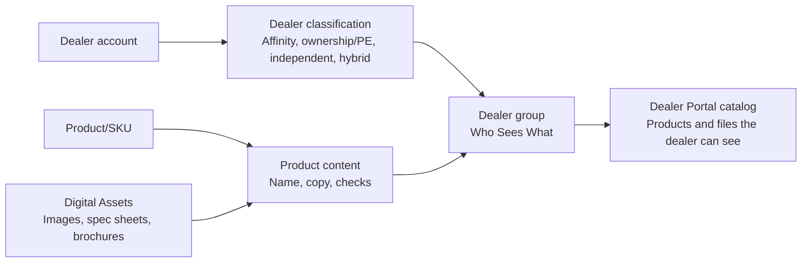
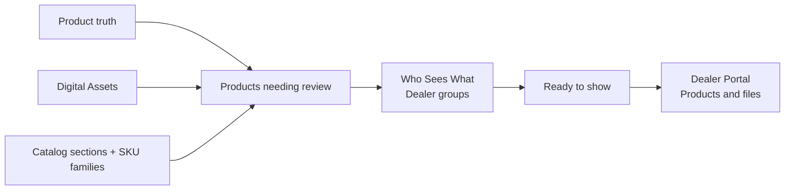

# UX-07 CRM Content Architecture Optimization Goal

Date: 2026-06-04

Status: `In Progress - Slices A-L deployed and QA passed`

## Product Design Brief

Pulse CRM should feel like an operator workbench, not a reporting portal with forms attached.

Each default module page should answer one question first:

> What does this role need to do next?

The first screen should show one active work surface, one primary action, and business-language status. Reporting, setup, migration, provider details, audit/provenance, ERP/Widen/Outlook boundaries, and secondary directories stay available through `More`, drawers, detail routes, modes, or guided setup.

This goal changes information architecture, page hierarchy, and copy. It does not change backend source-of-truth ownership, audit history, permission enforcement, or parked external dependencies.

## Research Basis

External UX guidance lines up with the Pulse meeting evidence:

- [Nielsen Norman Group usability heuristics summary](https://media.nngroup.com/media/articles/attachments/Heuristic_Summary1_A4_compressed.pdf): extra interface information competes with relevant information, so first paint must be ruthlessly scoped.
- [Salesforce Lightning navigation guidance](https://winter-20.lightningdesignsystem.com/guidelines/navigation/): default tabs should match the page's most important use case; tabs should not be used as a linear setup process; directional modals/steppers fit wizard-style work.
- [Salesforce Lightning metric-display guidance](https://v1.lightningdesignsystem.com/guidelines/data-visualization/metric-display/): metrics are useful when they help users understand current state and initiate useful action; alerting and metrics should be complementary, not one noisy wall.
- [Material Design data-table guidance](https://m1.material.io/components/data-tables.html): enterprise tables should support row selection, manipulation tools, and row/overflow menus instead of spreading every action across the page.
- [Nielsen Norman Group enterprise-app workflow guidance](https://media.nngroup.com/media/reports/free/Mobile_Intranets_and_Enterprise_Apps.pdf): enterprise workflows should reduce input burden, make smart assumptions, and guide users through one logical task at a time.
- [Carbon data table guidance](https://carbondesignsystem.com/components/data-table/usage/): toolbar actions are for global table work, row actions belong on rows, and overflow/hover actions can reduce visual clutter.
- [GOV.UK Details guidance](https://design-system.service.gov.uk/components/details/): pages become easier to scan when users reveal detailed information only when they need it.

Internal evidence is even stronger:

- Dynamic/Currie repeatedly asked for simpler navigation, fewer keystrokes, less manual work, and one place to see what needs attention.
- Field users spend much of their time on phones, so mobile and CRM defaults should avoid non-actionable dashboards and technical setup language.
- Existing Pulse UX-06 already codifies the rule: every default page must answer what the user should do next.

## Agent Audit Summary

| Agent lane | Scope | Main finding | Best next move |
| --- | --- | --- | --- |
| Leads + Accounts | Lead Management and Account Management | Slice L now makes Leads scan by backend workflow next action first; Accounts are mostly improved after UX-06 Slice B but still need a smaller filter/detail-density pass. | Keep Leads as a next-action queue with Kanban behind More. Then do the smaller Accounts filter/detail-density pass. |
| Territory | Territory Management | Territory remains the strongest mismatch: `Dashboard`, `Map View`, `Territory List`, metrics, and setup/reporting compete before RD/TM daily work. | Make `Needs attention` the default action queue; move map/list/performance/setup into More or drill-ins. |
| Product + Assets + Dealer Portal | Product Management, Digital Assets, Dealer Portal | Slice I keeps Product Management readable as a product-review workspace: Products needing review, Who Sees What, Catalog sections, SKU families, and source-file review only under Setup. | Move to Digital Assets/Consignment second-click density if first-paint clarity remains green during client UAT. |
| Training + Consignment | Training, Consignment | Slice F now splits Training completion into guided steps and compacts Consignment site detail around the current site work. | Keep the guided flow; next pass should be role/persona signoff and any remaining deep-detail polish, not new parked dependency work. |
| Admin + Calendar + Navigation | Admin, Roles/Permissions, Calendar, App Shell | Admin integrations stack multiple setup panels; Calendar is improved but still mixes schedule grid, health, and metrics; nav labels can drift from current defaults. | Add integration selector; keep Calendar schedule + Day Health only; align nav labels with default work surfaces. |
| Requirements + Meeting Sentiment | Meetings and requirements maps | The strongest business requirement is not “show everything”; it is reduce manual work and friction while keeping truth/audit intact. | Optimize default hierarchy and language first, without weakening governance. |

## CRM-Wide Page Rules

| Rule | Pass condition |
| --- | --- |
| One role question | The first screen has an obvious answer to “what should I do next?” for the current persona. |
| One active surface | A default page shows a queue, selected detail, setup step, or calendar work area, not several peers at once. |
| One primary CTA | Only one visually dominant action appears above the fold. Other actions use row menus, `More`, drawer actions, or secondary buttons. |
| Metrics explain work | Metrics support prioritization; they do not compete with the queue. Detailed metrics move to Insights, Performance details, or reports. |
| Forms are contextual | Create/edit/setup forms open from a selected task, modal, drawer, or stepper. Avoid blank setup forms on first paint. |
| Technical language is advanced | ERP, Acumatica, Widen, resolver, manifest, source ID, price class, provider, and migration terms stay out of operator/dealer defaults. |
| Dealer copy is dealer-safe | Dealers see products, files, account health, and support. They do not see internal publishing/readiness/missing-file workflow language. |
| Tables stay scannable | Primary columns and one row action are visible; secondary actions go into row overflow; wide admin/reporting tables require modes or drill-ins. |
| Parked dependencies stay honest | Parked items remain documented and available in admin/readiness detail, not framed as live operational features. |

## Module Plan

| Module | Current UX risk | Optimization direction |
| --- | --- | --- |
| Leads | Slice L makes the default work queue action-first by using backend workflow next-action truth as the first scannable column; remaining risk is large-dataset/server-aggregate hardening and downstream trigger clarity. | Keep `/leads` defaulted to `Lead Work Queue` with backend next action/SLA/owner/source. Keep `Pipeline board` behind More, metrics in `Insights`, and lead detail action-first with source/routing/evidence/lifecycle behind secondary detail. |
| Accounts | Mostly aligned after UX-06 Slice B; remaining risk is filter/header noise in follow-up mode. | Keep `Needs follow-up` default. Hide lifecycle filters unless `All accounts` mode is active or `More filters` is opened. Keep readiness/payment/training/portal/consignment in More drawer. |
| Territory | Slice K now turns the default action queue into a work-item scan instead of a count-only attention panel. | Keep `Territory Action Queue` as the default. Show `Next territory work` when scoped lead/account assignment rows exist, keep zero-work RD/TM states calm, and keep map/list/performance/setup behind More or disclosures. |
| Training | Slice F keeps `Priority Queue` as the visible primary tab and now splits session completion into `Completion`, `Proof`, `Certification`, and `Follow-up` steps without changing APIs. | Keep completion step-by-step. Next depth should tune copy/validation only after role UAT feedback. |
| Consignment | Slice F proves realistic open ROSE audits appear in `Next site work` and the site detail first paint is now `Current site work` with readiness/metrics/setup/history behind advanced sections. | Keep Acumatica/ERP/PO/inventory terms parked out of first paint. Next depth should be role UAT and selected detail polish. |
| Product Management | Slice I makes the default page understandable without schema knowledge: `Product Management`, `Products needing review`, `Ready to show`, `What to fix`, `Catalog sections`, `SKU families`, and `Who Sees What`. | Keep `/product-management` product-review-first and `/product-management?tab=visibility` dealer-group-selection-first. Continue protecting Category/Family as catalog organization and Dealer group/Who Sees What as visibility, while leaving API/database names intact. |
| Digital Assets | Slice C keeps share-ready files first, moves review-all-files into More, and collapses recipient/context/history under share options. | Keep `Copy customer link` / `Create share link` as the visible selected-asset job. Keep upload/migration/source trace in More or advanced sections. |
| Dealer Portal | Slice C removes internal publishing/missing-file/admin copy from catalog/detail/dashboard/account surfaces. | Dealer sees `Start Here`, `Account Center`, `Account Health`, `Products and Files`; unavailable/internal file records should not appear. |
| Admin/Roles | Integrations tab stacks Entra, Calendar, Payment, and Lead Alerts together. Admin default mixes metrics/daily work/setup. | Admin default = `Users & Access`. Integrations use a selector so only one setup panel is open. Metrics/health/provider notes move into detail disclosures. |
| Calendar | Calendar no longer auto-selects events, but grid + health + metrics can still crowd. | First paint = schedule grid + `Day Health`. Event detail only after selection. Scheduling CTA must be permission-aware. |
| Mobile | Field app has broad coverage, but Today/Notifications/Sync/More can disagree on next action and expose office terms. | Shared ranked `Next best action` model across Today, Notifications, and Sync. More becomes field toolbox. Keep asset files, consignment, training, and voice notes step/action-first. |

## Slice Plan

### Slice A - Leads Work Queue And Lead Detail Action-First

Purpose: fix the largest non-territory CRM clutter source.

Status: `Implemented - static QA passed; Browser/Playwright blocked by host Chromium SIGKILL`

Delivered:

- `/leads` now defaults to a list-style `Lead Work Queue` instead of a multi-surface board/dashboard.
- `Pipeline board` remains available as the Kanban mode, but is no longer the default work surface.
- Metrics/reporting context lives in `Insights`; first paint keeps only critical attention chips that help prioritize queue work.
- Lead detail opens action-first around the next-best work step with stage/readiness context.
- General information, workflow gates, source/routing facts, evidence, lifecycle disposition, and audit history remain reachable through `More`, work-step panels, or secondary detail.
- E2E/static contracts guard the list-first default, board/Insights demotion, one active work surface, compact queue columns, and lead-detail action-first behavior.

Static proof passed:

- `pnpm --filter @pulse/crm-web typecheck`
- `node --check apps/crm-web/e2e/ux-clutter.spec.mjs && node --check apps/crm-web/e2e/ux-depth.spec.mjs && node --check apps/crm-web/e2e/flows.spec.mjs && node --check apps/crm-web/e2e/ux-visual.spec.mjs && node --check apps/crm-web/e2e/route-coverage.spec.mjs`
- `git diff --check`

Browser/Playwright proof blocked:

- `pnpm --filter @pulse/crm-web exec playwright test -c e2e/playwright.depth.config.mjs -g "UX-03 detail hotspots" --workers=1 --max-failures=1`
- Blocker: Playwright reached the test runner, but the headless Chromium process was killed with `SIGKILL` before assertions executed under current host resource pressure.

### Slice B - Territory Action Queue And Setup Wizard

Purpose: make RD/TM daily work the default, not reporting/setup.

Status: `Implemented - static QA passed; Browser/Playwright blocked by host build SIGKILL`

Delivered:

- `Needs attention` becomes the first surface and is renamed `Territory Action Queue`.
- `Lead routing posture` and performance tables move into `Performance details`.
- `Map View`, `Territory Registry`, `Calendar`, and `Setup & Transfers` stay reachable through `More` or direct deep links, but are no longer equal default choices.
- Setup becomes a guided `Region -> Shipping hub -> Territory -> Coverage review` stepper.
- Bulk lead/account transfer stays in focused transfer queues and preserves the audited reassignment model.
- E2E contracts now assert the queue-first default, hidden performance details, More-based territory navigation, and setup stepper test hooks.

Static proof passed:

- `pnpm --filter @pulse/crm-web typecheck`
- `node --check apps/crm-web/e2e/ux-clutter.spec.mjs && node --check apps/crm-web/e2e/ux-depth.spec.mjs && node --check apps/crm-web/e2e/flows.spec.mjs && node --check apps/crm-web/e2e/ux-visual.spec.mjs && node --check apps/crm-web/e2e/route-coverage.spec.mjs`
- `git diff --check`

Browser/Playwright proof blocked:

- `pnpm --filter @pulse/crm-web exec playwright test -c e2e/playwright.depth.config.mjs -g "UX-03 slice C advanced tables|TM and RD scoped" --workers=1 --max-failures=1`
- Blocker: Playwright web server could not start because `pnpm build` was killed with exit 137 under current host resource pressure.

### Slice C - Product, Assets, And Dealer-Safe Copy

Purpose: protect the catalog/file mental model and remove internal publishing language from dealer screens.

Status: `Implemented - static and focused Browser/Playwright QA passed`

Delivered:

- Product Management no longer auto-selects the first visibility row on `/product-management?tab=visibility`; the detail rail starts with `Select a Dealer group`.
- Product Management metrics and copy use business terms such as `Need dealer group`, `Ready to show`, `Catalog sections`, and `SKU families`.
- Product detail scoped-presentation overrides now read as advanced exceptions, with `Regional audience`, `Approved relationship audience`, and ownership/private-label audience labels.
- Digital Assets keeps the approved/share-ready library as the first paint, moves `Review all files` into `More`, hides visibility filtering until review mode, and keeps upload/migration out of the default work surface.
- Selected Digital Asset detail keeps `Copy customer link` / `Create share link` first and collapses recipient fields, CRM context, and share-link history into `Share options and link history`.
- Dealer Portal catalog, product detail, dashboard, account center, and dealer layout now use dealer-safe copy: `available`, `Products and Files`, `Account Access`, `Pause access`, and `Restore access`.
- Dealer-facing product cards/details hide internal no-download file placeholders instead of showing `Missing files`, `not ready`, or `Unavailable`.

Static proof passed:

- `pnpm --filter @pulse/crm-web typecheck`
- `node --check apps/crm-web/e2e/ux-clutter.spec.mjs && node --check apps/crm-web/e2e/ux-depth.spec.mjs && node --check apps/crm-web/e2e/flows.spec.mjs && node --check apps/crm-web/e2e/ux-visual.spec.mjs && node --check apps/crm-web/e2e/route-coverage.spec.mjs`
- `git diff --check`
- Dealer-facing internal-copy sweep for `publish/published`, `Missing files`, `File not ready`, `Unavailable`, raw `Admin`, and setup defaults returned no matches in Dealer Portal render code.

Focused Browser/Playwright proof passed:

- `pnpm --filter @pulse/crm-web exec playwright test -c e2e/playwright.depth.config.mjs -g "UX-03 slice D role-first" --workers=1 --max-failures=1`
- `pnpm --filter @pulse/crm-web exec playwright test -c e2e/playwright.config.mjs -g "dealer catalog personas" --workers=1 --max-failures=1`
- `PULSE_UX_CLUTTER_SCOPE=critical pnpm --filter @pulse/crm-web exec playwright test -c e2e/playwright.clutter.config.mjs --workers=1 --max-failures=1`

Additional cleanup landed during critical clutter proof:

- Lead detail Discovery stepper was replaced with current-step sections so Stepper labels no longer count as extra visible controls.
- Consignment default copy scanner was fixed to avoid false `PO` hits inside normal words such as `operations`.
- Dealer dashboard hero badges and admin-ish `portal users` / `account context` copy were simplified.

### Slice D - Training And Consignment Step-Through Detail

Purpose: keep operational work simple while preserving proof/history/governance.

Status: `Implemented - focused Browser/Playwright QA passed`

Delivered:

- Training default keeps only `Priority Queue` as the visible tab.
- Scheduled Sessions, Account Coverage, Coverage Summary, Compliance Reports, and Catalog Setup are available through `More`.
- Training owner/window filters move into a `Filters` disclosure.
- Repeated queue empty states now use one all-clear message.
- Technical Training labels such as raw execution state, proof exception types, and certification outcomes are mapped to business copy.
- Realistic E2E fixture data now signs Agreement and BLUE evidence before activating the consignment site.
- Creating a consignment ROSE audit updates `nextAuditDueAt`, so the operator queue can surface the audit without waiting for a separate denormalized process.
- Focused Playwright verifies seeded Training and Consignment operator work with dealer-safe/parked-dependency copy.

Proof passed:

- `node --check apps/crm-web/e2e/flows.spec.mjs && node --check apps/crm-web/e2e/ux-clutter.spec.mjs`
- `pnpm --filter @pulse/crm-web typecheck`
- `pnpm --filter @pulse/api build`
- E2E fixture regeneration with realistic Training and Consignment records: `node apps/crm-web/e2e/prepare-e2e.mjs` using the test env
- `pnpm --filter @pulse/crm-web exec playwright test -c e2e/playwright.config.mjs -g "training and consignment seeded operator work" --workers=1 --max-failures=1`
- `PULSE_UX_CLUTTER_SCOPE=critical pnpm --filter @pulse/crm-web exec playwright test -c e2e/playwright.clutter.config.mjs --workers=1 --max-failures=1`
- Manual EC2 release `manual-20260604215038-ux07-slice-d` deployed to `https://pulse-crm.theclustox.com`.
- Deployed smoke passed: web `200`, `/api/v1/auth/me` unauthenticated `401`, `/api/v1/health/ready` healthy, `pulse-api`, `pulse-web`, and `nginx` active.
- Deployed Browser/Playwright check passed for `/training` and `/consignment`; screenshot: `output/playwright/ux-07-slice-d-deployed-training-consignment.png`.

Remaining depth:

- Training execution modal still needs a visible `Completion -> Proof -> Certification -> Follow-up` step flow.
- Consignment site detail still needs the compact one-CTA detail pass.
- Full API `test:training` was attempted but `@pulse/db` TypeScript build was killed with exit 137 under local host pressure; focused web/API build and Browser/Playwright proof passed.

### Slice E - Admin, Calendar, Navigation, And Mobile Alignment

Purpose: finish cross-module consistency and avoid new clutter entering through platform pages.

Status: `Implemented - focused Browser/Playwright, mobile QA, and deployed smoke passed`

Delivered:

- `/admin` now defaults to `Users & Access`; `System Setup` remains reachable through `More` instead of being the first paint.
- `/admin/integrations` now uses one selected integration setup area at a time instead of stacking Microsoft Entra, Calendar, Payments, and Lead Alerts together.
- Calendar first paint stays schedule grid + `Day health`; the duplicate metric strip was removed.
- Calendar scheduling entry points are permission-aware; users without discovery/training schedule access can review the calendar without seeing a misleading primary schedule CTA.
- Internal navigation now uses task labels `Leads`, `Territories`, `Accounts`, `Products and Files`, and `Users & Access`.
- Product Management and Digital Assets are grouped under one `Products and Files` shell area; dealer navigation now uses the same `Products and Files` wording.
- Decorative notification bells were removed from internal and dealer headers until a real web notification surface is wired.
- Mobile consignment first-paint copy no longer exposes parked Acumatica, PO, inventory, purchase-order, or manual-variance language.
- The mobile live-API status type was tightened so the shared next-action/live-status provider remains type-safe.

Proof passed:

- `node --check apps/crm-web/e2e/flows.spec.mjs && node --check apps/crm-web/e2e/ux-depth.spec.mjs && node --check apps/crm-web/e2e/ux-clutter.spec.mjs && node --check apps/crm-web/e2e/ux-visual.spec.mjs && node --check apps/crm-web/e2e/route-coverage.spec.mjs`
- `pnpm --filter @pulse/crm-web typecheck`
- `pnpm --filter @pulse/mobile typecheck`
- `pnpm --filter @pulse/mobile exec node --test --disable-warning=ExperimentalWarning --disable-warning=MODULE_TYPELESS_PACKAGE_JSON test/mobile-next-action.test.ts test/mobile-live-api-status.test.ts test/mobile-sync-uat-guidance.test.ts test/session-lifecycle.test.ts`
- `pnpm --filter @pulse/crm-web exec playwright test -c e2e/playwright.config.mjs -g "admin user management keeps creation|navigation keeps single-screen|dealer navigation distinguishes" --workers=1 --max-failures=1`
- `pnpm --filter @pulse/crm-web exec playwright test -c e2e/playwright.depth.config.mjs -g "common internal detail modals" --workers=1 --max-failures=1`
- `PULSE_UX_CLUTTER_SCOPE=critical PULSE_UX_CLUTTER_VIEWPORTS=desktop pnpm --filter @pulse/crm-web test:ux-clutter:quick`
- Manual EC2 release `manual-20260604230651-ux07-slice-e` deployed to `https://pulse-crm.theclustox.com`.
- Deployed smoke passed: `/` returned `200`, unauthenticated `/api/v1/auth/me` returned `401`, `/api/v1/health/ready` returned healthy database and queue status, and `pulse-api`, `pulse-web`, and `nginx` were active.
- Deployed Browser check passed for authenticated `/admin`, `/admin/integrations`, `/calendar`, and shell navigation; screenshots: `output/playwright/ux-07-slice-e-live/admin-users-access.png`, `output/playwright/ux-07-slice-e-live/admin-integrations-outlook.png`, `output/playwright/ux-07-slice-e-live/calendar.png`, `output/playwright/ux-07-slice-e-live/shell-nav.png`.
- Deployed terminal Playwright pass passed against live API session auth for `/admin`, `/admin/integrations`, `/calendar`, `/territories`, and shell navigation; screenshots: `apps/crm-web/output/playwright/ux-07-slice-e-live/terminal-admin-users-access.png`, `apps/crm-web/output/playwright/ux-07-slice-e-live/terminal-admin-integrations-outlook.png`, `apps/crm-web/output/playwright/ux-07-slice-e-live/terminal-calendar.png`, `apps/crm-web/output/playwright/ux-07-slice-e-live/terminal-territories.png`.

QA note:

- The first clutter rerun failed on stale route-readiness text for the consignment site detail. The page rendered correctly with the account name as the H1; the harness was still waiting for a `Consignment` H1. The expectation was updated to the seeded account name and the critical clutter gate then passed.
- The first deployed terminal Playwright attempts exposed selector strictness issues (`Sign in` also matched `Sign in with Microsoft`; `Integration setup area` matched both listbox and textbox; `Outlook Calendar` appeared in option, heading, and table copy). The final pass scoped those checks to exact button names, the integration textbox, and the Outlook heading.
- Live `/territories` now renders the current queue-first hub labels (`Territory Action Queue`, `Performance details`) rather than the older dashboard labels; deployed smoke verifies the current first-paint route.

### Slice F - Training Execution And Consignment Site Detail Depth

Purpose: finish the Training/Consignment depth cleanup called out after Slice E.

Status: `Implemented - focused Browser/Playwright, critical clutter, and deployed smoke passed`

Delivered:

- Training session completion now uses a guided `Completion -> Proof -> Certification -> Follow-up` stepper.
- The Training stepper keeps the existing completion payload and API contract intact; it changes the operator flow, not source-of-truth behavior.
- Required checkout notes, duration, attendee count, proof references, certification fields, and optional follow-up creation stay in the flow, but only the current step is visible.
- Consignment site detail now opens on `Current site work` with compact readiness, blocked checks, open work, discrepancies, and one primary site action.
- Consignment ROSE metrics, readiness checklist, setup/doc counts, and audit history move into advanced sections instead of competing on first paint.
- Parked Acumatica, ERP, PO, inventory, and purchase-order language remains hidden from the default site-detail workflow.
- Realistic E2E coverage now opens a seeded Training session, walks the completion stepper, and verifies compact Consignment site detail.

Proof passed:

- `node --check apps/crm-web/e2e/flows.spec.mjs`
- `pnpm --filter @pulse/crm-web typecheck`
- `pnpm --filter @pulse/crm-web exec playwright test -c e2e/playwright.config.mjs -g "training and consignment seeded operator work" --workers=1 --max-failures=1`
- `PULSE_UX_CLUTTER_SCOPE=critical PULSE_UX_CLUTTER_VIEWPORTS=desktop pnpm --filter @pulse/crm-web test:ux-clutter:quick`
- Manual EC2 release `manual-20260605000104-ux07-slice-f` deployed to `https://pulse-crm.theclustox.com`.
- Deployed smoke passed: `/api/v1/health/ready` returned healthy database and queue status, expected parked Acumatica false/503, and `pulse-api`, `pulse-web`, and `nginx` were active.
- Deployed terminal Playwright live smoke passed against seeded Training session `UAT IAQ Certification Visit` and Consignment site `UAT Main Showroom Consignment`; screenshots: `apps/crm-web/output/playwright/ux-07-slice-f-live/training-stepper-live.png`, `apps/crm-web/output/playwright/ux-07-slice-f-live/consignment-site-compact-live.png`.
- Deployed Browser check passed for authenticated `/training` and `/consignment/:siteId`; screenshot: `output/playwright/ux-07-slice-f-live/browser-consignment-site-compact-live.png`.

QA note:

- The first Slice F deploy attempt was stopped because the rsync excludes were too broad and started copying large local infrastructure/build folders. It did not switch the active symlink. The release was cleaned up, the exclude list was corrected, and fresh release `manual-20260605000104-ux07-slice-f` completed successfully.
- The deployed Training smoke was intentionally non-mutating: it walked the completion steps with realistic notes but did not submit `Complete Session`.
- Acumatica readiness remains false/503 by design until access and integration scope are available; no Slice F UI treats it as a live daily workflow.

### Slice G - Role Persona Signoff And First-Paint Copy Polish

Purpose: run the requested Super Admin, RD/TM, Dynamic support, and dealer persona signoff against the optimized default pages, then fix the remaining first-paint copy/hidden-panel issues that surfaced.

Status: `Implemented - focused Browser/Playwright, critical clutter, and deployed smoke passed`

Delivered:

- Admin top-level tabs now use `keepMounted={false}`, so hidden System Setup, Audit Monitor, and Integrations content no longer pollutes the first-paint DOM when the visible page is `Users & Access`.
- Digital Assets and Territory tabs now use `keepMounted={false}`, so hidden Widen import/delivery-health, territory map/registry/admin, and bulk-transfer content does not appear in default first-paint text.
- `/admin/integrations?provider=calendar` now opens the Calendar integration panel directly, which makes Calendar's `Manage scheduling setup` path land on the right business surface.
- Admin user rows no longer expose raw role enum text under the friendly access-profile name, and status filters now use business labels.
- Calendar first-paint copy no longer says `Google Calendar or Outlook`; it now explains the day-review job in business language.
- Territory first paint no longer promotes `Setup & transfers` as a primary CTA; setup remains available from `More`.
- Training session completion now permits `Complete Session` from the Completion step once required checkout data is valid, while proof/certification/follow-up remain available through `Add proof / follow-up`.
- Consignment default/detail copy no longer says `warehouse confirmation`, `warehouse setup waiting`, or `approved handoff`; it uses site-setup business copy instead.
- Product detail asset attachment now only offers active, approved assets with a current version; if none exist, the user is sent back to Digital Assets review instead of seeing ambiguous file choices.
- Dealer Portal catalog/account copy no longer says `ready for your company` or `made available`; empty states now direct dealers to Dynamic AQS support for missing products/files.
- E2E fixtures now include a Dynamic support persona (`ADMIN_CSR_OPS`) so signoff covers the support/admin operator path, not just Super Admin/RD/TM/dealer.

Proof passed:

- `node --check apps/crm-web/e2e/flows.spec.mjs && node --check apps/crm-web/e2e/prepare-e2e.mjs && node --check apps/crm-web/e2e/ux-depth.spec.mjs && node --check apps/crm-web/e2e/ux-clutter.spec.mjs`
- `pnpm --filter @pulse/crm-web typecheck`
- E2E fixture regeneration with the Dynamic support persona: `node apps/crm-web/e2e/prepare-e2e.mjs` using the test env
- `pnpm --filter @pulse/crm-web exec playwright test -c e2e/playwright.config.mjs -g "training and consignment seeded operator work|admin user management|dealer catalog personas|UX-07 role persona signoff" --workers=1 --max-failures=1`
- `PULSE_UX_CLUTTER_SCOPE=critical PULSE_UX_CLUTTER_VIEWPORTS=desktop pnpm --filter @pulse/crm-web test:ux-clutter:quick`
- Focused regression after deployed Territory hidden-panel finding: `pnpm --filter @pulse/crm-web exec playwright test -c e2e/playwright.config.mjs -g "UX-07 role persona signoff" --workers=1 --max-failures=1`
- Manual EC2 release `manual-20260605013756-ux07-slice-g2` deployed to `https://pulse-crm.theclustox.com`.
- Deployed smoke passed: `/` returned `200`, unauthenticated `/api/v1/auth/me` returned `401`, `/api/v1/health/ready` returned healthy database and queue status, expected parked Acumatica false/503, and `pulse-api`, `pulse-web`, and `nginx` were active.
- Deployed persona smoke passed 8 checks across Super Admin, RD, TM, and hybrid dealer for `/admin`, `/admin/integrations?provider=calendar`, `/calendar`, `/digital-assets`, `/territories`, `/dealer/dashboard`, and `/dealer/catalog`; screenshots/results: `output/playwright/ux-07-slice-g-live/`.

Browser note:

- The in-app Browser plugin rendered the local login page successfully and captured the visual smoke, but authenticated form input was blocked by the plugin's missing virtual clipboard in this environment. Authenticated functional proof is covered by the passing Playwright suites above.

QA note:

- The first focused rerun exposed two stale test expectations rather than app regressions: Consignment detail now intentionally uses the account/site name as the H1 with `Consignment site` as the label, and dealer empty-state copy intentionally no longer uses `ready for your company`. The tests were updated to assert the new operator/dealer-safe copy.
- The first deployed Slice G smoke caught a real Territory issue: inactive map/registry/admin/bulk-transfer panels were still mounted for RD/TM. The Territory tabs were fixed with `keepMounted={false}`, local UX-07 persona signoff passed again, and corrected release `manual-20260605013756-ux07-slice-g2` passed deployed smoke.
- Dynamic support persona is covered in the local generated E2E fixture. The deployed UAT seed currently documents Super Admin, RD, TM, and dealer personas only, so deployed Dynamic support smoke remains pending until that UAT persona is created on the live environment.

## QA And Acceptance

### Slice H - Product Vocabulary And Dealer Classification Readability

Purpose: make Product Management understandable enough for client UAT by removing split terminology and fixing the classification stewardship layout that feeds dealer-group rules.

Status: `Implemented - local Browser/Playwright, critical clutter, deployed smoke, and live UI smoke passed`

Delivered so far:

- Product detail no longer uses `Dealer Catalog View` as operator copy; it now says `Dealer group`, `Who Sees It`, `Product Content`, and `Add dealer group`.
- Admin catalog-rule UI now presents as `Dealer Group Rules`, with account classification rules assigning dealer groups rather than exposing catalog-view jargon.
- Internal navigation now uses `Products` and `Who Sees What` under `Products and Files`.
- Digital Assets advanced visibility text now refers to scoped dealer groups instead of Dealer Catalog Views.
- Lead Forms `Classification Stewardship` is renamed `Dealer Classification`, with a plain explanation: classifications describe dealer accounts; Product Management uses them to decide which dealer group, products, and files a dealer can see.
- Affinity and ownership group managers now stack vertically and use table scroll/wrapping safeguards so code/name/type/status/order/action columns do not collide.
- Roster preview/review tables now use `Table.ScrollContainer`, matching the existing lead-import table pattern.
- E2E wording expectations have been updated from old `Dealer Catalog View` labels to the current `Who Sees What` / `Dealer group` model.

Client-safe mental model:

Acceptance target:

- No operator-facing CRM component should show the old `Dealer Catalog View` term unless it is historical documentation or code/API naming.
- `/leads/forms?tab=classification` should be scannable without table overlap at desktop widths.
- Product Management should explain four jobs only: `Products`, `Files`, `Who Sees What`, and `Setup`.

Proof passed:

- `pnpm --filter @pulse/crm-web typecheck`
- `node --check apps/crm-web/e2e/flows.spec.mjs && node --check apps/crm-web/e2e/ux-depth.spec.mjs && node --check apps/crm-web/e2e/ux-clutter.spec.mjs`
- `git diff --check`
- `pnpm --filter @pulse/crm-web exec playwright test -c e2e/playwright.depth.config.mjs -g "product" --workers=1 --max-failures=1`
- `pnpm --filter @pulse/crm-web exec playwright test -c e2e/playwright.config.mjs -g "internal workspace auth and core module routes" --workers=1 --max-failures=1`
- `PULSE_UX_CLUTTER_SCOPE=critical PULSE_UX_CLUTTER_VIEWPORTS=desktop pnpm --filter @pulse/crm-web test:ux-clutter:quick`
- Manual EC2 release `manual-20260605021056-ux07-slice-h` deployed to `https://pulse-crm.theclustox.com`.
- Deployed smoke passed: `/` returned `200`, unauthenticated `/api/v1/auth/me` returned `401`, `/api/v1/health/ready` returned healthy database and queue status, expected parked Acumatica false/503, and `pulse-api`, `pulse-web`, and `nginx` were active.
- Deployed live UI smoke passed for `/product-management`, `/product-management?tab=visibility`, `/leads/forms` Dealer Classification, and `/admin/catalog-rules`; results/screenshots: `output/playwright/ux-07-slice-h-live/`.

### Slice I - Product Management First-Paint Clarity

Purpose: make Product Management understandable to client users as a governed dealer-catalog workbench, not a schema/admin/import screen.

Status: `Implemented - local typecheck, focused Playwright, critical clutter QA, deployed smoke, and live Product Management smoke passed`

Delivered so far:

- Product Management now starts with the plain job: `Products needing review`.
- First-paint language uses `Product Management`, `Need dealer group`, `Ready to show`, and `What to fix`.
- Setup is expressed as `Catalog sections`, `SKU families`, and `Source file review`; source review stays behind Setup and is not visible on the default page.
- The dealer access path stays `Who Sees What`, with the helper action renamed to `How dealer groups work`.
- The PRD now includes a plain-language playbook: Product Management decides which approved products, copy, files, and catalog sections each dealer group should see.
- The Product/Digital Assets requirements map now has a Slice I trace linking the UI clarity pass back to PM-001, PM-002, PM-006/PM-007, PM-008/PM-009, and PM-012.
- Product default clutter is now a critical QA route and fails if Acumatica, Widen, pricing, price class, import, source-file review, or setup actions leak into first paint.

Client-safe mental model:

Proof passed:

- `pnpm --filter @pulse/crm-web typecheck`
- `git diff --check`
- `node --check apps/crm-web/e2e/ux-depth.spec.mjs && node --check apps/crm-web/e2e/ux-clutter.spec.mjs && node --check apps/crm-web/e2e/ux-visual.spec.mjs && node --check apps/crm-web/e2e/flows.spec.mjs`
- `pnpm --filter @pulse/crm-web exec playwright test -c e2e/playwright.depth.config.mjs -g "product" --workers=1 --max-failures=1`
- `pnpm --filter @pulse/crm-web exec playwright test -c e2e/playwright.depth.config.mjs -g "advanced tables" --workers=1 --max-failures=1`
- `PULSE_UX_CLUTTER_SCOPE=critical PULSE_UX_CLUTTER_VIEWPORTS=desktop pnpm --filter @pulse/crm-web test:ux-clutter:quick`
- Manual EC2 release `manual-20260605025703-ux07-slice-i` deployed to `https://pulse-crm.theclustox.com`.
- Deployed smoke passed: `/` returned `200`, unauthenticated `/api/v1/auth/me` returned `401`, `/api/v1/health/ready` returned healthy database and queue status, expected parked Acumatica false/503, and `pulse-api`, `pulse-web`, and `nginx` were active.
- Deployed live UI smoke passed for `/product-management` and `/product-management?tab=visibility` using an API-backed Super Admin session; results/screenshots: `output/playwright/ux-07-slice-i-live/`.

### Slice J - Consignment Business-Language And Detail Density

Purpose: finish the targeted Consignment pass called out after Slice I by keeping Samantha/Ops and TM/RD work focused on due audits, setup confirmations, and site issues without exposing Acumatica/warehouse/PO mechanics on the daily screen.

Status: `Implemented - local typecheck, focused Playwright, route coverage, critical clutter QA, deploy, and live smoke passed`

Delivered so far:

- `/consignment` first-paint copy now says due audits, follow-ups, setup confirmations, and site issues; it no longer describes reports as a tab or exposes warehouse wording.
- `Create Site` is shown only to roles with `consignment.manage`, so TM/RD audit users do not see a button that would 403.
- Consignment work-subject formatting now scrubs warehouse setup/pending, approved handoff, Acumatica, PO, purchase order, and manual-variance subjects into business-safe `Site setup needs confirmation` or `Site issue needs review` copy.
- Status labels now render `Setup ready` / `Setup pending` instead of raw warehouse-oriented labels.
- Consignment site detail workflow actions are state-aware and permission-aware: completed/invalid actions are not left in `More`, and the seeded active audit page shows only the valid `Finish audit` action.
- Live UAT records with signed Agreement/BLUE evidence and an `activeSince` timestamp now show ROSE audit work instead of stale setup actions even when legacy status text has not been normalized yet.
- Site detail now shows `Current site work`, `Site Snapshot`, and one `Site details and evidence` disclosure instead of four competing advanced controls.
- Route coverage now marks `/consignment/:siteId` as functionally/depth covered, and the clutter scan applies parked-term checks to the detail route.
- The depth test helper now waits for the actual authenticated landing route instead of assuming every internal persona lands on `/leads`.

Requirement trace:

| Requirement area | Slice J response |
| --- | --- |
| Samantha/Ops daily work queue | Keeps `Next site work` as one ranked table with six columns and one row action. |
| ROSE audit execution | Keeps `Finish audit` as the one valid primary action when an active audit is open. |
| Audit vs reconciliation split | Keeps `No issue` vs `Log site issue` decision without surfacing PO mechanics first. |
| Shared mailbox/follow-up style work | Maps work-item subjects into setup confirmation or site issue language. |
| Parked Acumatica boundary | Warehouse/Acumatica/PO/inventory language is scrubbed from default and detail first-paint checks. |

Proof passed:

- `pnpm --filter @pulse/crm-web typecheck`
- `node --check apps/crm-web/e2e/flows.spec.mjs && node --check apps/crm-web/e2e/ux-depth.spec.mjs && node --check apps/crm-web/e2e/ux-clutter.spec.mjs && node --check apps/crm-web/e2e/route-coverage.spec.mjs`
- `pnpm --filter @pulse/crm-web test:route-coverage`
- `pnpm --filter @pulse/crm-web exec playwright test -c e2e/playwright.config.mjs -g "training and consignment seeded operator work" --workers=1 --max-failures=1`
- `pnpm --filter @pulse/crm-web exec playwright test -c e2e/playwright.depth.config.mjs -g "UX-05 slice E Training and Consignment" --workers=1 --max-failures=1`
- `PULSE_UX_CLUTTER_SCOPE=critical PULSE_UX_CLUTTER_VIEWPORTS=desktop pnpm --filter @pulse/crm-web test:ux-clutter:quick`
- `git diff --check`
- Manual EC2 release `manual-20260605040639-ux07-slice-j-active-state` deployed to `https://pulse-crm.theclustox.com`.
- Deployed smoke passed: `/` returned `200`, unauthenticated `/api/v1/auth/me` returned `401`, `/api/v1/health/ready` returned healthy database and queue status, expected parked Acumatica false/503, and `pulse-api`, `pulse-web`, and `nginx` were active.
- Deployed live UI smoke passed for `/consignment` and seeded site detail `UAT Main Showroom Consignment`; screenshots: `output/playwright/ux-07-slice-j-live/consignment-default-live.png`, `output/playwright/ux-07-slice-j-live/consignment-detail-live.png`.

### Slice K - Territory Next-Work Table Density Pass

Purpose: finish the table-density follow-up after Slice J by making Territory managers and regional leaders see concrete assignment work first, without turning the default route back into a report dashboard.

Status: `Implemented - local typecheck, focused Playwright depth, critical clutter QA, deploy, and public smoke passed`

Delivered so far:

- `Territory Action Queue` now renders a compact `Next territory work` table whenever the current persona can see unassigned lead/account rows.
- The table is capped to five columns: work item, gap, state/territory, owner/scope, and one row action menu.
- Lead and account row actions reuse the existing open, assign territory, and assignment-history handlers; no new backend route or fake workflow was introduced.
- RD/TM zero-work states remain clean and scoped: if their backend-visible queue has no rows, the page shows `0 items` and keeps setup/reporting hidden.
- `Performance details`, map, registry, setup, calendar, route optimization, polygons, and ERP-backed reporting stay outside first paint.
- The clutter budget now asserts `/territories` default has at most one table, five columns, one row action, one primary button, and no forbidden setup/reporting copy.

Requirement trace:

| Requirement area | Slice K response |
| --- | --- |
| TM/RD daily assignment work | Converts unassigned lead/account counts into directly openable work rows when the scoped backend exposes records. |
| Territory truth and audit | Reuses existing territory reassignment and assignment-history paths, preserving audit behavior. |
| Role-scoped visibility | Allows RD/TM zero-work states without leaking hidden records or setup tabs. |
| Keep it simple | Keeps only one compact work table before performance/reporting details. |
| Parked dependency boundary | Does not introduce route optimization, polygon editing, ERP revenue truth, or route-activity analytics. |

Proof passed:

- `pnpm --filter @pulse/crm-web typecheck`
- `node --check apps/crm-web/e2e/ux-clutter.spec.mjs && node --check apps/crm-web/e2e/ux-depth.spec.mjs && git diff --check`
- `pnpm --filter @pulse/crm-web exec playwright test -c e2e/playwright.depth.config.mjs -g "TM and RD scoped workspaces|UX-03 slice C advanced tables" --workers=1 --max-failures=1`
- `PULSE_UX_CLUTTER_SCOPE=critical PULSE_UX_CLUTTER_VIEWPORTS=desktop pnpm --filter @pulse/crm-web test:ux-clutter:quick`
- Manual EC2 release `manual-20260605135006-ux07-slice-k-territory-work` deployed to `https://pulse-crm.theclustox.com`.
- Public smoke passed: `/` returned `200`, unauthenticated `/api/v1/auth/me` returned `401`, `/api/v1/health/ready` returned healthy database and queue status, and `pulse-api`, `pulse-web`, and `nginx` were active.

### Slice L - Lead Action Scan Pass

Purpose: finish the lead follow-up after Slice A by making the default `/leads` queue scan by real workflow work, not by stage labels or a board-first mental model.

Status: `Implemented - local QA passed; manual EC2 deploy and public smoke passed`

Delivered so far:

- `LeadSummary` now carries an optional `workflowTask` computed by the existing backend workflow engine during `listLeads`.
- The default `Lead Work Queue` table now starts with `Next action`, backed by `workflowTask.nextAction`, `workflowTask.reason`, and the workflow color token when available.
- The old `Stage / next action` column is removed; stage remains as a supporting badge inside the action cell.
- Each lead row exposes one visible `Open lead` action. Pipeline board access moves behind the header `More` menu instead of competing on first paint.
- Lead detail now opens the active Work lane from the same backend next-action truth, including `Review Returned CIS` routing into the CIS lane.
- The inactive `Contacted` button is no longer shown after initial contact; users see `Log Call` only when it is still actionable.

Requirement trace:

| Requirement area | Slice L response |
| --- | --- |
| Lead team daily work | Makes the first column answer what needs to happen next for each lead. |
| Workflow truth | Reuses the existing backend workflow task builder instead of duplicating action rules in the browser. |
| Detail/list consistency | Aligns lead detail's active work lane with the same next-action value shown in the queue. |
| Keep it simple | Removes the visible board/list switch from first paint and keeps one row action visible. |
| Parked dependency boundary | Does not add new ERP, payment, product import, or external workflow dependencies. |

Proof passed:

- `pnpm --filter @pulse/contracts build`
- `pnpm --filter @pulse/api build`
- `pnpm --filter @pulse/crm-web typecheck`
- `node --check apps/crm-web/e2e/flows.spec.mjs && node --check apps/crm-web/e2e/ux-depth.spec.mjs && node --check apps/crm-web/e2e/ux-clutter.spec.mjs`
- `pnpm --filter @pulse/crm-web exec playwright test -c e2e/playwright.config.mjs -g "internal workspace auth|internal lead kanban" --workers=1 --max-failures=1`
- `pnpm --filter @pulse/crm-web exec playwright test -c e2e/playwright.depth.config.mjs -g "common internal detail modals" --workers=1 --max-failures=1`
- `PULSE_UX_CLUTTER_SCOPE=critical PULSE_UX_CLUTTER_VIEWPORTS=desktop pnpm --filter @pulse/crm-web test:ux-clutter:quick`
- `git diff --check`
- Manual EC2 release `manual-20260605141810-ux07-slice-l-lead-action` deployed to `https://pulse-crm.theclustox.com`.
- Public smoke passed: `/` returned `200`, unauthenticated `/api/v1/auth/me` returned `401`, `/api/v1/health/ready` returned healthy database and queue status, and `pulse-api`, `pulse-web`, and `nginx` were active.

Static proof for each slice:

- `pnpm --filter @pulse/crm-web typecheck`
- `node --check apps/crm-web/e2e/ux-clutter.spec.mjs && node --check apps/crm-web/e2e/ux-depth.spec.mjs && node --check apps/crm-web/e2e/flows.spec.mjs && node --check apps/crm-web/e2e/ux-visual.spec.mjs && node --check apps/crm-web/e2e/route-coverage.spec.mjs`
- `git diff --check`

Browser/Playwright proof:

- Focused Browser/Playwright route capture for each changed default route.
- Persona UAT as Super Admin, RD, TM, Dynamic support, dealer admin, dealer viewer.
- Visual clutter budget: first paint has one active work surface and no more than one dominant CTA.

## Parked Boundaries

These must not be pulled into first-paint UI while optimizing:

- Acumatica inventory, price, order, invoice, shipment, PO, warehouse, and settlement truth.
- Product CSV final import/apply as production source-of-truth.
- Widen migration/source trace beyond asset admin/advanced detail.
- True dealer impersonation.
- Territory route optimization, polygon editing, merge/split/restructure, and route-activity analytics.
- External training site replacement, Teams/WebEx policy, and final certificate authority.
- Mobile true background sync, conflict merge, media cache, push/deep-link production policy, and route optimization.

## Recommended Next Slice

After Slice L, move to the smaller **Accounts filter/detail-density pass**: keep the default account page on follow-up work, reduce filter/header noise, and make account detail second-click areas easier to scan without pulling ERP/payment dependencies forward.

The local critical clutter report, focused Territory depth pass, focused Training/Consignment E2E flow, route coverage, deployed Consignment smoke, and Product Management clarity proof are green. The next useful cleanup is not a new feature; it is to tighten remaining wide tables and ledgers where the first paint is correct but dense detail still slows scanning.
