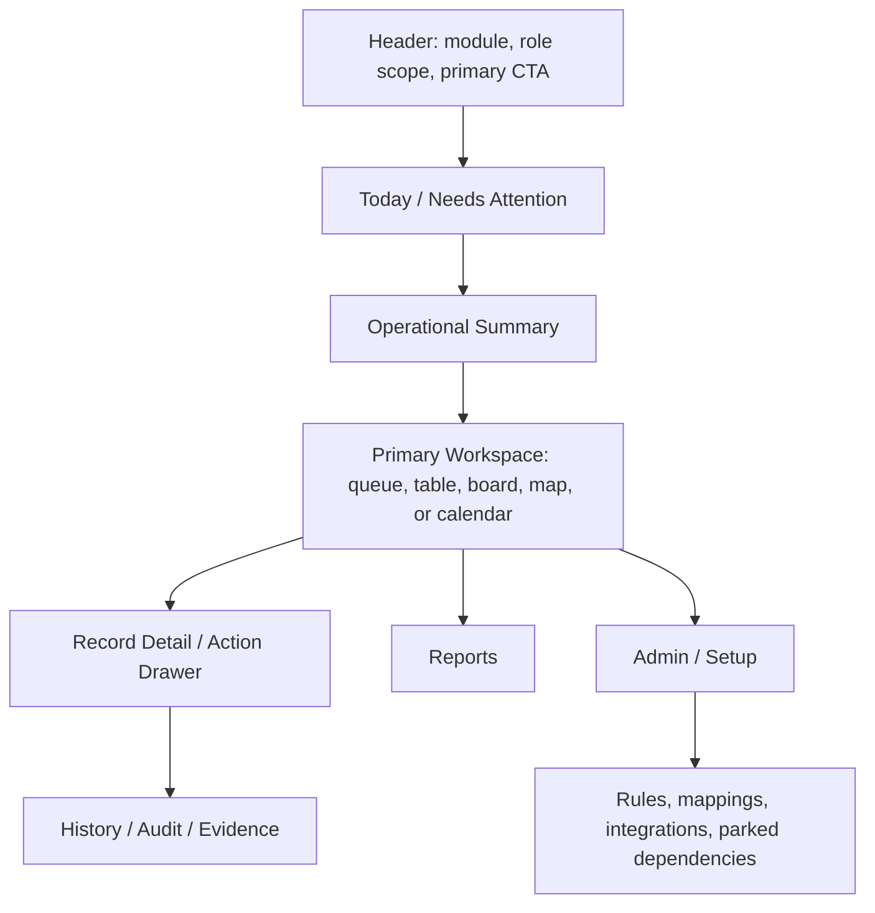

# UX-01 Role-Based Workbench Optimization Goal

Date: 2026-05-25

Status: `In Progress - Slice E CRM/dealer visual QA passed 2026-05-26; mobile device visual QA pending`

## Goal

Make every developed Pulse CRM module easier for Dynamic AQS users to operate by converting broad, mixed module pages into role-based workbenches.

The workbench pattern should answer one first-screen question:

> What do I need to do next?

Reports, setup, migration trace, integration health, rule configuration, and audit evidence must remain available, but they should not dominate the default operator view.

## Why This Goal Exists

The recent Territory simplification proved the core issue is not one page. The same pattern appears across Leads, Calendar, Territory, Training, Product Management, Digital Assets, Dealer Portal, Consignment, Accounts, Admin, and Mobile:

- daily work, reports, admin setup, audit evidence, and parked dependencies appear together
- broad metric grids often appear before the first actionable queue
- repeated cards are used where a compact queue or table would be easier
- implementation vocabulary appears in user-facing navigation
- parked dependencies are visible, but sometimes too loud for the daily path

This directly conflicts with the discovery feedback that Dynamic wants fewer barriers, less clutter, fewer keystrokes, easier reporting, and better adoption.

## Source Inputs

Current cross-module execution plan:

- `docs/UX_01_CROSS_MODULE_OPTIMIZATION_PLAN_2026-05-26.md`
- `docs/UX_01_WORKBENCH_SLICE_D_IMPLEMENTATION_2026-05-26.md`
- `docs/UX_01_WORKBENCH_SLICE_E_IMPLEMENTATION_2026-05-26.md`

### Dynamic AQS Meeting Evidence

- Current CRM adoption pain, navigation friction, and need to remove barriers: `/Users/clustox1/Documents/Currie/dynamic-aqs-crm/Meetings/Discovery Session 1 - 16th Feb 2026.md`
- "Bare minimum information with no clutter" and better data entry: `/Users/clustox1/Documents/Currie/dynamic-aqs-crm/Meetings/Discovery Session 1 - 16th Feb 2026.md`
- Simpler user interface, less frustration, better reporting, and fewer keystrokes: `/Users/clustox1/Documents/Currie/dynamic-aqs-crm/Meetings/Currie - Catch Up - 8 Dec 2025.md`
- Field-user frustration with clunky tools and incomplete data entry: `/Users/clustox1/Documents/Currie/dynamic-aqs-crm/Meetings/24 Feb 2026 Discovery session 4.md`
- Role-driven TM/RD visibility and reporting expectations: `/Users/clustox1/Documents/Currie/dynamic-aqs-crm/Meetings/25 Feb 2026 Session 5.md`

### Pulse Delivery Evidence

- `docs/DELIVERY_PROGRESS_TRACKER.md`
- `docs/DEPENDENCY_FREE_UAT_READINESS_PLAN_2026-05-24.md`
- `docs/FUNCTIONAL_GAPS_AND_NEXT_SLICES_2026-04-28.md`
- `docs/DEALER_CATALOG_RULES_AND_UX_PLAYBOOK_2026-05-02.md`
- `docs/requirements-mapping/`
- CRM web implementation under `apps/crm-web/src/components/`
- Mobile implementation under `apps/mobile/`

### External UX Research

- Tableau dashboard guidance: dashboards should be designed around audience, purpose, and a limited set of high-value views.
  - https://help.tableau.com/current/pro/desktop/en-us/dashboards_best_practices.htm
- Salesforce Lightning Design System data guidance: large record sets should use data tables, filters, sorting, and row actions instead of heavy card stacks.
  - https://winter-20.lightningdesignsystem.com/guidelines/displaying-data/
- Salesforce datatable capabilities: sorting, header actions, row actions, resizing, wrapping, and compact scanning patterns are standard for operational record review.
  - https://developer.salesforce.com/docs/platform/lightning-component-reference/guide/lightning-datatable.html

## UX North Star

Pulse should feel like a focused CRM workbench, not a collection of setup dashboards.

Each module should have:

1. one clear default work surface
2. one primary call to action
3. one "Needs Attention" lane
4. compact operational metrics only when they change today's decision
5. a searchable queue or table for record work
6. drill-down drawers or detail pages for history, audit, and evidence
7. separate reports for leadership rollups
8. separate admin/setup areas for rules, mappings, migrations, and integrations

## Common Module Page Contract

Every major CRM module should follow this structure unless a specific workflow requires a different primary surface.



## Default-Visible Rules

Show these by default:

- assigned work
- overdue work
- blocked or exception records
- next best action
- owner, role scope, SLA/risk, and status
- source/freshness/confidence when it affects trust
- no more than 4-6 first-screen metrics
- one primary CTA and limited secondary actions

Do not show these by default unless they directly affect the next action:

- full audit logs
- source payloads
- migration manifests
- storage keys, source IDs, MIME types, provider internals
- rule order / resolver values / technical matching fields
- integration retry/dead-letter details
- long leadership reports
- parked dependency explanations repeated across multiple panels

## Role Defaults

| Role | Default View Should Prioritize |
| --- | --- |
| Territory Manager | Assigned leads, assigned accounts, today's route, due training, due consignment audits, unsynced mobile work |
| Regional Director | Regional exceptions, stale territories, overdue training, unassigned work, team coverage |
| Operations / CSR | Work queues, duplicate decisions, customer/account cleanup, consignment follow-ups, portal provisioning |
| Product / Marketing Admin | Catalog readiness, missing assets, publish blockers, approved file sharing |
| Super Admin | Setup, mappings, rules, users, integrations, audit monitors |
| Dealer User | Published products/files, account context, approved assets, support-safe account actions |
| Leadership | Rollups, trends, exception totals, freshness, drill-down to evidence |

## Module Optimization Targets

### Leads And Calendar

Goal: make Leads a daily workflow surface, not a collection of duplicate intake/reporting entry points.

Target changes:

- default to lead workbench with pipeline/list, next action, SLA, owner, source, and stage
- keep one primary CTA: create or capture lead
- move website form governance, routing policy, duplicate history, source payloads, and import audit into admin/drawers/reports
- separate real analytics/reporting from the operational workspace
- make Calendar default to the schedule itself, not setup and sync details

Key preservation:

- source/site/campaign/capture method
- duplicate decision evidence
- routing basis and owner override audit
- stage and lifecycle history
- CIS/finance/onboarding milestones

### Territory And Training

Goal: make Territory and Training feel like field operating tools.

Target changes:

- Territory defaults to Today / Work Queue / Map or Field Plan / Reports / Admin
- keep Territory dashboard as a reporting view, not the default for every role
- move watchlists into compact queues
- avoid duplicate map surfaces unless one is clearly "planning" and one is "execution"
- Training defaults to scheduled sessions, due proof, overdue recertification, and exceptions
- move training templates/catalog/provider setup into admin

Key preservation:

- TM/RD scoped visibility
- assignment history
- Strategic Growth policy
- shipping/coverage truth
- training proof, certification, and recertification states

### Product Management, Digital Assets, And Dealer Portal

Goal: make product and asset workflows understandable without exposing schema/rule internals.

Target changes:

- Product Management becomes a Catalog Readiness hub
- flow becomes: choose dealer catalog view -> review products/files/gaps -> publish
- merge overlapping readiness/publish queues
- move rule order, resolver fields, input codes, migration preview, and source internals into Admin Setup
- Digital Assets default to Library, approved usage, product assignment, and customer/prospect sharing
- move Widen migration trace, storage keys, source URLs, MIME types, and source version IDs into a technical trace panel
- Dealer Portal should reduce repeated parked-commerce warnings to one quiet account-health explanation

Key preservation:

- dealer visibility rules
- catalog snapshot and publish audit
- Widen/source traceability
- asset share tracking
- parked pricing/order/inventory dependencies

### Consignment, Accounts, And Admin

Goal: make operations queues and customer context easier to act on.

Target changes:

- Consignment opens to audits due, PO follow-ups, site issues, and next actions
- move broad KPIs, onboarding setup, and parked ERP boundary detail into reports/admin
- Customer detail opens with profile plus compact next-action rail
- move UAT/readiness detail, portal provisioning, contact/location edit, and payment-method management into drawers or tabs
- split Admin into User & Access, Integrations, Audit Monitor, and Business Rules

Key preservation:

- role-filtered consignment visibility
- audit vs reconciliation states
- source lead lineage
- account consignment indicator
- Acumatica/payment parked boundaries
- user/admin mutation audit

### Mobile

Goal: make the mobile app a field assistant, not a narrow CRM clone.

Target changes:

- compress tabs toward Today, Route, Sync, More
- voice notes, OCR, proof photo, asset share, and business card scan should be contextual capture actions
- Today should prioritize route stops, training, due ROSE audits, urgent leads, and unsynced drafts
- Sync should clearly show what is on the phone only, what saved to CRM, what failed, and what needs review

Key preservation:

- check-in/out evidence
- GPS/time context
- offline queue truth
- voice-note structured review
- OCR preview/review guardrails
- consignment audit evidence

## Phased Delivery Plan

### Phase 0 - UX Governance Baseline

Status: `Done - baseline goal and tracker created 2026-05-25`

Deliverables:

- this goal document
- shared screen contract and acceptance rules
- module-by-module clutter inventory
- progress tracker link

Acceptance:

- future agents have one UX source of truth
- no new module page should add admin/report/migration clutter to the default operator view without explicit reason

### Phase 1 - Shared Workbench Shell And Navigation Rules

Status: `Implemented across active CRM surfaces - shared components and navigation wording applied through Slice B 2026-05-26`

Deliverables:

- common page-level pattern for header, attention lane, operational summary, workspace, reports, and admin
- navigation naming cleanup toward user outcomes
- rule for single-child navigation groups and duplicate destinations
- standard compact queue/table pattern for repeated action records

Acceptance:

- modules can be evaluated against the same UX contract
- no duplicate primary routes to the same destination unless intentionally role-specific
- repeated records above 10 items use compact table/list behavior, not large cards

### Phase 2 - Leads, Calendar, Territory, And Training

Status: `In Progress - Slice C CTA/filter/table compaction implemented 2026-05-26`

Deliverables:

- lead workbench simplification
- lead detail command layout
- lead/forms governance split
- calendar focus mode
- territory dashboard/report separation
- training operations queue vs reports/admin split

Acceptance:

- TM/RD/admin users can find their next action within two clicks
- no first screen has more than one primary CTA and 4-6 metrics
- reports and admin setup are discoverable but not default clutter

### Phase 3 - Product, Digital Assets, Dealer Portal

Status: `In Progress - Slice C default-language cleanup implemented 2026-05-26`

Deliverables:

- Catalog Readiness hub
- product detail "make dealer-ready" layout
- Digital Assets detail cleanup
- asset share flow remains first-class
- dealer portal copy quieting
- internal preview/support diagnostics kept separate from true impersonation

Acceptance:

- product users can understand who sees what without learning schema terms
- dealer users can browse products/files without internal storage/rule/migration language
- parked pricing/order/inventory dependencies remain visible but quiet

### Phase 4 - Consignment, Accounts, Admin

Status: `In Progress - Slice C queue/table/setup cleanup implemented 2026-05-26`

Deliverables:

- consignment ops queue default
- consignment reports/admin separation
- customer detail next-action rail
- admin split into task hubs
- lead capture governance separated from website-form day-to-day review

Acceptance:

- operations users see queues before broad KPIs
- admin users still have setup and audit power
- field users are not exposed to ERP boundary detail unless it affects their next action

### Phase 5 - Mobile Field Assistant Refinement

Status: `In Progress - Slice C duplicate Today notification entry removed 2026-05-26`

Deliverables:

- tab compression plan and implementation
- Today agenda
- contextual capture action model
- offline/sync trust center
- route/check-in/training/consignment proof paths remain prominent

Acceptance:

- mobile supports field work without behaving like a full module browser
- offline and sync states are understandable to a TM without engineering language
- parked provider/media/offline limitations are clear and not disguised as complete

### Phase 6 - Cross-Module QA And UAT

Status: `In Progress - CRM Playwright regression passed 11/11 and Slice E CRM/dealer visual QA captured 2026-05-26`

Deliverables:

- Browser/Playwright smoke per optimized module
- persona-based UAT script for Super Admin, RD, TM, Ops, Dealer, and Support
- visual clutter checklist
- denied/out-of-scope path for each sensitive module

Acceptance:

- every optimized module has one happy path and one denied/out-of-scope path covered
- no active button remains concept-only
- every visible parked dependency is intentional and tracked

## Acceptance Checklist

Before UX-01 can be marked done:

- [ ] Every major module follows the common workbench contract or has a documented exception.
- [ ] Each default module page has one primary CTA.
- [ ] Each default module page has no more than 4-6 first-screen metrics.
- [ ] Each default module page has one "Needs Attention" lane or equivalent.
- [ ] Admin/setup/migration/integration content is moved out of daily operator defaults.
- [ ] Repeated record sets over 10 items are compact queues/tables/lists with row actions.
- [ ] Role-specific defaults are verified for TM, RD, Super Admin, Ops, Dealer, and Support where applicable.
- [ ] Parked dependencies remain visible but are not repeated as dominant panels.
- [ ] Audit/history/evidence remains accessible from detail drawers or tabs.
- [x] Browser/Playwright verifies main optimized flows.
- [x] The delivery progress tracker is updated with evidence.

Current evidence:

- `docs/UX_01_WORKBENCH_SLICE_A_IMPLEMENTATION_2026-05-25.md`
- `docs/UX_01_WORKBENCH_SLICE_B_IMPLEMENTATION_2026-05-26.md`
- `docs/UX_01_WORKBENCH_SLICE_B_QA_NOTES_2026-05-26.md`
- `docs/UX_01_WORKBENCH_SLICE_C_VISUAL_QA_2026-05-26.md`
- `docs/UX_01_WORKBENCH_SLICE_D_IMPLEMENTATION_2026-05-26.md`
- `docs/UX_01_WORKBENCH_SLICE_E_IMPLEMENTATION_2026-05-26.md`
- `output/playwright/ux-01-slice-e/`
- CRM Playwright e2e: `11 passed`
- CRM/dealer Playwright visual QA: `2 passed`

Still pending before UX-01 closure:

- mobile iOS/Android screenshot proof for Today, Route, More, Asset Library, Voice Notes, Training, Consignment, and Sync Status

## QA Plan

Recommended checks after each phase:

```bash
pnpm --filter @pulse/crm-web typecheck
pnpm --filter @pulse/api build
pnpm --filter @pulse/api test:uat-readiness
```

Recommended Browser/Playwright coverage:

- Super Admin: navigation, admin setup, product/catalog readiness, user/access surfaces
- Regional Director: territory and training exceptions, scoped reports
- Territory Manager: leads, route, account detail, training execution, consignment audit
- Dealer User: portal dashboard, account center, product catalog, asset open/share
- Support/Internal Preview: dealer catalog/account preview without true impersonation side effects

## Out Of Scope For UX-01

UX-01 should not claim completion for:

- Acumatica inventory/order/pricing/customer truth
- final product CSV import/apply
- true dealer impersonation
- route optimization provider selection
- full offline conflict merge
- real Widen migration execution
- marketing campaign/email/SMS modules
- provider-specific notification delivery beyond already-approved boundaries

These stay parked until the relevant source-of-truth, provider, security, or business-signoff dependency is closed.

## Definition Of Done

UX-01 is done when Dynamic AQS can open the main CRM and mobile module surfaces and consistently find the next action first, while still being able to drill into evidence, audit, reports, and setup when the role and task require it.

The final proof must include:

- updated docs and tracker
- committed implementation slices
- Browser/Playwright evidence
- persona-based QA report
- no known concept-only active navigation items
- no hidden loss of auditability, RBAC, or parked-dependency clarity
