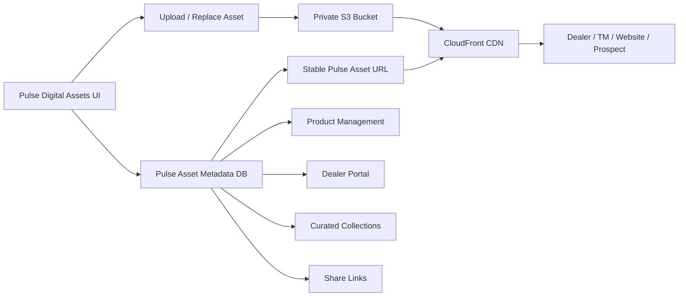
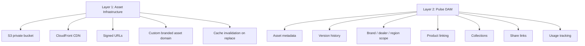
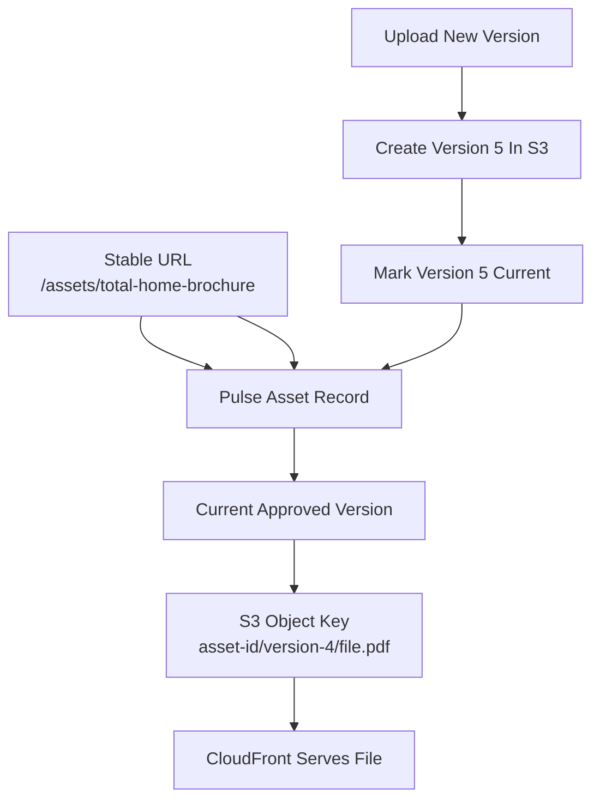
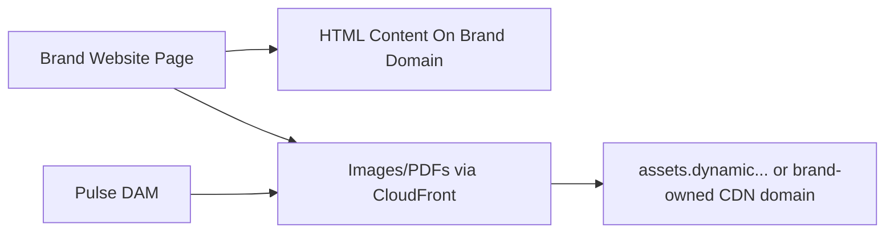
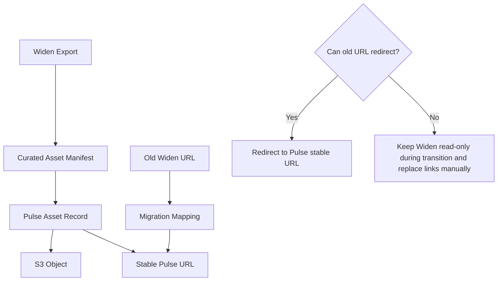
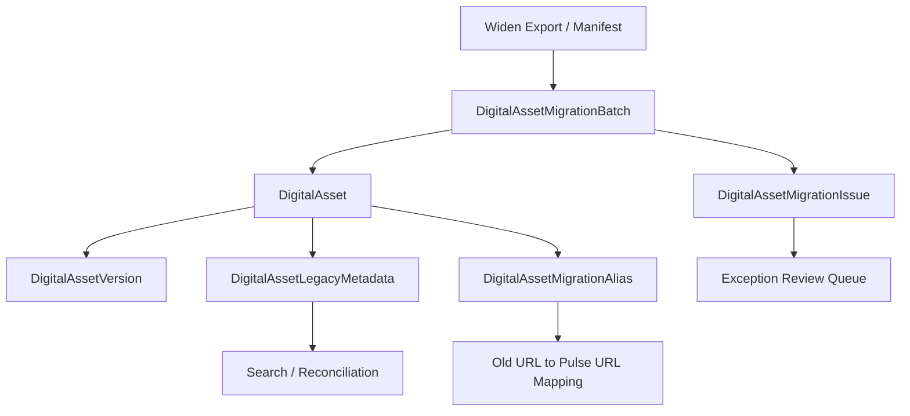
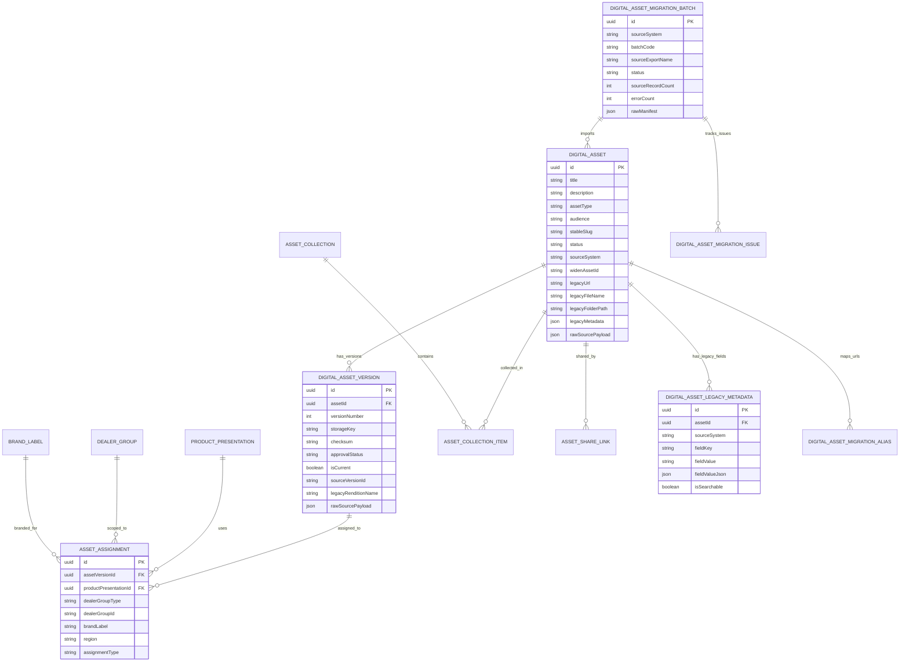

# Widen Replacement And Digital Assets PRD

## Document Control

| Field | Value |
|---|---|
| Module | Digital Assets / Widen Replacement |
| Status | Active development PRD |
| Date | 2026-05-01 |
| Owner | Marketing / Product / Architecture |
| Target Technical Path | Pulse metadata + AWS S3 private storage + AWS CloudFront delivery |
| Requirements Sources | Session 12 Reporting and Widen, Digital Assets PRD, integration register, digital assets scope workbook |

## Executive Summary

Pulse will replace Widen for the bounded product/dealer asset workflow described in discovery: approved product literature, images, brochures, videos, spec sheets, install guides, dealer-safe collections, stable share links, and quick search/share behavior for internal and dealer users.

Pulse should not promise a full enterprise DAM replacement unless leadership separately approves that scope. Internal marketing working files, long-tail historical DAM archive, complex rights management, and broad non-product DAM workflows remain outside Phase 1.

The architecture is simple but must be governed: S3 stores binaries, CloudFront delivers them, and Pulse owns asset identity, metadata, versioning, permissions, product linkage, dealer-group visibility, stable URLs, audit, and user experience.

## Scope Boundary

| Workflow | Phase 1 Scope | Notes |
|---|---:|---|
| Dealer product literature | Yes | Replace Widen/Dropbox hunts with Pulse library. |
| Dealer videos | Yes | Share by stable link instead of attachments. |
| Product images/specs/install guides | Yes | Linked to Product Management. |
| Branded dealer collections | Yes | Portal-style collections by brand/region/dealer group. |
| Single asset reused across destinations | Yes | Stable Pulse URL points to current approved version. |
| Widen URL migration/preservation | Yes, as migration plan | Requires Widen export and redirect/coexistence decision. |
| Internal marketing working files | No | Keep outside Phase 1 unless separately approved. |
| Long-tail historical archive | No | Retain outside launch library unless curated. |
| Enterprise DAM rights/governance | No | Separate decision. |

## Target Architecture

## Layered Responsibilities

## Stable URL And Versioning Model

The external stable URL must not change when an asset is renamed or replaced. A new binary creates a new version record and S3 object. Pulse changes the current approved version pointer after approval. The same stable URL then resolves to the new approved file.

## SEO And Website Content Guidance

For SEO-sensitive content, the brand website should keep meaningful product/case-study text as HTML on the brand domain. Pulse/S3/CloudFront should serve governed images, PDFs, downloads, and media assets. This avoids the current concern where Widen-hosted PDF/content links can move SEO value away from the brand site or create broken link risk.

## Migration And Link Preservation

Required migration fields:

| Field | Purpose |
|---|---|
| Widen asset ID | Legacy traceability. |
| Old Widen URL | Link mapping and broken-link review. |
| File name and title | Search and user recognition. |
| File checksum | Duplicate detection and migration validation. |
| Asset type | Image, brochure, video, spec sheet, install guide, document. |
| Brand | Wrong-brand warning and filters. |
| Region | Dealer portal and product presentation filtering. |
| Dealer group / audience | Permission-aware serving. |
| Product SKU / product family | Product Management linkage. |
| Current usage context | Website, portal, collection, product page, shared link. |

### Legacy Migration Flexibility

Widen export shape is not fully controlled by Pulse, so the migration schema must absorb inconsistent legacy fields without turning every Widen column into a permanent governed CRM field.

The Pulse model uses three layers:

| Layer | Storage | Purpose |
|---|---|---|
| Governed asset fields | `DigitalAsset` / `DigitalAssetVersion` columns | Search, filters, lifecycle, permissions, versioning, link preservation, audit. |
| Searchable legacy metadata | `DigitalAssetLegacyMetadata` rows | Arbitrary Widen metadata fields that users may need to search, reconcile, or review during migration. |
| Raw source snapshots | JSON payloads on asset/version/alias/batch/issue records | Lossless migration evidence so unknown Widen fields are not discarded. |

Migration batches record source export name, source counts, imported counts, skipped counts, errors, start/end timestamps, and raw manifest. Asset records retain normalized legacy fields such as Widen ID, legacy URL, file name, folder path, legacy created/updated/published dates, migration batch, and raw source payload. Version records retain source version/rendition IDs and download URLs. Import issues preserve row-level exceptions instead of silently dropping bad rows.

This keeps the launch schema flexible for legacy Widen data while still preserving explicit columns for fields that drive permissions, filtering, reporting, product linkage, and cutover verification.

## Functional Requirements

| ID | Requirement | Acceptance Criteria | Priority |
|---|---|---|---|
| DA-001 | Asset upload | Upload approved images, PDFs, videos, and documents with required metadata. | P0 |
| DA-002 | Metadata validation | Asset cannot be published/shareable until required title, type, brand/audience/scope metadata is complete. | P0 |
| DA-003 | Versioning | Upload replacement version while retaining history and preserving stable URL. | P0 |
| DA-004 | Stable asset URLs | Stable Pulse URL survives rename and version replacement. | P0 |
| DA-005 | S3 private storage | Binary stored outside DB with private bucket/container policy. | P0 |
| DA-006 | CloudFront delivery | Authorized previews/downloads served through CDN/signed delivery. | P0 |
| DA-007 | Search and filters | Search by title/description/tags and filter by brand, region, dealer group, category, file type, audience. | P0 |
| DA-008 | Preview | Browser preview for images/PDFs and thumbnail for videos. | P0 |
| DA-009 | Product linking | Attach approved assets to product presentations with asset type and sort order. | P0 |
| DA-010 | Dealer-safe access | Dealer Portal sees only assets allowed for the resolved dealer context. | P0 |
| DA-011 | Wrong-brand warning | Warn/block product or collection publish when asset brand scope conflicts. | P0 |
| DA-012 | Collections | Admin can create curated asset collections for dealer/product use cases. | P1 |
| DA-013 | Quick share | Internal users can generate link-first shares with optional expiration. | P1 |
| DA-014 | Usage tracking | Track product/collection/dealer usage and download audit events. | P1 |
| DA-015 | Widen curated import | Import curated Widen subset with metadata, source IDs, checksums, and link mapping. | P1 |
| DA-016 | Dropbox curated import | Import approved Dropbox files for product/dealer/operational workflows only. | P1 |
| DA-017 | Duplicate detection | Detect duplicate imports by checksum and metadata. | P1 |
| DA-018 | Mobile-friendly layout | Phone-friendly search/share is required in final UX, but mobile app implementation is deferred. | P1 |
| DA-019 | Legacy migration auditability | Track Widen import batches, raw source payloads, searchable legacy metadata, migration aliases, and row-level issues. | P0 |

## Access Modes

| Mode | Audience | Behavior |
|---|---|---|
| Internal library | Authenticated internal users | Browse and manage according to role. |
| Dealer-safe collection | Authenticated dealers | Only approved assets for dealer group, brand, region, and audience. |
| Share link | External recipient or prospect | Explicitly approved asset/collection, optional expiration, audit where possible. |
| Public website asset | Website visitor | CDN-served public asset where approved for web use. |

## Data Model

## Build Now Versus Parked

| Build Now | Park Until Decision / Access |
|---|---|
| Pulse metadata model | Full enterprise DAM replacement |
| S3/CloudFront-ready storage abstraction | Final production AWS account/IAM setup if credentials unavailable |
| Stable URL resolver | Automatic old Widen URL redirects if Widen/domain control is unavailable |
| Version history and current pointer | Advanced legal/rights lifecycle |
| Product/dealer/brand asset scoping | Long-tail archive migration |
| Curated Widen manifest import design | Non-product marketing working files |
| Dealer-safe asset feed | Mobile app implementation |

## Delivery Slices

| Slice | Scope | Output |
|---|---|---|
| DA0 | PRD and scope control | This PRD plus migration boundary. |
| DA1 | Schema/contracts/storage abstraction | DigitalAsset, DigitalAssetVersion, assignments, collections, share links. |
| DA2 | API foundation | List/search/detail/version/link/publish/check endpoints. |
| DA3 | CRM web asset library | Internal asset library, filters, preview, metadata, version panel. |
| DA4 | Product Management integration | Product detail Files tab, required asset checks, wrong-brand warnings. |
| DA5 | Dealer portal feed | Dealer-safe downloads/resources and product page assets. |
| DA6 | Widen migration | Curated manifest import, checksum reconciliation, old-to-new link mapping. |

## Open Decisions

| ID | Decision | Owner | Impact |
|---|---|---|---|
| DA-Q01 | Final AWS account/IAM/bucket/CDN naming standard | Architecture | Deployment and environment config. |
| DA-Q02 | Existing Widen URL redirect/control strategy | Marketing + Architecture | Cutover risk and coexistence duration. |
| DA-Q03 | File size limits, video handling, and lifecycle retention | Architecture + Marketing | Upload constraints and storage cost. |
| DA-Q04 | Minimum Phase 1 parity for collections/share pages | Marketing + Product | UI and release scope. |
| DA-Q05 | Approval workflow depth | Marketing + Product | Whether Phase 1 uses simple status or formal approval tasks. |
