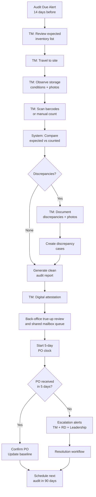

# Consignment Management PRD

## Document Control
| Field | Value |
|-------|-------|
| Module | Consignment Management |
| Document Type | Master PRD |
| Version | 1.1 |
| Status | Draft - traceability closure pass complete |
| Owner | Product / Operations |
| Sprint Sequence | Seq 04–05, M-Seq 04 |
| Priority | P1 |
| Meeting Traceability | Session 5 (Feb 25 2026), Session 6 (Feb 27 2026), Session 10 (Mar 17 2026), April 20 scope review, supporting consignment onboarding/forms/docs/workbooks/screenshots shared by Samantha |
| Primary Companion Docs | `CONSIGNMENT_STAKEHOLDER_SWIMLANE.md`, `validated/authoritative/CONSIGNMENT_OPERATING_MODEL_AND_SCHEMA_VALIDATION.md` |

---

## 1. Executive Summary

The Consignment Management module replaces spreadsheet-driven consignment tracking with a governed system covering pre-warehouse onboarding, agreement management, site management, Acumatica-linked transfer and receipt visibility, BLUE baseline verification, 90-day audit cycles (ROSE), physical reconciliation, discrepancy handling, shared mailbox work queue operations, and PO follow-up. Consignment = inventory placed at customer location, owned by Dynamic AQS until sold/consumed by the customer.

The enrollment backbone is: signed program agreement -> warehouse/site created in Acumatica -> initial transfer and receipt -> BLUE verification -> baseline established. Recurring ROSE audits and reconciliation follow that governed baseline.

The 90-day ROSE audit cycle is the heartbeat of consignment operations, executed by TMs in the field using the mobile app.

---

## 2. Problem Statement

### Current State
- Consignment tracked in master spreadsheets — error-prone, no audit trail
- TMs manually count inventory with paper forms
- Discrepancies discovered weeks after audit
- PO follow-up relies on memory and email chains
- Shared mailbox, Dropbox forms, and TM folders hold the real operational history
- No visibility into overdue audits for leadership
- ROSE audit steps not standardized

### Target State
- Governed consignment sites with auto-scheduled 90-day audit cycles
- Mobile-first ROSE audit with barcode scanning
- Automated discrepancy detection and PO follow-up clock
- Mini onboarding pipeline before warehouse creation so Ops can see customers who started consignment but are not warehouse-ready yet
- Digital document and form history for BLUE, ROSE, PURPLE, and SAND events
- Leadership dashboard for consignment health across all sites
- Full audit history with photos and signed forms

---

## 3. Functional Requirements

### 3.1 Enrollment & Agreement (FR-CSG-001 through FR-CSG-010)

| ID | Requirement | Acceptance Criteria | Priority | Sprint |
|----|------------|-------------------|----------|--------|
| FR-CSG-001 | Consignment enrollment from lead/customer | Capture interest during onboarding or later; track: not_discussed → interested → approved → declined | P0 | Seq 04 |
| FR-CSG-002 | Consignment agreement management | Upload/store signed consignment agreement per customer | P0 | Seq 04 |
| FR-CSG-003 | Agreement template | Standardized agreement template with customer-specific terms | P1 | Seq 04 |
| FR-CSG-004 | Enrollment approval workflow | TM recommends → Sales Leadership approves → Agreement generated | P0 | Seq 04 |
| FR-CSG-005 | Consignment site creation | On approval: create consignment site linked to customer location; signed agreement triggers Acumatica warehouse/site creation, warehouse ID assignment, and readiness tracking before the first deployment | P0 | Seq 04 |
| FR-CSG-006 | Initial inventory deployment | Track: signed agreement → warehouse/site created in Acumatica → initial transfer order shipped/received → BLUE form sent → BLUE form completed → baseline established | P0 | Seq 04 |
| FR-CSG-007 | BLUE form workflow | Initial inventory verification: send form → customer confirms receipt → baseline established | P0 | Seq 04 |
| FR-CSG-008 | Disenrollment workflow | Close consignment through written notice, final joint reconciliation, PO/settlement for remaining or missing inventory, return of Dynamic-owned saleable stock, and formal site closure | P1 | Seq 05 |
| FR-CSG-009 | Consignment site list | View all consignment sites with status, last audit, next audit due, assigned TM | P0 | Seq 04 |
| FR-CSG-010 | Site status tracking | Active / Suspended / Closed | P0 | Seq 04 |

### 3.2 ROSE Audit Cycle (FR-CSG-011 through FR-CSG-025)

| ID | Requirement | Acceptance Criteria | Priority | Sprint |
|----|------------|-------------------|----------|--------|
| FR-CSG-011 | 90-day audit cycle scheduling | In Phase 1, system auto-schedules the next on-site audit 90 days from baseline establishment or the last completed audit | P0 | Seq 04 |
| FR-CSG-012 | Audit due alerts | Alert TM + RD 14 days before audit due, 7 days before, and on due date | P0 | Seq 04 |
| FR-CSG-013 | Overdue audit escalation | If audit not completed by due date: +7 days → RD alert; +14 days → Sales Leadership alert | P0 | Seq 04 |
| FR-CSG-014 | ROSE Step 1: Review | TM reviews expected inventory list from last audit/deployment before visiting site | P0 | Seq 04 |
| FR-CSG-015 | ROSE Step 2: Observe | TM arrives at site, observes inventory storage conditions | P0 | Seq 04 |
| FR-CSG-016 | ROSE Step 3: Scan | TM scans barcodes of all consignment items present; OR manual count entry | P0 | Seq 04 |
| FR-CSG-017 | ROSE Step 4: Evaluate | System compares scanned count vs expected count; calculates: present, consumed (expected - present), missing (unaccounted) | P0 | Seq 04 |
| FR-CSG-018 | ROSE Step 5: Exceptions | TM documents any discrepancies with photos and notes | P0 | Seq 04 |
| FR-CSG-019 | ROSE Step 6: Report | Generate audit report: inventory counted, consumed, missing, discrepancies, photos, TM signature | P0 | Seq 04 |
| FR-CSG-020 | ROSE Step 7: Settle | Initiate PO process for consumed items; handle discrepancy cases | P0 | Seq 04 |
| FR-CSG-021 | Audit line items | Each audit tracks: product SKU, expected quantity, counted quantity, status (present/consumed/missing) | P0 | Seq 04 |
| FR-CSG-022 | Barcode scanning (mobile) | Camera-based barcode scanning for inventory count; manual fallback | P0 | M-Seq 04 |
| FR-CSG-023 | Audit photos | Capture photos during audit (storage conditions, inventory, discrepancies) | P0 | M-Seq 04 |
| FR-CSG-024 | Audit attestation | TM provides digital attestation on completed ROSE audits; recurring customer signature is optional unless required by a specific program variant, while initial BLUE/agreement verification remains signature-backed | P0 | M-Seq 04 |
| FR-CSG-025 | Offline audit support | Complete full ROSE audit offline; sync when connected | P0 | M-Seq 04 |

### 3.3 Reconciliation & PO (FR-CSG-026 through FR-CSG-035)

| ID | Requirement | Acceptance Criteria | Priority | Sprint |
|----|------------|-------------------|----------|--------|
| FR-CSG-026 | Reconciliation algorithm | Expected = last baseline + additions - known POs; Consumed = Expected - Counted; Missing = Consumed - customer-confirmed usage | P0 | Seq 04 |
| FR-CSG-027 | Discrepancy case creation | Auto-create discrepancy case when missing items detected; assign to TM | P0 | Seq 04 |
| FR-CSG-028 | Discrepancy resolution workflow | TM investigates → documents resolution (found, confirmed consumed, write-off) → close case | P0 | Seq 04 |
| FR-CSG-029 | PO follow-up — 5 business day clock | After audit completion and true-up review, customer has 5 business days to submit PO for consumed items; system tracks deadline | P0 | Seq 04 |
| FR-CSG-030 | PO clock alerts | Alert at: PO clock start, 3 days remaining, 1 day remaining, overdue | P0 | Seq 04 |
| FR-CSG-031 | PO received confirmation | Admin/Ops or the shared consignment mailbox work queue confirms PO received, closes PO follow-up, and updates inventory baseline when reconciliation is resolved | P0 | Seq 04 |
| FR-CSG-032 | PO overdue escalation | If PO not received by day 5: alert TM + RD. Day 10: Sales Leadership | P0 | Seq 04 |
| FR-CSG-033 | Inventory baseline update | After PO confirmed + discrepancies resolved: update baseline for next audit cycle | P0 | Seq 04 |
| FR-CSG-034 | Acumatica inventory sync | Consignment warehouse inventory synced from Acumatica as read model | P0 | Seq 05 |
| FR-CSG-035 | PO generation to Acumatica | On PO confirmation, create/link PO in Acumatica | P1 | Seq 05 |

### 3.4 BLUE/PURPLE/SAND Cycles (FR-CSG-036 through FR-CSG-040)

| ID | Requirement | Acceptance Criteria | Priority | Sprint |
|----|------------|-------------------|----------|--------|
| FR-CSG-036 | BLUE cycle | Initial receipt/baseline verification after first deployment; separate from ROSE and required before the site is considered baseline-complete | P0 | Seq 04 |
| FR-CSG-037 | PURPLE cycle | Inventory-adjustment form/process for approved additions or reductions to the baseline; not the default workflow for ordinary replenishment | P2 | Seq 05 |
| FR-CSG-038 | SAND cycle | Annual comprehensive audit with full reconciliation + agreement review | P2 | Seq 05 |
| FR-CSG-039 | Cycle type tracking | Each audit tagged with cycle type (ROSE/BLUE/PURPLE/SAND) | P0 | Seq 04 |
| FR-CSG-040 | Cycle scheduling rules | ROSE: 90-day recurring on-site audit; BLUE: on initial deployment; PURPLE: event-driven for approved baseline changes; SAND: annual/strategic review if retained in final policy | P0 | Seq 04 |

### 3.5 Discovery Clarifications — Operational Controls, ERP Boundaries, and Visibility (FR-CSG-041 through FR-CSG-055)

| ID | Requirement | Acceptance Criteria | Priority | Sprint |
|----|------------|-------------------|----------|--------|
| FR-CSG-041 | Audit and reconciliation are separate states | A site audit can be marked complete while reconciliation remains open; users can see both statuses independently | P0 | Seq 04 |
| FR-CSG-042 | PO clock starts only after true-up review | The 5-business-day PO clock begins only after open POs, in-transit items, and transfer/receipt status are reviewed and a real unresolved consumption discrepancy remains | P0 | Seq 04 |
| FR-CSG-043 | Near-real-time warehouse context | Consignment status must account for in-transit product, submitted POs, shipped replenishment, and transfer orders that are not complete until receipt in Acumatica | P0 | Seq 05 |
| FR-CSG-044 | Acumatica-first warehouse creation | New warehouse/location creation defaults to Acumatica as system of record, with Pulse syncing the result; if Pulse-origin creation exists it must be restricted to high-permission admins only | P0 | Seq 04 |
| FR-CSG-045 | Role-filtered consignment dashboards | TMs see only their assigned sites, RDs see their regional rollup, and leadership/Ops see the full program | P0 | Seq 04 |
| FR-CSG-046 | Warehouse readiness snapshot | Dashboard shows onboarding/active/exited status, warehouse readiness, current variance, and next audit timing at a glance | P1 | Seq 04 |
| FR-CSG-047 | BLUE form baseline activation | Initial deployment is not considered baseline-complete until customer receipt is acknowledged and the BLUE verification step is completed | P0 | Seq 04 |
| FR-CSG-048 | Variance drilldown | KPI cards and dashboards drill into the exact SKUs and discrepancy details behind the variance, not just summary counts | P1 | Seq 04 |
| FR-CSG-049 | Manual count remains required | Pulse improves tracking and reconciliation workflow but does not eliminate the need for physical on-site counting by the TM | P0 | Seq 04 |
| FR-CSG-050 | Customer account indicator | Customer/account pages visibly indicate consignment participation and allow drill-down into the related site/program details | P1 | Seq 04 |
| FR-CSG-051 | Shared mailbox operating queue | Shared consignment inbox/work queue owns requests, inventory updates, PO chasing, and customer correspondence, with Customer Experience/Ops monitoring and TMs copied as required | P0 | Seq 04 |
| FR-CSG-052 | BLUE/PURPLE document semantics | BLUE establishes the initial verified baseline after first receipt, while PURPLE records approved baseline additions/reductions rather than standard replenishment activity | P0 | Seq 04 |
| FR-CSG-053 | Phase 1 on-site audit mode | Phase 1 assumes physical on-site ROSE audits rather than remote-only reconciliations, even if older process documents reference earlier timing variants | P0 | Seq 04 |
| FR-CSG-054 | Formal exit workflow controls | Exit/disenrollment includes written notice, final joint reconciliation, return/disposition instructions for Dynamic-owned inventory, and settlement tracking before closure | P1 | Seq 05 |
| FR-CSG-055 | TM mobile audit and back-office reconciliation split | TMs get a simple account-level consignment audit flow on mobile, while back-office users retain separate reconciliation drilldown, missing-item investigation, and point-of-reference replacement tools | P0 | Seq 04 |

### 3.6 Operating Detail from Samantha Feedback (FR-CSG-056 through FR-CSG-060)

| ID | Requirement | Acceptance Criteria | Priority | Sprint |
|----|------------|-------------------|----------|--------|
| FR-CSG-056 | Pre-warehouse consignment onboarding pipeline | Pulse tracks `interest captured -> onboarding in progress -> ready for warehouse -> warehouse created -> baseline pending -> active` so Ops can see customers who start consignment but do not reach warehouse creation | P0 | Seq 04 |
| FR-CSG-057 | Digital consignment document register | Store and track operational forms by type and status: program agreement, BLUE verification, ROSE reconciliation, PURPLE adjustment, SAND exit, and TM inventory master references | P0 | Seq 04 |
| FR-CSG-058 | Transfer and receipt linkage | Pulse stores the transfer order / receipt references that establish or replenish a site so users can distinguish shipped, in-transit, and received inventory before declaring a discrepancy | P0 | Seq 05 |
| FR-CSG-059 | Shared mailbox and outreach history | Consignment work queue stores inbound/outbound correspondence state, owner, last contact date, escalation state, and links back to the relevant site, audit, form, or PO follow-up | P0 | Seq 04 |
| FR-CSG-060 | True-up review checkpoint | Audit completion, true-up review, and PO follow-up start are distinct timestamps so the system only starts the PO clock after open POs, in-transit items, and transfer receipts are reviewed | P0 | Seq 04 |

---

## 4. ROSE Audit Flow



---

## 4A. End-to-End Workflow Reference Architecture (Pulse ↔ Acumatica)

This section is the authoritative reference for how a consignment site moves through its full life across both systems. Section 4 covers the ROSE loop in detail; this section places that loop inside the five lifecycle phases and names every cross-system boundary.

### 4A.1 System ownership in one line each

- **Pulse is the workflow + evidence + people system.** Owns: enrollment funnel, agreements, signed forms, ROSE 90-day cadence, mobile field execution, discrepancy cases, the 5-business-day PO clock, shared-mailbox work queue, audit history, dashboards.
- **Acumatica is the warehouse + financial truth system.** Owns: warehouse creation, transfer orders, transfer receipts, inventory on-hand balance, PO/sales-order posting, invoice/credit-memo posting, financial settlement.

Pulse never invents a `warehouseCode`, never posts a PO, never adjusts inventory truth. Acumatica never schedules ROSE audits, never holds field photos/signatures, never owns the 5-day clock.

### 4A.2 The five lifecycle phases

| Phase | What happens | Pulse role | Acumatica role |
| --- | --- | --- | --- |
| **1. Enrollment** | Lead → interested → qualified → approved | Owns funnel + approval workflow + agreement | None |
| **2. Setup (BLUE)** | Agreement signed → warehouse created → initial transfer → receipt → BLUE baseline verified | Owns onboarding checklist, BLUE form, readiness, evidence | Owns warehouse creation, TR transfer, receipt posting |
| **3. Active ROSE cycle** | 90-day audits forever; each audit triggers a PO clock | Owns scheduling, mobile execution, photos, attestation, true-up review, PO clock, escalations, discrepancy cases | Receives PO when reconciliation resolves; provides inventory read model |
| **4. PURPLE adjustments (event-driven)** | Approved baseline change (adds/removes) | Owns the PURPLE form + reviewer approval | Posts the inventory adjustment after Pulse approves |
| **5. Exit (SAND)** | Notice → final reconciliation → final PO → returns → close | Owns exit form, joint final audit, closure evidence | Posts final PO, receives returned stock, posts credit-memo, closes warehouse |

### 4A.3 End-to-end diagram

```mermaid
flowchart TB
  classDef pulse fill:#dbeafe,stroke:#1d4ed8,stroke-width:1px,color:#0b1733
  classDef acumatica fill:#fee2e2,stroke:#b91c1c,stroke-width:1px,color:#3f0a0a
  classDef gate fill:#fef3c7,stroke:#b45309,stroke-width:1.5px,color:#3b1d05
  classDef end_ fill:#dcfce7,stroke:#15803d,stroke-width:1px,color:#052e16

  subgraph P1["PHASE 1 — Enrollment (Pulse owns)"]
    direction TB
    L1["Lead/Account flagged<br/>consignmentInterestStatus = interested"]:::pulse
    L2["TM qualifies → recommends<br/>(qualification_review)"]:::pulse
    L3["Sales Leadership approves<br/>(approved)"]:::pulse
    L4["Pulse generates agreement<br/>ConsignmentForm.AGREEMENT (draft)"]:::pulse
    L5["Agreement sent → signed<br/>(awaiting_signature → completed)"]:::pulse
  end
  L1 --> L2 --> L3 --> L4 --> L5

  G1{{"GATE 1<br/>Signed agreement required<br/>before warehouse creation"}}:::gate
  L5 --> G1

  subgraph P2["PHASE 2 — Setup &amp; BLUE baseline"]
    direction TB
    S1["Pulse creates ConsignmentSite<br/>status=onboarding_in_progress<br/>acumaticaStatus=PARKED"]:::pulse
    S2["Pulse opens onboarding checklist<br/>(13 items)"]:::pulse
    A1["Acumatica: create warehouse<br/>+ assign warehouse ID"]:::acumatica
    A2["Acumatica: create initial<br/>TR transfer order"]:::acumatica
    A3["Acumatica: post transfer<br/>receipt at customer site"]:::acumatica
    S3["Pulse syncs warehouseCode +<br/>acumaticaWarehouseId<br/>acumaticaStatus=READY"]:::pulse
    S4["Pulse sends BLUE form<br/>to customer (mobile/email)"]:::pulse
    S5["Customer confirms receipt<br/>BLUE signed (TM + customer)"]:::pulse
    S6["Pulse sets<br/>baselineEstablishedAt = NOW<br/>status = active<br/>nextAuditDueAt = NOW + 90d"]:::pulse
  end
  G1 --> S1 --> S2 --> A1
  A1 --> A2 --> A3 --> S3 --> S4 --> S5 --> S6

  subgraph P3["PHASE 3 — ROSE 90-day cycle (recurring)"]
    direction TB
    R0["Pulse scheduler:<br/>T-14d, T-7d, T-0 alerts<br/>to TM + RD"]:::pulse
    R1["TM (mobile) Step 1: Review<br/>expected inventory from<br/>last baseline + receipts − POs"]:::pulse
    R2["TM Step 2-3: Observe + Scan<br/>barcodes / manual count<br/>+ photos (offline-capable)"]:::pulse
    R3["Pulse Step 4: Evaluate<br/>counted vs expected →<br/>PRESENT / CONSUMED / MISSING / OVERAGE"]:::pulse
    R4["TM Step 5-6: Exceptions + Report<br/>discrepancy cases auto-created<br/>+ TM digital attestation"]:::pulse
    R5["Back-office true-up review<br/>(shared-mailbox work queue)"]:::pulse
    R6["Pulse starts 5-business-day PO clock<br/>poClockStart=true_up_confirmed<br/>poDueAt = +5 biz days"]:::pulse
    R7["Pulse alerts: clock start,<br/>T-3, T-1, OVERDUE"]:::pulse
  end

  S6 --> R0 --> R1 --> R2 --> R3 --> R4 --> R5 --> R6 --> R7

  PO_GATE{{"PO received in 5 days?"}}:::gate
  R7 --> PO_GATE

  PO_YES["Ops/mailbox confirms<br/>PO received"]:::pulse
  PO_NO["Day+5: TM+RD escalation<br/>Day+10: Sales Leadership"]:::pulse
  PO_GATE -- "yes" --> PO_YES
  PO_GATE -- "no" --> PO_NO

  A4["Acumatica: PO posted<br/>(create or link)"]:::acumatica
  A5["Acumatica: inventory baseline<br/>updated in ERP"]:::acumatica
  PO_YES --> A4 --> A5

  REC["Pulse: update<br/>baselineEstablishedAt<br/>+ schedule next ROSE +90d"]:::pulse
  A5 --> REC
  PO_NO --> R5

  REC -->|"loop back"| R0

  subgraph P4["PHASE 4 — PURPLE adjustment (event-driven)"]
    direction TB
    PU1["Approved baseline change<br/>requested (add/remove SKUs)"]:::pulse
    PU2["Pulse PURPLE form<br/>+ reviewer approval"]:::pulse
    PU3["Acumatica posts<br/>inventory adjustment"]:::acumatica
    PU4["Pulse updates<br/>baselineEstablishedAt"]:::pulse
  end
  REC -.->|"out-of-cycle change"| PU1 --> PU2 --> PU3 --> PU4 -.-> R0

  subgraph P5["PHASE 5 — Exit (SAND)"]
    direction TB
    X1["Written notice received<br/>status = exit_pending"]:::pulse
    X2["Joint final reconciliation<br/>(TM + customer)"]:::pulse
    X3["Final PO for consumed/missing"]:::pulse
    X4["Returns of saleable stock"]:::acumatica
    X5["Acumatica final settlement<br/>+ credit memo + close warehouse"]:::acumatica
    X6["Pulse: status=closed<br/>exitedAt=NOW"]:::end_
  end
  REC -.->|"customer requests exit"| X1 --> X2 --> X3 --> X4 --> X5 --> X6
```



### 4A.4 Step-by-step walkthrough (numbered)

**Phase 1 — Enrollment (Pulse only)**

1. Lead/account flagged consignment-interested (`Account.consignmentInterestStatus = interested`).
2. TM qualifies (location fit, volume, term) and writes a recommendation.
3. Sales Leadership reviews and approves — gate before any agreement is sent.
4. Pulse generates the agreement (`ConsignmentForm.formType = AGREEMENT`, status `draft`).
5. Customer signs. Status moves `draft → sent → awaiting_signature → completed`. E-sign provider is parked; manual upload of countersigned PDF for now.

> **Gate 1 (FR-CSG-005)** — `acumaticaStatus` cannot leave `PARKED` until the agreement form is `completed`.

**Phase 2 — Setup / BLUE baseline**

6. Pulse creates `ConsignmentSite` linked to `Account` + `AccountLocation`. Initial: `status = onboarding_in_progress`, `acumaticaStatus = PARKED`, `baselineEstablishedAt = null`.
7. Pulse opens the 13-item onboarding checklist (location criteria, signed agreement on file, Acumatica warehouse created, warehouse details entered, customer consignment flag, Warehouse Visit Tracking record, Inventory Master generated, mailbox workflow assigned, initial stock shipped, BLUE returned, training/communication complete, go-live approved).
8. **Acumatica creates the warehouse** and assigns a warehouse ID. `acumaticaStatus` moves `PARKED → PENDING → READY`. `acumaticaWarehouseId` populated in Pulse.
9. **Acumatica creates the TR transfer order** for the initial stock.
10. **Acumatica posts the transfer receipt** at the customer site.
11. Pulse sends the BLUE form to the customer (mobile/email). TM walks the customer through receipt verification.
12. BLUE completed — TM and customer both sign. `ConsignmentForm.formType = BLUE` status `completed`.
13. Pulse stamps `baselineEstablishedAt = NOW`, sets `status = active`, schedules the first ROSE: `nextAuditDueAt = NOW + 90 days`.

**Phase 3 — Active ROSE 90-day cycle**

14. **Pulse scheduler fires** T-14d, T-7d, T-0 alerts to TM + RD (FR-CSG-012; scanner wired in commit `ae7385a`, delivery dispatcher parked behind Microsoft Graph).
15. TM opens mobile app and runs the 7-step ROSE flow:
    - Step 1 Review: expected = `lastBaseline + additionsAfterLastAudit - knownPOs`
    - Step 2 Observe: photos of storage conditions
    - Step 3 Scan: barcode or manual count, offline-capable
    - Step 4 Evaluate: Pulse compares counted vs expected → `PRESENT / CONSUMED / MISSING / OVERAGE`
    - Step 5 Exceptions: any non-`PRESENT` auto-opens a `ConsignmentDiscrepancyCase`; TM attaches photos + notes
    - Step 6 Report: Pulse generates `ConsignmentAudit` + `ConsignmentAuditLine[]` + `ConsignmentAuditEvidence[]`
    - Step 7 Attest: TM digital attestation; customer signature optional unless program variant requires it
16. Back-office true-up review (Ops/mailbox queue). When confirmed, `trueUpConfirmedAt = NOW`.
17. **Pulse starts the 5-business-day PO clock**: `poClockStartAt = trueUpConfirmedAt`, `poDueAt = addBusinessDays(trueUpConfirmedAt, 5)`. Alerts fire at clock start, T-3, T-1, OVERDUE (FR-CSG-030; scanner wired in commit `ae7385a`).
18. Branch on outcome:
    - **PO received in time** → Ops/mailbox marks PO received → **Acumatica posts/links the PO** → Acumatica updates ERP inventory → Pulse stamps the new `baselineEstablishedAt` and schedules `nextAuditDueAt = +90d` (FR-CSG-031/033 wired in commit `3fc9e8d`: `markConsignmentPoReceived` recalculates when the audit's last PO-required discrepancy closes).
    - **PO overdue** → Day +5 escalates to TM+RD, Day +10 to Sales Leadership; case stays open until resolved (waived / written off / received late).

**Phase 4 — PURPLE adjustments (event-driven, optional)**

19. Reviewer (TM/Ops) opens a `PURPLE` form (current quantity / add / remove / new total), attaches customer acknowledgement if required.
20. Approval gate (sales leadership for material changes).
21. **Acumatica posts the inventory adjustment** in the warehouse.
22. Pulse updates `baselineEstablishedAt`. ROSE cadence continues from the new baseline.

**Phase 5 — Exit / SAND**

23. Written notice received. `ConsignmentSite.status = exit_pending`. Pulse creates a `ConsignmentExit` record.
24. Joint final reconciliation (TM + customer) — a final ROSE-style audit captures everything on site.
25. Final PO issued by the customer for consumed/missing inventory.
26. Returns — customer returns Dynamic-owned saleable stock; **Acumatica posts the transfer-back receipt**.
27. **Acumatica posts final settlement** — PO/invoice/credit memo for netted reconciliation, then closes the warehouse.
28. Pulse stamps `exitedAt = NOW`, `status = closed`. `ConsignmentExit` holds closure evidence.

### 4A.5 Wired-today status (truth as of 2026-06-08)

This is the honest delta between the architecture above and shipping code. Anything marked `WIRED` has both API service operations and a UI surface; `PARTIAL` has API but no UI or vice versa; `GAP` is in-scope-not-parked and is not yet implemented; `PARKED` waits on Acumatica/payment/Widen access.

Section 4A.7's first build slice (commits `3fc9e8d`, `b1ccbb7`, `f5223ca`, `ae7385a`) closed the four gaps the original audit flagged. The remaining items are all `PARKED` behind Acumatica/payment/Widen access and are not Pulse-owned work.

| Step | Requirement | Status | Evidence / location |
| --- | --- | --- | --- |
| 1–5 | Phase 1 enrollment + agreement | `WIRED` | `ConsignmentSiteDetail.tsx` Forms tab supports `agreement` formType; `upsertConsignmentDocument` / `updateConsignmentDocument` in `service.ts` |
| Gate 1 | Signed agreement before warehouse | `WIRED` | `hasSignedAgreement` check in `ConsignmentSiteDetail.tsx` |
| 6–7 | Site create + onboarding checklist | `WIRED` | `createConsignmentSite`, `listConsignmentReadinessItems` in `service.ts`; Create Site primary action in `ConsignmentWorkspace.tsx` |
| 8–10 | Acumatica warehouse create + TR + receipt | `PARKED` | `acumaticaStatus = PARKED` default in schema; resume requires sandbox + endpoint certification |
| 11–13 | BLUE form + baseline establishment | `WIRED` | BLUE formType in `ConsignmentSiteDetail.tsx`; `baselineEstablishedAt` column in schema |
| 14 | T-14 / T-7 / T-0 audit alerts | `WIRED` (FR-CSG-012, commit `ae7385a`) | Scanner `scanConsignmentOperationalAlerts` in `apps/api/src/modules/consignment/alerts.ts`; queue `CONSIGNMENT_OPERATIONAL_ALERT_SCAN_QUEUE`; persists `ConsignmentOperationalAlert` records, dedupe-key idempotent. Delivery dispatcher is the same parked Microsoft Graph dependency as lead alerts |
| 15 | Mobile 7-step ROSE execution | `WIRED` | `apps/mobile/src/hooks/use-consignment-rose-audit.ts`; `apps/mobile/app/(tabs)/consignment.tsx`; offline-capable via `mobile-draft-queue.ts` |
| 16 | True-up review | `WIRED` | `confirmConsignmentTrueUp` in `service.ts` |
| 17 | PO clock start + T-3 / T-1 / overdue alerts | `WIRED` (FR-CSG-030, commit `ae7385a`) | Clock start in `service.ts` + scanner produces `PO_CLOCK_START` / `PO_CLOCK_THREE_DAYS_REMAINING` / `PO_CLOCK_ONE_DAY_REMAINING` alerts |
| 18 PO-yes | Mark PO received | `WIRED` (FR-CSG-031/033, commit `3fc9e8d`) | `markConsignmentPoReceived` now recalculates `baselineEstablishedAt = receivedAt`, schedules `nextAuditDueAt = +90d`, and sets `audit.reconciliationStatus = RESOLVED` when the last PO-required discrepancy for the audit closes |
| 18 PO-no | +5 / +10 escalations | `WIRED` (FR-CSG-032, commit `ae7385a`) | Scanner produces `PO_OVERDUE_FIVE_DAYS` (TM+RD) and `PO_OVERDUE_TEN_DAYS` (Sales Leadership) alerts |
| 18 → ERP | Acumatica PO posting + inventory baseline | `PARKED` | Resume on PO/order endpoint certification |
| Audit overdue | +7 / +14 escalations | `WIRED` (FR-CSG-013, commit `ae7385a`) | Scanner produces `AUDIT_OVERDUE_SEVEN_DAYS` and `AUDIT_OVERDUE_FOURTEEN_DAYS` alerts |
| 19–22 | PURPLE adjustment flow | `WIRED` (Pulse) / `PARKED` (Acumatica) | `createConsignmentAdjustment` + `applyConsignmentAdjustment` in `service.ts`; UI tab in `ConsignmentSiteDetail.tsx`; the Acumatica posting half is parked |
| 23–24 | SAND exit start + joint reconciliation | `WIRED` (Pulse) | `startConsignmentExit` in `service.ts`; UI tab at `ConsignmentSiteDetail.tsx` |
| 25–27 | Final PO + returns + settlement | `PARKED` | Acumatica finance truth |
| 28 | Close exit | `WIRED` (Pulse) | `closeConsignmentExit` in `service.ts` |
| Dashboard | Server-owned `/api/v1/consignment/dashboard` | `WIRED` (commit `b1ccbb7`) | `getConsignmentDashboard` in `apps/api/src/modules/consignment/service.ts`; scoped via `siteScopeWhere`, computes 14 metrics directly from Prisma (no client-side 200-row truncation) |
| Reports | Section 6 KPIs (10 formulas) | `WIRED` for 5 / `PARKED` for 1 (commits `b1ccbb7` + `f5223ca`) | Five new server-computed KPIs: `auditComplianceRatePct` (FR-CSG-019/021), `onTimeFirstBaselinePct` (FR-CSG-006/007), `overduePoCount` (FR-CSG-030), `meanPoCycleDays` (FR-CSG-029), `exitCompletionRatePct` (FR-CSG-008). Sixth KPI (`inventoryValueBySiteParked`) is correctly parked behind Acumatica inventory truth and surfaces a dashed "Parked" card in the Reports view |
| Alert delivery | Microsoft Graph sendMail for consignment alerts | `PARKED` | Same provider/credentials dependency as lead alerts; persisted `ConsignmentOperationalAlert` records sit in `PENDING` until Graph is certified |

### 4A.6 Integration boundary rules — non-negotiable

Three rules keep Pulse and Acumatica from creating double-truth:

1. **Pulse never invents a `warehouseCode` or `acumaticaWarehouseId`.** Until Acumatica returns a real warehouse ID, `acumaticaStatus` stays `PARKED` and the site **cannot leave `onboarding_in_progress`**. Admin exception allowed but audit-logged.
2. **Pulse never posts a PO.** It closes its own work item and stamps `poReceivedAt`, then *requests* Acumatica to post. Until Acumatica confirms, the PO is `pending_acumatica`. Inventory baseline does NOT recalculate until the Acumatica confirmation arrives.
3. **Every Acumatica-sourced number in Pulse carries `sourceRef + lastSyncedAt + syncStatus`** plus a stale-data warning. Pulse reports on workflow state truthfully; it does **not** report financial truth — it links out to Acumatica for that.

### 4A.7 First build slice — DELIVERED

The single slice originally identified as closing the audit's 14-point completion delta — the **time-pressure engine + baseline recalc + missing KPIs** — has been delivered across four commits:

| Commit | Slice | What it closed |
| --- | --- | --- |
| `3fc9e8d` | Baseline recalc bug fix | FR-CSG-031 / FR-CSG-033 — `markConsignmentPoReceived` now recalcs `baselineEstablishedAt` + `nextAuditDueAt` when the last PO-required discrepancy for an audit closes |
| `b1ccbb7` | Server-owned dashboard + 5 KPIs | `/api/v1/consignment/dashboard` endpoint with typed contract; replaces the client-side 200-row sample assembly; adds `auditComplianceRatePct`, `onTimeFirstBaselinePct`, `overduePoCount`, `meanPoCycleDays`, `exitCompletionRatePct` |
| `f5223ca` | KPI cards in Reports UI | Surfaces the 5 new KPIs as tone-colored cards with FR-CSG mapping in helper text; renders the 6th KPI (inventory value) as an explicit dashed "Parked" card |
| `ae7385a` | Time-pressure engine scanner | FR-CSG-012 / FR-CSG-013 / FR-CSG-030 / FR-CSG-032 — `ConsignmentOperationalAlert` schema + scheduled pg-boss scanner that materializes alerts for all 10 audit/PO windows, idempotent via `dedupeKey` |

### 4A.7.1 Next Pulse-owned slices

After this slice, the remaining Pulse-owned work (everything except Acumatica/payment/Widen) is:

1. **In-app alert surface** — pull `ConsignmentOperationalAlert` records with status `PENDING` into the Next Site Work queue and the mobile Today screen, so TMs and RDs see them without needing email delivery. This is the highest-leverage follow-up and does NOT require Microsoft Graph.
2. **Alert delivery dispatcher** — mirror the lead-alert `DELIVERY_QUEUE` + Microsoft Graph sendMail pattern for consignment alerts when Graph credentials are certified.
3. **Audit alert recipient roster** — admin-managed roster (TM / RD / Sales Leadership) by site/territory, modeled on `LeadOperationalAlertRecipient`.
4. **Reports drill-throughs** — clicking a KPI card opens the underlying filtered queue (e.g. "Audit compliance 70%" → list the late audits).

---

## 5. Reconciliation Algorithm

```
// After TM completes count:
expectedInventory = lastBaseline + additionsAfterLastAudit - knownPOs

for each product SKU:
    counted = scanned count from TM
    expected = expectedInventory[SKU]

    if counted == expected:
        status = PRESENT
    else if counted < expected:
        consumed = expected - counted
        status = CONSUMED
        // Customer should PO for consumed amount
    else if counted > expected:
        overage = counted - expected
        status = OVERAGE
        // Flag for investigation (customer added stock?)

consumed_total = SUM(consumed for all SKUs)
missing_total = SUM(items where discrepancy cannot be explained)

// PO amount = consumed_total value at current price class
po_amount = calculate_price(consumed_items, customer.priceClass)

// Start 5 business day PO clock
po_due_date = add_business_days(audit_completed_date, 5)
```

---

## 6. Reporting Requirements

| KPI | Formula |
|-----|---------|
| Active Consignment Sites | COUNT(sites WHERE status = Active) |
| Overdue Audits | COUNT(sites WHERE nextAuditDue < NOW AND lastAuditCompleted < nextAuditDue) |
| Audit Compliance Rate | COUNT(audits completed on time) / COUNT(audits due) × 100 |
| Average Discrepancy Rate | SUM(missing items) / SUM(expected items) × 100 |
| PO Recovery Rate | SUM(POs received on time) / SUM(POs generated) × 100 |
| PO Overdue Count | COUNT(PO follow-ups past due date) |
| Consignment Revenue (period) | SUM(PO amounts) in date range |
| Average Days to PO | AVG(po_received_date - audit_completed_date) |
| Site Inventory Value | SUM(current baseline × price) per site |
| Total Consignment Value | SUM(inventory value across all active sites) |

---

## 7. Open Questions

| # | Question | Impact | Decision Owner |
|---|---------|--------|---------------|
| OQ-CSG-01 | Barcode format? (UPC, QR, Code 128?) | Scanner implementation | Ops + Architecture |
| OQ-CSG-02 | What constitutes a "write-off" for discrepancies? | Financial policy | Finance + Samantha |
| OQ-CSG-03 | PURPLE and SAND cycle — mandatory or optional? | Process complexity | Ops |
| OQ-CSG-04 | Should consignment POs auto-create in Acumatica or manual? | Integration scope | Finance + Architecture |
| OQ-CSG-05 | Partial PO acceptance — can customer PO for part of consumed? | Financial rules | Finance |
| OQ-CSG-06 | Is “minute-by-minute” sync required, or is a short-delay operational SLA acceptable for Pulse consignment views? | Integration load vs accuracy | Ops + Architecture |
| OQ-CSG-07 | After onboarding, is the first follow-up always the standard 90-day on-site ROSE audit, or does any 45-60 day remote/onsite reconciliation variant remain in scope? | Process consistency | Ops + Samantha |

---

## 8. Sprint Mapping

| Sprint | Features |
|--------|---------|
| **Seq 04** | Enrollment workflow, agreement management, pre-warehouse onboarding pipeline, site creation, Acumatica-first warehouse governance, BLUE form, digital document register, baseline activation, 90-day ROSE cycle scheduling, all 7 ROSE steps, audit vs reconciliation state handling, true-up review checkpoint, reconciliation algorithm, discrepancy cases, PO follow-up with 5-day clock, shared mailbox work queue and outreach history, alerts (due/overdue/PO), role-filtered site list/dashboard, cycle type tracking, customer account indicator, TM mobile audit vs back-office reconciliation split |
| **Seq 05** | Near-real-time Acumatica inventory context, transfer/receipt linkage, PO generation to Acumatica, disenrollment/exit controls, PURPLE/SAND policy implementation, leadership dashboards, consignment reporting KPIs |
| **M-Seq 04** | Mobile ROSE audit (barcode scan, photos, signature, offline support), mobile site list, mobile audit completion |

---

## VALIDATION SUPPLEMENT — 2026-04-05

> Produced by BA validation pass against Sessions 5 (Feb 25 2026), 6 (Feb 27 2026), code evidence in `src/components/consignment/ConsignmentDashboard.tsx` and related component files, and `src/types/customer.ts`. All existing PRD content above is preserved verbatim.

---

### 1. PRD Validation Summary

| Area | Assessment |
|------|------------|
| Process coverage | Good. BLUE/ROSE/PURPLE/SAND lifecycle is represented. The 90-day cycle, PO clock, and reconciliation algorithm are present. |
| EARS requirements | **Missing.** All requirements are in table rows; no EARS-format sentences exist. |
| Acceptance criteria | Partial. Most rows state the requirement but not a testable pass/fail condition. |
| Missing from meetings | The Sessions 5/6 walkthrough revealed: (a) TM folder naming convention (TM name + warehouse ID) not captured; (b) color-coded form system (BLUE/PURPLE/ROSE/SAND) is acknowledged but the operational significance of the color system for field navigation is not formally documented; (c) hyperlink-to-reconciliation-form pattern in the master tracking file is a critical navigation shortcut that needs a digital equivalent; (d) dedicated consignment mailbox (separate from general inbox) confirmed and partially captured but communication ownership rules are vague; (e) the "exit form" (SAND disenrollment) is a real operational document, not optional. |
| Code vs PRD alignment | `ConsignmentDashboard.tsx` implements BLUE, ROSE, PURPLE, SAND, and NEW form types (`activeForm` state line 83). This matches PRD cycle types. The `addBusinessDays` function in the component (lines 58–69) correctly calculates the 5-business-day PO clock, aligning with FR-CSG-029. `Customer` type (`customer.ts`) has `isConsignmentActive`, `consignmentInterestStatus`, `consignmentEntryTiming`, `consignmentApprovedDate`, `consignmentApprovedBy`, and `consignmentDetails` — all align with enrollment model in FR-CSG-001 through FR-CSG-004. |
| Terminology deviation | Meetings use "warehouse" and "consignment location" interchangeably; PRD standardizes on "consignment site." Code uses "warehouse" (e.g., `useConsignmentStore`, `NewWarehouseForm`). Terminology should be reconciled across code and PRD. |
| Error handling | Absent. No section covers Acumatica sync failure during audit, offline mode sync conflict, or what happens when the PO clock fires but no escalation contact is configured. |
| Non-functional requirements | Absent. No latency or offline-mode sync targets. |

---

### 2. EARS Requirements (Missing from Existing PRD)

**FR-CSG-EARS-001** — TM folder and naming convention
> The system shall assign each consignment site a warehouse ID following the naming convention used in Acumatica, and shall link audit documents to both the warehouse ID and the assigned TM so that any document can be retrieved by either identifier without ambiguity.

**FR-CSG-EARS-002** — Digital equivalent of the hyperlink-to-form shortcut
> When an audit has unresolved discrepancies, the system shall provide a single-click navigation path from the consignment site overview to the specific reconciliation document for that audit, replacing the manual Excel hyperlink pattern currently in use.

**FR-CSG-EARS-003** — Color-coded cycle type visibility
> The system shall display each audit or form event with a visible cycle-type indicator (BLUE, ROSE, PURPLE, SAND) so that TMs and back-office users can distinguish event types at a glance without opening the record.

**FR-CSG-EARS-004** — Dedicated consignment communication channel
> The system shall route all consignment-related inbound and outbound communication through a designated consignment work queue, separate from general CRM inbox, monitored by Customer Experience/Ops, with TMs copied on actions relevant to their assigned sites.

**FR-CSG-EARS-005** — Inventory is a moving target; export freshness warning
> When a TM initiates a ROSE audit review, the system shall display the timestamp of the last Acumatica inventory sync and shall warn the TM if the data is more than [configurable threshold] hours old, so the TM understands they may be reviewing stale inventory data.

**FR-CSG-EARS-006** — CRM consignment flag on customer profile
> When a customer is enrolled in the consignment program, the system shall display a visible consignment indicator on the customer account profile so that any CRM user viewing the account immediately knows the customer is a consignment participant without navigating to a sub-page.

**FR-CSG-EARS-007** — Forms may become electronic but audit remains physical
> The system shall support digital completion of consignment forms (BLUE, ROSE, PURPLE, SAND) while maintaining the requirement that ROSE audits are conducted as physical on-site visits; the system shall not present "remote audit" as a default option for standard 90-day cycles.

---

### 3. Given/When/Then Acceptance Criteria (P0 Items)

**FR-CSG-001 — Consignment enrollment from lead/customer**
- **Given** a TM views a customer account
- **When** they initiate a consignment enrollment request
- **Then** the system captures the request, sets the status to `interested`, and notifies Sales Leadership for approval review; the status transitions are: `not_discussed → interested → approved → declined` and no step can be skipped without a recorded reason

**FR-CSG-011 — 90-day audit cycle scheduling**
- **Given** a consignment site has an established baseline (BLUE verification complete)
- **When** the baseline is confirmed
- **Then** the system auto-schedules the next ROSE audit exactly 90 calendar days from baseline date; the scheduled date is visible on the TM's dashboard and the site overview list

**FR-CSG-016 — ROSE Step 3: Scan**
- **Given** a TM is conducting a ROSE audit on mobile
- **When** they activate the scan step
- **Then** the mobile app activates the camera for barcode scanning; each successful scan is confirmed with visual and haptic feedback; items not found via scan can be entered manually; a running count of scanned vs. expected items is visible throughout

**FR-CSG-029 — PO follow-up: 5 business day clock**
- **Given** a ROSE audit is marked complete and the true-up review confirms an unresolved consumption discrepancy
- **When** the true-up review is finalized
- **Then** the system starts a 5-business-day PO clock (using business-day calculation, excluding weekends), displays the PO due date on the site record, and sends the first alert to the customer and TM immediately; the clock does NOT start at audit completion, only at true-up finalization

**FR-CSG-031 — PO received confirmation**
- **Given** a PO follow-up is open for a consignment site
- **When** back-office or shared mailbox confirms PO received
- **Then** the system closes the PO follow-up, records the confirmation timestamp and confirming user, updates the inventory baseline to reflect consumed items, and schedules the next 90-day audit from the baseline update date

**FR-CSG-044 — Acumatica-first warehouse creation**
- **Given** a new consignment site is being set up
- **When** the warehouse/site creation step is initiated
- **Then** the system defaults to requiring the Acumatica warehouse ID to be entered or synced before the site is considered active in Pulse; Pulse-origin warehouse creation (without prior Acumatica record) is restricted to users with the `consignment_admin` permission level and generates an audit log entry

---

### 4. Business Rules from Meeting Evidence

| Rule ID | Rule | Source |
|---------|------|--------|
| BR-CSG-01 | Consignment is NOT a "nice to have" for CRM scope. Curry explicitly confirmed it is a priority because it directly removes barriers for territory managers. | Session 5: Curry — "In my opinion [consignment] is more important than nice to have" |
| BR-CSG-02 | All ROSE audits are on-site physical visits. Remote/online audits were used initially but are no longer in use. The 90-day cycle is always on-site. | Session 5: Samantha — "There were [online audits] in the beginning but they're not currently it's all 90 day on-site audits" |
| BR-CSG-03 | Orders come in through Shopify (to be replaced by dealer portal) or phone — NOT directly from dealer's own systems. No Service Titan integration. | Session 6: Curry — "I want them to come to our dealer portal and we have control of it" |
| BR-CSG-04 | The inventory balance form exported from Acumatica is a static snapshot. Any TM activity or transfer during the export window is not reflected. This is the core driver for near-real-time sync requirement. | Session 5: Samantha — "inventory is a moving target" |
| BR-CSG-05 | TM folders in Dropbox are organized by TM name; each TM folder contains all their consignment location subfolders with blank audit forms, activity records, and completed forms. This structure must have a digital equivalent. | Session 5: Samantha walkthrough of Dropbox structure |
| BR-CSG-06 | The exit form (SAND disenrollment) is an active operational document, not a theoretical construct. Customers leaving the program trigger a formal exit process with the exit form. | Session 5: Samantha — "this is the exit form which I just happened to pull up" |
| BR-CSG-07 | Customer must sign and return the consignment program agreement before any warehouse setup begins. This signed agreement is the trigger. | Session 6: Ahmad summary confirmed by Samantha |
| BR-CSG-08 | The 5-business-day PO clock begins only after open POs and in-transit items are reviewed. It does NOT start immediately on audit completion. | FR-CSG-042 captures this; confirmed in Session 6 discussion |
| BR-CSG-09 | The consignment flag on the customer profile does not currently exist in the CRM (Acumatica has it). The new system must add this flag to the CRM customer record. | Session 6: Samantha — "we don't use the CRM currently for flagging consignment"; Adrienne — "we do want it noted in the CRM customer profile" |
| BR-CSG-10 | Paper forms may be eliminated or reduced but the customer acknowledgment element (signature/agreement) must be preserved electronically for the program agreement and BLUE verification. ROSE recurring audits may use digital attestation only. | Session 5: Curry and Samantha discussion on form future-state |

---

### 5. Error Handling Requirements

| ID | Scenario | Required Behavior |
|----|----------|------------------|
| EH-CSG-01 | Acumatica inventory sync fails before a ROSE audit | System displays last sync timestamp and warning on the audit screen; TM can still proceed with manual count; audit is flagged as "completed with stale sync data" |
| EH-CSG-02 | Offline mode sync conflict (TM submits audit offline; data changed on server during offline window) | On reconnect, system presents a conflict resolution screen showing offline count vs. server state; back-office user must approve merge; audit is not auto-committed |
| EH-CSG-03 | PO clock fires but no escalation contact is configured for the site | System logs the alert failure, notifies the global consignment admin queue, and does not silently drop the escalation |
| EH-CSG-04 | Barcode scan returns no match in system | TM receives "Item not found — enter manually" prompt; manually entered item is flagged for back-office validation post-audit |
| EH-CSG-05 | Signed agreement upload fails | User receives explicit error with retry option; partial upload is not silently saved; agreement status remains "pending" until successful upload confirmed |
| EH-CSG-06 | Warehouse creation in Acumatica fails after Pulse initiates it | Pulse site remains in "warehouse pending" state; admin alert generated; site is NOT set to active; no audit cycle is started until warehouse ID is confirmed |

---

### 6. Non-Functional Requirements (Absent from Current PRD)

| ID | Requirement | Target |
|----|-------------|--------|
| NFR-CSG-01 | Mobile audit offline duration | TM must be able to complete a full ROSE audit offline for up to 8 hours without connectivity |
| NFR-CSG-02 | Offline sync time on reconnect | After reconnect, all offline audit data must sync to server within 60 seconds on a standard mobile connection |
| NFR-CSG-03 | Audit data load time | TM's audit screen (expected inventory list for a site) must load within 3 seconds on a 4G mobile connection |
| NFR-CSG-04 | Barcode scan response | Barcode scan result must be confirmed (match or no-match response) within 1 second of scan |
| NFR-CSG-05 | Audit history retention | All audit records, reconciliation forms, and document history must be retained for a minimum of 7 years |
| NFR-CSG-06 | Role-based data isolation | TMs must only see their assigned sites; the isolation must be enforced server-side and cannot be bypassed by URL manipulation |

---

### 7. Open Client Questions

| # | Question | Why Not Yet in PRD | Decision Owner |
|---|----------|--------------------|----------------|
| OQ-CSG-SUPP-01 | Should the dealer portal eventually show the consignment customer their inventory balance, or is that internal-only? Dan mentioned the dealer portal could show inventory to the dealer to reduce reconciliation calls. | Mentioned in Session 6 but not scoped | Curry + Ops |
| OQ-CSG-SUPP-02 | The "activity folder" in Dropbox stores signed inventory adjustment forms. What is the retention and legal standing of these documents? Does the digital equivalent need to meet any regulatory standard? | Not discussed | Legal / Finance |
| OQ-CSG-SUPP-03 | Can a customer partially PO — i.e., submit a PO for some but not all consumed items from one audit? FR-CSG-05 flags this as open. Session evidence suggests it is possible but the workflow and consequences are unclear. | OQ-CSG-05 already open | Finance + Samantha |
| OQ-CSG-SUPP-04 | The PURPLE cycle is currently defined as P2. Samantha's walkthrough showed it is actively used for inventory additions and reductions. Should it be promoted to P1 given operational evidence? | New finding from Session 5 | Ops + Product |
| OQ-CSG-SUPP-05 | The code uses "warehouse" terminology throughout (`NewWarehouseForm`, `useConsignmentStore.warehouses`). The PRD uses "consignment site." Which term will be used in the dealer-facing and TM-facing UI? Decide before UI copy is written. | Code vs PRD terminology gap | Product + Samantha |
| OQ-CSG-SUPP-06 | Is there a minimum order quantity or minimum inventory level that triggers eligibility to join consignment? The credit/operational eligibility criteria mentioned in Session 5 were not defined. | Session 5 mentioned eligibility check but criteria not captured | Sales Leadership + Samantha |

---

### 8. Revision Notes

- **2026-04-05**: Validation supplement appended by BA review. No existing PRD content modified.
- Key finding: The ROSE audit `addBusinessDays` helper in `ConsignmentDashboard.tsx` correctly implements the 5-business-day clock, confirming alignment with FR-CSG-029.
- Key finding: The customer `isConsignmentActive` flag in `customer.ts` must be the basis for the CRM consignment indicator confirmed required in Session 6. A corresponding UI indicator on the Account page is required (FR-CSG-050 covers this, but the code does not yet surface it on the Account view).
- PURPLE cycle should be reviewed for priority promotion given Samantha's Session 5 evidence of active use.

---

## TRACEABILITY CLOSURE ADDENDUM - 2026-04-30

This addendum is the granular requirements closure pass requested after scanning the full Meetings corpus, Samantha's consignment walkthroughs, the consignment forms/workbooks/screenshots, and the existing prototype/code artifacts. It does not replace the PRD above; it makes the PRD auditable by tying each scope area to evidence, data, owner, and UAT coverage.

### A. Source Inventory Used For Closure

| Source ID | Artifact | Requirement Value |
| --- | --- | --- |
| SRC-CSG-001 | `/Users/clustox1/Documents/Currie/dynamic-aqs-crm/Meetings/25 Feb 2026 Session 5.md` | Samantha's live Dropbox/forms/Acumatica walkthrough; confirms signed agreement trigger, BLUE initial verification, on-site 90-day audits, forms/folders, hyperlinks to completed reconciliation forms, and inventory as a moving target. |
| SRC-CSG-002 | `/Users/clustox1/Documents/Currie/dynamic-aqs-crm/Meetings/Fri 27th  Feb Session 6.md` | Validation of the team understanding; confirms Acumatica-first warehouse creation, CRM consignment flag gap, TR transfer/receipt, BLUE/PURPLE/ROSE/SAND forms, shared mailbox, PO/reconciliation concerns, and reporting need. |
| SRC-CSG-003 | `/Users/clustox1/Documents/Currie/dynamic-aqs-crm/Meetings/17th March  session 10-To-Be consognment and App.md` | Target-state mobile/app discussion; confirms pre-warehouse onboarding visibility, Samantha alert boundary, Acumatica permission risk, location ID/customer ID/warehouse linkage, 90-day timer reset, audit vs reconciliation split, PO-clock semantics, map/calendar/mobile needs, and role visibility. |
| SRC-CSG-004 | `/Users/clustox1/Documents/Currie/dynamic-aqs-crm/Meetings/session-13th-20thApril-2026.md` | Broader scope review; confirms role-based dashboards, custom report/export expectations, dealer/consignment permission controls, and source-of-truth split between Pulse customer data and Acumatica product/sales/inventory truth. |
| SRC-CSG-005 | `/Users/clustox1/Documents/Currie/dynamic-aqs-crm/Meetings/asispricingdocuments/Consignment Overview.docx.md` | Formal operating overview; confirms program purpose, Acumatica warehouse setup, shared mailbox, transfer/receipt, baseline, replenishment, adjustments, returns, reconciliation cadence, and program exit. |
| SRC-CSG-006 | `/Users/clustox1/Documents/Currie/dynamic-aqs-crm/Meetings/asispricingdocuments/DAQS Consignment Program Onboarding Doc V1 (1).docx.md` | Onboarding procedure; confirms criteria review, signed program description, Acumatica warehouse setup fields, Dropbox tracking, mailbox ownership, transfer order, transfer receipt, initial/additional inventory steps, and go-live checklist. |
| SRC-CSG-007 | `/Users/clustox1/Documents/Currie/dynamic-aqs-crm/Meetings/asispricingdocuments/DAQS_Consignment_Onboarding_Checklist_v1 (1).docx.md` | Checklist backbone for pre-onboarding, system setup, docs, communication/training, workflows, go-live, and post-onboarding controls. |
| SRC-CSG-008 | `/Users/clustox1/Documents/Currie/dynamic-aqs-crm/Meetings/asispricingdocuments/Consign Docs and forms overview-V1.docx.md` | Form taxonomy and intended document use for agreement, BLUE, ROSE, PURPLE, SAND, returns, damage, and master references. |
| SRC-CSG-009 | `/Users/clustox1/Documents/Currie/dynamic-aqs-crm/Meetings/asispricingdocuments/Consignment Program Agreement 2.2 (2).docx.md` | Legal/operating obligations: customer contact, physical count duties, PO timing, adjustment, returns, damaged inventory, 30-day exit notice, final reconciliation, inventory return/settlement. |
| SRC-CSG-010 | `/Users/clustox1/Documents/Currie/dynamic-aqs-crm/Meetings/Consignment/Warehouse_Visit_Tracking_Master.xlsx - Main (1).csv` and `asispricingdocuments/Warehouse_Visit_Tracking_Master.xlsx - *.csv` | Current master data and reporting grain: locations, warehouse IDs, TM, address, contact, active/exited state, audit cycles, due dates, outcomes, action/follow-up status, summary/TM/sales/inventory tabs. |
| SRC-CSG-011 | `/Users/clustox1/Documents/Currie/dynamic-aqs-crm/Meetings/remomdiscoveryworkshopsession625feb2026/*.xlsx` and PDF mirrors | Current operational form field model for initial verification, inventory master, reconciliation, adjustment, and exit forms. |
| SRC-CSG-012 | `/Users/clustox1/Documents/Currie/dynamic-aqs-crm/Meetings/Consignment/*.png` | Screenshot evidence for Dropbox form organization, Acumatica Inventory Balance, Acumatica TR Sales Orders, transfer/order detail, SQL/reporting exports, and Dynamic Online Orders surface. |
| SRC-CSG-013 | `/Users/clustox1/Documents/Currie/dynamic-aqs-crm/src/components/consignment/` and `/Users/clustox1/Documents/Currie/dynamic-aqs-crm/mobile/src/screens/consignment/` | Prototype coverage: dashboards, BLUE/ROSE/PURPLE/SAND forms, new warehouse modal, seeded store, 90-day and 5-business-day calculations, mobile audit/discrepancy screens. |
| SRC-CSG-014 | `/Users/clustox1/Documents/Currie/dynamic-aqs-pulse-platform/packages/contracts/src/auth.ts`, `packages/contracts/src/leads.ts`, and lead UI/API files | Pulse current baseline: consignment module/action permissions exist; lead consignment interest/timing exists; no durable consignment backend module yet. |

### B. Samantha Traceability Matrix

| Samantha / Discovery Requirement | Evidence | PRD Coverage | Closure Action |
| --- | --- | --- | --- |
| Signed consignment agreement triggers warehouse setup and initial inventory. | SRC-CSG-001, SRC-CSG-005, SRC-CSG-006, SRC-CSG-009 | FR-CSG-002, FR-CSG-004, FR-CSG-005, FR-CSG-006 | Covered; acceptance must require signed agreement before warehouse-ready state. |
| Track customers who start consignment onboarding but never reach warehouse creation. | SRC-CSG-003 | FR-CSG-056 | Covered; must be first build slice because Samantha should not receive premature warehouse work. |
| Samantha/Ops should be alerted only when the branch is ready for warehouse setup. | SRC-CSG-003 | FR-CSG-056, FR-CSG-059 | Add UAT-CSG-003; alert boundary must be tested. |
| Link customer ID, location ID, and warehouse ID because consignment can be location-specific. | SRC-CSG-003, SRC-CSG-006 | FR-CSG-005, FR-CSG-044, FR-CSG-058 | Covered; data dictionary now makes these mandatory fields. |
| Warehouse creation should normally be Acumatica-first and restricted if Pulse-originated. | SRC-CSG-002, SRC-CSG-003 | FR-CSG-044 | Covered; open decision remains whether Pulse-origin creation is ever enabled. |
| Initial transfer is a non-revenue TR/internal transfer; receipt updates inventory balance. | SRC-CSG-001, SRC-CSG-006, SRC-CSG-012 | FR-CSG-006, FR-CSG-043, FR-CSG-058 | Covered; integration slice must treat transfer and receipt as separate read-model states. |
| BLUE form establishes initial baseline and requires customer acknowledgement/signature. | SRC-CSG-001, SRC-CSG-011 | FR-CSG-007, FR-CSG-036, FR-CSG-047 | Covered; signature required for BLUE, not assumed for every ROSE/PURPLE. |
| All current ROSE audits are physical on-site audits on a 90-day cadence. | SRC-CSG-001, SRC-CSG-003 | FR-CSG-011, FR-CSG-014 through FR-CSG-025, FR-CSG-053 | Covered; remote audit must not be default Phase 1 workflow. |
| Next 90-day timer resets from submitted/completed audit date. | SRC-CSG-003 | FR-CSG-011, FR-CSG-040 | Covered; UAT must verify reset after audit completion. |
| Audit completion and reconciliation completion are separate statuses. | SRC-CSG-003 | FR-CSG-041, FR-CSG-060 | Covered; lifecycle state machine below makes this explicit. |
| PO clock does not start until true-up confirms unresolved consumption/missing inventory after POs in transit are reviewed. | SRC-CSG-003, SRC-CSG-009 | FR-CSG-029, FR-CSG-042, FR-CSG-060 | Covered; this is a required business rule, not optional. |
| Completed audit/reconciliation forms need one-click reference from the site, replacing Excel hyperlinks. | SRC-CSG-001, SRC-CSG-010 | FR-CSG-EARS-002, FR-CSG-057 | Covered; document register must store current point-of-reference form link. |
| PURPLE is active operational scope for inventory additions/reductions, not a theoretical future. | SRC-CSG-001, SRC-CSG-002, SRC-CSG-011 | FR-CSG-037, FR-CSG-052 | Promote from P2 to P1 for operational parity; open question remains for build timing, not scope validity. |
| SAND/exit is formal and includes written notice, final reconciliation, returns/disposition, PO/settlement, and closure evidence. | SRC-CSG-001, SRC-CSG-005, SRC-CSG-008, SRC-CSG-009, SRC-CSG-011 | FR-CSG-008, FR-CSG-038, FR-CSG-054 | Covered; exit workflow must be implemented before "100% module complete." |
| Shared consignment mailbox is an operating queue monitored by Customer Experience/Ops with TMs copied as needed. | SRC-CSG-002, SRC-CSG-005, SRC-CSG-006 | FR-CSG-051, FR-CSG-059 | Covered; must include owner, last contact, escalation, linked site/audit/PO/form. |
| TMs need simple mobile audit flow from account context, with expected inventory, actual count, discrepancy/PO-needed outcome, and notes/photos. | SRC-CSG-001, SRC-CSG-003, SRC-CSG-013 | FR-CSG-014 through FR-CSG-025, FR-CSG-055 | Covered; mobile offline/barcode/photo NFRs are required for complete field rollout. |
| Consignment must be visible on account/customer profile. | SRC-CSG-002, SRC-CSG-003, SRC-CSG-014 | FR-CSG-001, FR-CSG-050 | Covered; current Pulse only has lead interest, so account-side production work remains missing. |
| Reporting is not optional; Samantha's spreadsheet must become dashboard/reporting with drilldowns and exports. | SRC-CSG-002, SRC-CSG-004, SRC-CSG-010 | Section 6 Reporting Requirements | Covered; reporting data dictionary and metrics below define grain and formulas. |

### C. Granular Scope Baseline

#### C1. Core Entities And Required Fields

| Entity | Required Fields / Data Points | Source |
| --- | --- | --- |
| `ConsignmentProgram` | program id, customer/account id, location id, agreement version, agreement sent date, agreement signed date, signed artifact id, status, owner, source channel, created by, approved by, declined/closed reason | SRC-CSG-001, SRC-CSG-005, SRC-CSG-009 |
| `ConsignmentSite` | site id, account id, location id, customer ID/CID, Acumatica warehouse id, warehouse code, warehouse name, warehouse type, WH code, status, active flag, inception date, exit date, assigned TM, assigned RD, shipping hub, address/city/state/zip, warehouse manager/contact/email/cell | SRC-CSG-006, SRC-CSG-010, SRC-CSG-011 |
| `ConsignmentOnboardingStage` | stage, stage owner, entered at, completed at, blocked reason, ready-for-warehouse flag, Samantha/Ops alert timestamp | SRC-CSG-003, SRC-CSG-006, SRC-CSG-007 |
| `ConsignmentFormEvent` | type `AGREEMENT/BLUE/ROSE/PURPLE/SAND/RETURN/DAMAGE/MASTER_REFERENCE`, color family, status, sent at, returned at, signed by, signed at, artifact id/link, current point-of-reference flag, version | SRC-CSG-001, SRC-CSG-008, SRC-CSG-011 |
| `InventoryItemSnapshot` | site id, inventory id/SKU, description, unit cost, on hand, available, not available, expired, source warehouse, snapshot time, Acumatica sync run id | SRC-CSG-011, SRC-CSG-012 |
| `InventoryBaselineLine` | site id, SKU, baseline quantity, current quantity, source event id, effective date, previous quantity, change reason | SRC-CSG-001, SRC-CSG-005, SRC-CSG-011 |
| `TransferReceiptReadModel` | Acumatica order type, transfer order number, receipt number, status, source warehouse, destination warehouse, external ref, created date, shipped date, received date, lines, sync timestamp | SRC-CSG-001, SRC-CSG-006, SRC-CSG-012 |
| `ConsignmentAudit` | audit id, site id, cycle type, due date, scheduled date, actual audit date, started at, submitted at, audit status, reconciliation status, audit type, results returned status, outcome, reason, activity, action, form event id | SRC-CSG-010, SRC-CSG-011 |
| `ConsignmentAuditLine` | audit id, SKU, description, expected/on-hand quantity, actual count, variance, POs in transit, missing items, scanned count, manual count, line status, notes/photo ids | SRC-CSG-011 |
| `DiscrepancyCase` | case id, audit id, site id, SKU/line refs, missing quantity, value, owner, status, reason, resolution, due date, escalated at, closed at | SRC-CSG-003, SRC-CSG-010, SRC-CSG-011 |
| `PoFollowUp` | audit id, site id, clock start date, due date, status, PO number, PO received date, partial PO flag, confirmed by, escalation state, linked Acumatica sales order/invoice | SRC-CSG-003, SRC-CSG-009 |
| `MailboxWorkItem` | mailbox message/thread id, site id, related audit/form/PO/case, direction, sender/recipient, owner, status, last contact date, due date, escalation state, copied TM/RD | SRC-CSG-002, SRC-CSG-006 |
| `ProgramExit` | site id, request date, notice received date, reviewer, exit date, final audit id, return quantities, retained quantities, shortage PO status, credit memo references, closure artifact id, closed at | SRC-CSG-005, SRC-CSG-009, SRC-CSG-011 |
| `DamageReturnEvent` | site id, SKU, quantity, condition, damage timing, return notification date, received date, credit memo id, liability branch, insurance reference, notes/photos | SRC-CSG-005, SRC-CSG-009 |

#### C2. Canonical State Machines

| State Family | States |
| --- | --- |
| Enrollment | `not_discussed`, `interested`, `qualification_review`, `approved`, `declined`, `onboarding_started`, `ready_for_warehouse`, `warehouse_pending`, `baseline_pending`, `active`, `suspended`, `exit_pending`, `closed` |
| Warehouse readiness | `not_required_yet`, `pending_acumatica`, `created`, `transfer_order_created`, `in_transit`, `receipt_completed`, `ready_for_blue`, `baseline_established` |
| Audit | `not_due`, `due_soon`, `scheduled`, `in_progress`, `submitted`, `completed`, `missed`, `cancelled` |
| Reconciliation | `not_started`, `waiting_for_form`, `true_up_pending`, `reconciled`, `discrepancy_open`, `po_follow_up_open`, `closed` |
| PO follow-up | `not_required`, `clock_pending_true_up`, `open`, `partial_received`, `received`, `overdue`, `escalated`, `waived`, `closed` |
| Form/document | `draft`, `sent`, `awaiting_signature`, `returned`, `completed`, `superseded`, `voided` |
| Exit | `notice_received`, `final_reconciliation_scheduled`, `return_pending`, `settlement_pending`, `closed`, `cancelled` |

#### C3. Field-Level Forms Scope

| Form / Screen | Must Capture |
| --- | --- |
| Onboarding checklist | location criteria, discovery/review complete, signed program description, Acumatica warehouse created, warehouse details entered, customer consignment flag, Warehouse Visit Tracking replacement record created, Inventory Master generated, mailbox workflow assigned, initial stock shipped, BLUE returned, training/communication complete, go-live approved |
| Initial Consignment / BLUE | company, address, transfer ship date, warehouse ID, DAQS TM, SKU/description, shipped quantity, shipped from, received quantity, variance, customer acknowledgement/signature |
| Inventory Master | warehouse ID, customer/site, inventory ID, description, unit cost, on hand/current, available, not available, expired, baseline quantity, current quantity, last Acumatica sync, source event |
| ROSE Reconciliation | warehouse ID, company, address, DAQS TM, contact type, Dynamic rep, warehouse rep, date of review, SKU/description, on hand/expected, actual, variance, POs in transit, missing items, outcome, reason, action, notes, photos, attestation |
| PURPLE Adjustment | request date, reviewer, date of review, SKU, description, current quantity, add quantity, added from, remove quantity, moved to, new total, customer acknowledgement if required |
| Return / credit | product/SKU, checked-out unused product, associated PO, return notification date, received/verified date, credit memo reference, outstanding status |
| Damage | damage timing, SKU/quantity, photos, notes, separated/secure storage status, insurance/customer liability branch, agreed disposition |
| SAND Exit | request date, reviewer, date of exit, SKU, current quantity, return quantity, balance, PO required for unreturned items, final reconciliation result, closure confirmation |
| Warehouse Visit Tracking replacement | TM, description, warehouse ID, inception date, WH, type, active, exit date, CID, address/city/state/zip, WM/contact/email/cell, audit summary, next audit due, next scheduled audit, last audit date, latest reconciliation, cycle history #1-N with due date, actual date, status, audit type, results returned, outcome, reason, activity, action, form |

### D. Source Of Truth And Integration Rules

| Domain | System Of Record | Pulse Responsibility |
| --- | --- | --- |
| Customer/account/contact/location profile | Pulse for CRM profile; Acumatica may hold ERP customer/location IDs | Store consignment flag, link to account/location, enforce account/profile visibility, expose drilldown. |
| Warehouse creation and warehouse setup fields | Acumatica | Track readiness, store/sync warehouse ID, block active state until Acumatica warehouse exists unless admin exception is explicitly approved. |
| Inventory on hand, transfer, receipt, sales order, invoice, credit memo | Acumatica | Store read models, sync status, last sync timestamp, stale-data warning, reconciliation context, and references. |
| Signed forms, photos, audit artifacts | Pulse document store after build; Dropbox is legacy source to migrate/reference | Register type/status/version/link, preserve point-of-reference navigation, attach to site/audit/case/PO. |
| Shared mailbox communications | Consignment mailbox operationally; Pulse work queue for structured tracking | Ingest or record threads, assign owner, link to site/audit/PO/form, trigger escalations. |
| Audit count and field notes/photos | Pulse mobile | Capture offline-capable count/scan/manual entry, photos, attestation, sync/conflict state. |
| Reporting and dashboard grain | Pulse semantic layer over Pulse + Acumatica read models | Provide role-filtered dashboards, drilldowns, exports, and freshness warnings. |

### E. RBAC And Visibility Matrix

| Role | Visibility | Allowed Actions |
| --- | --- | --- |
| Territory Manager | Assigned consignment sites/accounts, upcoming/due audits, own discrepancy cases, own mailbox actions copied to them | Start/submit ROSE audit, capture counts/photos/notes, request follow-up, view inventory context, open account/site docs, log field activity. |
| Regional Director | Regional rollup and all subordinate TM sites | View dashboards, audit compliance, overdue/discrepancy escalations, approve/monitor TM follow-up, export regional reports. |
| Customer Experience / Ops | Full consignment operating queue, forms, warehouse readiness, true-up, PO follow-up | Advance onboarding, manage docs/forms, own mailbox work queue, perform true-up, confirm PO received, close reconciliation, process returns/exit. |
| Samantha / Consignment Ops Admin | Full operational control except financial posting where Acumatica owns truth | Control warehouse setup readiness, review Acumatica sync context, manage exceptions, audit history, document register, reporting views. |
| Executive / Sales Leadership | Full rollup, KPIs, escalations, trends | View reports, approve policy decisions, monitor overdue/at-risk sites and PO recovery. |
| Finance | PO/settlement/invoice/credit memo context | Review PO overdue, settlement, write-off, credit memo, value-at-risk; no hidden financial posting in Pulse. |
| Super Admin | System-wide | Manage permissions, integrations, sync health, policy configuration, exception overrides. |
| Dealer / Customer | Not in Phase 1 unless explicitly approved | Future-only possible inventory/balance view; must be permission gated because not all dealers should see consignment. |

### F. Reporting And Metrics Grain

| Metric / Report | Grain | Required Inputs |
| --- | --- | --- |
| Active consignment sites | Site | site status, active flag, exit date |
| Sites by type | Site | type `SE/SA/ASV/OTH`, WH code, TM/RD |
| Audit compliance | Audit/site/month | due date, completed date, audit status |
| Upcoming audits | Audit/site | next audit due, next scheduled audit, assigned TM |
| Past due audits | Audit/site | due date, current date, completed date, status bucket |
| Pending reconciliations | Audit/site | audit complete flag, reconciliation status |
| Discrepancy rate | Audit line | expected/on-hand, actual, missing/variance |
| PO clock compliance | PO follow-up | clock start, due date, PO received date, status |
| Value at risk | Discrepancy line | missing quantity, unit cost/current price, case status |
| Inventory value | Site/SKU | current baseline/current quantity, unit cost |
| Sales/replenishment activity | Site/customer/week/month | Acumatica sales/order/read model; distinguish consignment-specific activity where source permits |
| TM overview | TM/site | assigned sites, inventory value, current/past due/upcoming/scheduled/follow-up |
| Executive export | Period/role | all above with PDF, Excel, CSV export capability |

### G. 100 Percent Traceable Build Slices

| Slice | Scope | Evidence Trace | Exit Criteria |
| --- | --- | --- | --- |
| CSG-1 Site master and migration reconciliation | Import/seed/reconcile existing Warehouse Visit Tracking Master, Acumatica warehouse IDs, customer/location links, status, TM/RD, contact fields | SRC-CSG-006, SRC-CSG-010, SRC-CSG-012 | Every active/exited/pending site has account/location/warehouse trace or explicit exception. |
| CSG-2 Lead/account enrollment and customer flag | Extend Pulse beyond lead interest into account/location consignment onboarding and visible account profile indicator | SRC-CSG-002, SRC-CSG-003, SRC-CSG-014 | Existing/new customers can enter onboarding; non-consignment accounts hide/disable consignment tab. |
| CSG-3 Agreement and document/form register | Agreement, BLUE, ROSE, PURPLE, SAND, return, damage, master reference artifacts with status/version/link | SRC-CSG-001, SRC-CSG-008, SRC-CSG-011 | Users can navigate from site/audit to the current point-of-reference form/document. |
| CSG-4 Acumatica warehouse/transfer/receipt read models | Warehouse, TR order, transfer receipt, inventory balance snapshot, sales order/PO references, last sync timestamp | SRC-CSG-001, SRC-CSG-003, SRC-CSG-006, SRC-CSG-012 | Site cannot become active until warehouse/receipt/BLE baseline dependencies are satisfied or admin exception logged. |
| CSG-5 Onboarding readiness pipeline | Track interest through ready-for-warehouse and Samantha/Ops alert boundary | SRC-CSG-003, SRC-CSG-007 | Samantha/Ops queue receives only warehouse-ready work; abandoned onboarding remains reportable. |
| CSG-6 ROSE audit scheduler and calendar source | 90-day cadence, due/upcoming/past-due buckets, timer reset from audit completion, role-filtered calendar events | SRC-CSG-001, SRC-CSG-003, SRC-CSG-010 | Calendar and site list show the same due dates; completing audit resets next due. |
| CSG-7 Web command center | Role-filtered dashboard/list/detail/history/reporting over live backend | SRC-CSG-004, SRC-CSG-010, SRC-CSG-013 | TM/RD/Ops/Exec see correct scope and drilldowns without mock store. |
| CSG-8 Mobile TM audit | Account-level audit button, expected inventory, barcode/manual count, photos, notes, attestation, offline sync/conflict state | SRC-CSG-001, SRC-CSG-003, SRC-CSG-013 | TM can complete a full on-site ROSE audit from mobile and sync durable results. |
| CSG-9 Reconciliation engine | Expected/current/in-transit/actual variance, audit vs true-up split, discrepancy creation | SRC-CSG-003, SRC-CSG-011 | Audit can be complete while reconciliation is open; cases auto-create from unresolved variance. |
| CSG-10 PO follow-up and escalation | 5-business-day clock after true-up only, partial/received/overdue/escalated states, mailbox confirmation | SRC-CSG-003, SRC-CSG-009 | No PO clock starts when reconciliation is clean; unresolved consumed items produce due/escalation behavior. |
| CSG-11 Shared mailbox/outreach queue | Structured consignment inbox work items with owner, last contact, linked site/audit/form/PO/case | SRC-CSG-002, SRC-CSG-006 | Ops can manage all correspondence without Dropbox/email-only history. |
| CSG-12 PURPLE adjustment and SAND exit | Baseline change workflow, final reconciliation, returns, retained inventory PO, credit memo references, closure evidence | SRC-CSG-001, SRC-CSG-005, SRC-CSG-008, SRC-CSG-009, SRC-CSG-011 | Add/reduce/exit events update baseline/status and preserve settlement evidence. |
| CSG-13 Reporting semantic layer | Consignment KPI definitions, role dashboards, exports, freshness and source notes | SRC-CSG-004, SRC-CSG-010 | Reports replace Samantha's spreadsheet operationally with drilldown and export. |
| CSG-14 Traceability/UAT pack | Requirement ID to evidence to implementation to test matrix | All sources | Every FR-CSG row has source evidence, acceptance criteria, and test/UAT coverage before module is declared complete. |

### H. UAT Matrix

| UAT ID | Scenario | Requirements Covered |
| --- | --- | --- |
| UAT-CSG-001 | Existing customer expresses consignment interest; Ops moves through qualification, agreement sent, agreement signed, ready-for-warehouse. | FR-CSG-001 through FR-CSG-006, FR-CSG-056 |
| UAT-CSG-002 | Customer starts onboarding then stalls before warehouse creation; site remains reportable without alerting Samantha as active warehouse work. | FR-CSG-056, FR-CSG-059 |
| UAT-CSG-003 | Ready-for-warehouse transition alerts Ops/Samantha and requires Acumatica warehouse ID before active/baseline states. | FR-CSG-044, FR-CSG-056 |
| UAT-CSG-004 | Initial TR transfer and receipt sync into Pulse; BLUE form is sent/returned and baseline is established. | FR-CSG-006, FR-CSG-007, FR-CSG-036, FR-CSG-047, FR-CSG-058 |
| UAT-CSG-005 | TM completes on-site ROSE audit from mobile with manual/barcode count, photos, notes, and attestation. | FR-CSG-014 through FR-CSG-025, FR-CSG-049, FR-CSG-055 |
| UAT-CSG-006 | Submitted audit resets next ROSE due date 90 days from completion. | FR-CSG-011, FR-CSG-040 |
| UAT-CSG-007 | Audit has discrepancy but open POs/in-transit transfer explain variance; no PO clock starts until true-up confirms unresolved shortage. | FR-CSG-041, FR-CSG-042, FR-CSG-060 |
| UAT-CSG-008 | True-up confirms missing consumed inventory; discrepancy case and 5-business-day PO follow-up open with alerts/escalation. | FR-CSG-026 through FR-CSG-033 |
| UAT-CSG-009 | Ops receives PO via mailbox and closes PO follow-up; baseline updates only after reconciliation is resolved. | FR-CSG-031, FR-CSG-033, FR-CSG-051, FR-CSG-059 |
| UAT-CSG-010 | PURPLE adjustment increases/reduces baseline and preserves signed/current point-of-reference document. | FR-CSG-037, FR-CSG-052, FR-CSG-057 |
| UAT-CSG-011 | SAND exit follows notice, final reconciliation, return/retained inventory disposition, settlement references, and closed state. | FR-CSG-008, FR-CSG-038, FR-CSG-054 |
| UAT-CSG-012 | TM sees only assigned sites; RD sees regional rollup; Ops/Executive see full program; dealer users do not see consignment unless explicitly enabled. | FR-CSG-045, NFR-CSG-06 |
| UAT-CSG-013 | Reports reproduce Warehouse Visit Tracking and summary/TM/inventory/sales views with drilldown to site/audit/SKU/form. | Section 6, FR-CSG-046, FR-CSG-048 |
| UAT-CSG-014 | Acumatica sync fails or is stale before audit; system shows last sync timestamp, warning, and flags audit for true-up review. | EH-CSG-01, NFR-CSG-03 |

### I. Remaining Decisions Before Production Build Start

| Decision | Current Best Assumption | Owner |
| --- | --- | --- |
| Barcode standard | Support UPC/Code 128 scan where product barcodes exist plus manual fallback; final barcode authority pending product/Acumatica mapping. | Ops + Architecture |
| PURPLE priority | Promote to P1 for parity because Samantha showed active adjustment use; can ship after ROSE if dependencies require. | Product + Samantha |
| SAND priority | Required for 100% module completion; can be later than first active-site/audit slice. | Product + Ops |
| Partial PO behavior | Model partial PO state; financial policy must decide escalation/settlement handling. | Finance + Samantha |
| Dealer/customer consignment visibility | Internal-only in Phase 1; dealer portal inventory view remains future/permission-gated. | Product + Curry/Ops |
| Sync freshness SLA | Default to visible last-sync timestamp and stale warning; target 15-minute operational freshness is desired but depends on Acumatica integration readiness. | Architecture + Ops |
| First follow-up cadence | Phase 1 build assumes 90-day on-site ROSE cycle; older 45-60 day and monthly count references remain configurable policy notes until Ops signs off. | Ops + Samantha |

### J. PRD Closure Verdict

The consignment PRD is now traceable enough to start implementation planning, with the following boundaries:

- `In scope for production module`: site master, account/location/warehouse linkage, onboarding pipeline, Acumatica read models, document/form register, BLUE baseline, ROSE scheduler/audit, reconciliation split, discrepancy/PO follow-up, mailbox queue, role dashboards, PURPLE/SAND workflows, reporting, mobile field audit.
- `Not source-of-truth in Pulse`: warehouse creation, posted inventory, posted orders/invoices/credit memos, financial settlement. These remain Acumatica-owned.
- `Prototype-only today`: the CRM and mobile consignment screens are mock/Zustand-backed and must be rebuilt against Pulse backend services before they count as production.
- `Must not be called 100% complete until`: every UAT row above passes against durable backend state, Acumatica source-of-truth boundaries are implemented or stubbed with explicit sync status, and all open decisions in Section I are either closed or parked with signed owner acceptance.
