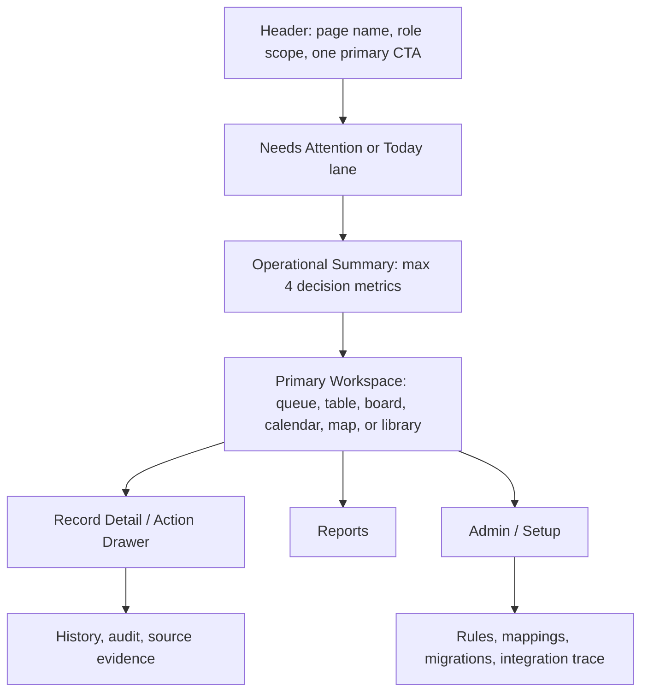

# Pulse CRM UI/UX Optimization Implementation Plan

> **For agentic workers:** REQUIRED SUB-SKILL: Use superpowers:subagent-driven-development (recommended) or superpowers:executing-plans to implement this plan task-by-task. Steps use checkbox (`- [ ]`) syntax for tracking.

**Goal:** Reduce cognitive load across every developed Pulse CRM and Dealer Portal module so each page answers: "What needs my attention, and what is the next safe action?"

**Architecture:** Introduce a shared workbench contract before doing more one-off page cleanup. Each module keeps its current backend behavior, permissions, and requirement coverage, but moves setup, reports, audit trace, migration internals, and parked dependency language behind progressive disclosure.

**Tech Stack:** Next.js App Router, React, TypeScript, Mantine, Tabler icons, existing Pulse API clients, Playwright visual/e2e tests.

---

## Research Basis

External UX anchors used for this plan:

- Salesforce Lightning Design System says large record sets are easier to scan as tables with sorting, filtering, and row actions, while tiles are best for short lists under 10 items: https://winter-20.lightningdesignsystem.com/guidelines/displaying-data/
- USWDS table guidance says tables should be simple, scannable, column-minimized, and not used as layout grids or paragraph containers: https://designsystem.digital.gov/components/table/
- IBM progressive disclosure recommends revealing essentials first, avoiding repeated assistance patterns, and building a guided journey instead of a scavenger hunt: https://www.ibm.com/docs/en/technical-content?topic=practices-progressive-disclosure
- Tableau dashboard guidance recommends designing for a clear audience/purpose, placing the most important view in the top-left scan area, and limiting dashboards to two or three major views: https://help.tableau.com/current/pro/desktop/en-us/dashboards_best_practices.htm

Dynamic AQS requirement anchors:

- Meetings repeatedly stress "keep it simple", less frustration, fewer keystrokes, and fewer barriers to CRM adoption.
- Pulse must not feel like a second ERP. Acumatica, final pricing, orders, invoices, shipments, payments, route optimization, and unresolved migration internals stay parked or advanced.
- TM and RD users need role-specific work queues, not setup dashboards.
- Marketing/Product users need catalog readiness, dealer visibility, approved files, and customer/prospect sharing without Widen/schema internals in the daily path.
- Dealer users need a simple account-aware portal, not internal readiness rules or fake commerce.

## Six-Agent Audit Summary

| Agent Area | Routes / Modules Reviewed | Main Finding |
| --- | --- | --- |
| Leads, Accounts, Calendar, Admin | `/leads`, lead detail, website forms, `/customers`, `/calendar`, `/admin` | Same task appears through too many doors. Intake, duplicate checks, reports, admin setup, and operational queues compete at the same visual level. |
| Territory, Training, Consignment | `/territories`, `/territory_map`, `/training`, `/consignment` | Territory improved, but drilldowns/watchlists/report tables still feel like one giant dashboard. Training and Consignment expose admin/dependency language too early. |
| Product, Digital Assets, Dealer Portal | `/product-management`, `/digital-assets`, `/dealer/*` | Product is still schema-first in places. Digital Assets mixes library, share, migration, and file operations. Dealer Portal needs account-aware simplicity. |
| Requirement Synthesis | Meetings and PRDs | The product should feel like role workbenches. Reports and evidence are important, but not the first thing every user sees. |
| Design System / Code Audit | `apps/crm-web/src/components`, `globals.css`, `AppProviders.tsx` | Pages use repeated local metric cards, badges, tabs, and panels instead of shared workbench primitives and density rules. |
| QA / End-User Sentiment | All developed page families | Failure modes are duplicate active nav, overloaded modals, blank details, too many first-screen metrics, unclear empty states, and implementation vocabulary in user copy. |

## Problem Statement

The current UI is broad and functional, but many pages still behave like "all available data dashboards". That makes users scan through metrics, tabs, badges, reports, setup forms, and dependency notes before finding the next task.

The fix is not more isolated shrinking. The next UX goal should standardize how a Pulse module is allowed to present work.

## Workbench Contract

Every default module route should follow this order unless the module has a documented reason to differ.



Default-visible budget:

- One primary CTA.
- Two or fewer visible secondary actions.
- Four first-screen metrics maximum, unless a role-specific exception is documented.
- One Needs Attention lane per module.
- One primary work surface before reports/admin.
- Tabs max four visible items; move Admin, Advanced, Reports, Import, Migration, and Setup into More or a secondary area when they are not the user's default job.
- Row/card badges max two. Badge colors must be semantic: brand, success, warning, danger, neutral.
- Tables default to five columns or fewer plus one row action menu. Dense detail moves into a drawer or detail page.
- Empty states must distinguish all clear, no data, filtered out, no permission, and external dependency parked.
- Non-admin users should not see provider IDs, source IDs, storage keys, MIME types, Widen IDs, Acumatica internals, UAT language, raw enum keys, or rule-order fields in the default view.

## Files To Touch

Shared UI foundation:

- Modify: `/Users/clustox1/Documents/Currie/dynamic-aqs-pulse-platform/apps/crm-web/src/components/ui/Workbench.tsx`
- Modify: `/Users/clustox1/Documents/Currie/dynamic-aqs-pulse-platform/apps/crm-web/src/app/globals.css`
- Modify: `/Users/clustox1/Documents/Currie/dynamic-aqs-pulse-platform/apps/crm-web/src/components/providers/AppProviders.tsx`
- Modify: `/Users/clustox1/Documents/Currie/dynamic-aqs-pulse-platform/apps/crm-web/src/components/layout/Navigation.tsx`
- Modify: `/Users/clustox1/Documents/Currie/dynamic-aqs-pulse-platform/apps/crm-web/src/components/dealer/DealerNavigation.tsx`

Module pages:

- Modify: `/Users/clustox1/Documents/Currie/dynamic-aqs-pulse-platform/apps/crm-web/src/components/leads/LeadWorkspace.tsx`
- Modify: `/Users/clustox1/Documents/Currie/dynamic-aqs-pulse-platform/apps/crm-web/src/components/leads/LeadRecordWorkspace.tsx`
- Modify: `/Users/clustox1/Documents/Currie/dynamic-aqs-pulse-platform/apps/crm-web/src/components/leads/LeadWebsiteFormsWorkspace.tsx`
- Modify: `/Users/clustox1/Documents/Currie/dynamic-aqs-pulse-platform/apps/crm-web/src/components/calendar/CalendarWorkspace.tsx`
- Modify: `/Users/clustox1/Documents/Currie/dynamic-aqs-pulse-platform/apps/crm-web/src/components/customers/CustomerList.tsx`
- Modify: `/Users/clustox1/Documents/Currie/dynamic-aqs-pulse-platform/apps/crm-web/src/components/customers/CustomerDetail.tsx`
- Modify: `/Users/clustox1/Documents/Currie/dynamic-aqs-pulse-platform/apps/crm-web/src/components/territories/TerritoryManagement.tsx`
- Modify: `/Users/clustox1/Documents/Currie/dynamic-aqs-pulse-platform/apps/crm-web/src/components/territories/TerritoryCommandDashboard.tsx`
- Modify: `/Users/clustox1/Documents/Currie/dynamic-aqs-pulse-platform/apps/crm-web/src/components/territories/TerritoryOperationsPanel.tsx`
- Modify: `/Users/clustox1/Documents/Currie/dynamic-aqs-pulse-platform/apps/crm-web/src/components/training/TrainingWorkspace.tsx`
- Modify: `/Users/clustox1/Documents/Currie/dynamic-aqs-pulse-platform/apps/crm-web/src/components/consignment/ConsignmentWorkspace.tsx`
- Modify: `/Users/clustox1/Documents/Currie/dynamic-aqs-pulse-platform/apps/crm-web/src/components/consignment/ConsignmentSiteDetail.tsx`
- Modify: `/Users/clustox1/Documents/Currie/dynamic-aqs-pulse-platform/apps/crm-web/src/components/product-management/ProductManagementWorkspace.tsx`
- Modify: `/Users/clustox1/Documents/Currie/dynamic-aqs-pulse-platform/apps/crm-web/src/components/product-management/ProductDetailWorkspace.tsx`
- Modify: `/Users/clustox1/Documents/Currie/dynamic-aqs-pulse-platform/apps/crm-web/src/components/digital-assets/DigitalAssetsWorkspace.tsx`
- Modify: `/Users/clustox1/Documents/Currie/dynamic-aqs-pulse-platform/apps/crm-web/src/components/admin/AdminWorkspace.tsx`
- Modify: `/Users/clustox1/Documents/Currie/dynamic-aqs-pulse-platform/apps/crm-web/src/components/admin/AdminCatalogRulesWorkspace.tsx`
- Modify: `/Users/clustox1/Documents/Currie/dynamic-aqs-pulse-platform/apps/crm-web/src/components/dealer/DealerDashboard.tsx`
- Modify: `/Users/clustox1/Documents/Currie/dynamic-aqs-pulse-platform/apps/crm-web/src/components/dealer/DealerCatalog.tsx`
- Modify: `/Users/clustox1/Documents/Currie/dynamic-aqs-pulse-platform/apps/crm-web/src/components/dealer/DealerAccountCenter.tsx`

Tests and documentation:

- Modify: `/Users/clustox1/Documents/Currie/dynamic-aqs-pulse-platform/apps/crm-web/e2e/ux-visual.spec.mjs`
- Modify: `/Users/clustox1/Documents/Currie/dynamic-aqs-pulse-platform/apps/crm-web/e2e/flows.spec.mjs`
- Modify: `/Users/clustox1/Documents/Currie/dynamic-aqs-pulse-platform/docs/DELIVERY_PROGRESS_TRACKER.md`
- Modify: `/Users/clustox1/Documents/Currie/dynamic-aqs-pulse-platform/docs/UX_ROLE_BASED_WORKBENCH_OPTIMIZATION_GOAL_2026-05-25.md`

## Task 1: Create Shared Workbench Density Primitives

**Files:**
- Modify: `/Users/clustox1/Documents/Currie/dynamic-aqs-pulse-platform/apps/crm-web/src/components/ui/Workbench.tsx`
- Modify: `/Users/clustox1/Documents/Currie/dynamic-aqs-pulse-platform/apps/crm-web/src/app/globals.css`
- Modify: `/Users/clustox1/Documents/Currie/dynamic-aqs-pulse-platform/apps/crm-web/src/components/providers/AppProviders.tsx`
- Test: `/Users/clustox1/Documents/Currie/dynamic-aqs-pulse-platform/apps/crm-web/e2e/ux-visual.spec.mjs`

- [ ] **Step 1: Add visual budget tests**

  Update the visual spec to count obvious clutter signals per route:

  ```javascript
  const clutterBudget = {
    maxPrimaryButtons: 1,
    maxVisibleSecondaryButtons: 2,
    maxTopMetrics: 4,
    maxVisibleTabs: 4,
  };
  ```

  Add route assertions for `/leads`, `/territories`, `/training`, `/consignment`, `/product-management`, `/digital-assets`, `/admin`, `/dealer/dashboard`, and `/dealer/catalog`.

- [ ] **Step 2: Run the visual test and capture the expected failure**

  Run:

  ```bash
  pnpm --filter @pulse/crm-web exec playwright test e2e/ux-visual.spec.mjs --config e2e/playwright.visual.config.mjs
  ```

  Expected: at least one page fails the budget because pages still have too many visible tabs, buttons, metrics, or empty detail panels.

- [ ] **Step 3: Expand `Workbench.tsx` with shared primitives**

  Add these exports, reusing Mantine and existing visual style:

  - `WorkbenchPage`
  - `WorkbenchHeader`
  - `WorkbenchPrimaryActions`
  - `WorkbenchAttentionLane`
  - `WorkbenchMetricStrip`
  - `WorkbenchTable`
  - `WorkbenchDetailRail`
  - `WorkbenchMoreMenu`
  - `StatusBadge`
  - `RowActionMenu`
  - `EmptyStateMessage`

  Keep each primitive focused and typed. Do not add business logic to this file.

- [ ] **Step 4: Normalize CRM surface styling**

  In `globals.css` and `AppProviders.tsx`, reduce decorative defaults:

  - remove broad radial page backgrounds from workbench content
  - use medium radius for cards
  - use restrained shadow only for modals/drawers
  - keep brand blue for primary CTA and navigation
  - reserve orange for warnings and red for blockers

- [ ] **Step 5: Run typecheck and visual test**

  Run:

  ```bash
  pnpm --filter @pulse/crm-web typecheck
  pnpm --filter @pulse/crm-web exec playwright test e2e/ux-visual.spec.mjs --config e2e/playwright.visual.config.mjs
  ```

  Expected: typecheck passes. Visual test may still fail on module pages until later tasks convert them.

- [ ] **Step 6: Commit foundation**

  Run:

  ```bash
  git add apps/crm-web/src/components/ui/Workbench.tsx apps/crm-web/src/app/globals.css apps/crm-web/src/components/providers/AppProviders.tsx apps/crm-web/e2e/ux-visual.spec.mjs
  git commit -m "refactor: add pulse workbench density primitives"
  ```

## Task 2: Fix Navigation And Role Mental Model

**Files:**
- Modify: `/Users/clustox1/Documents/Currie/dynamic-aqs-pulse-platform/apps/crm-web/src/components/layout/Navigation.tsx`
- Modify: `/Users/clustox1/Documents/Currie/dynamic-aqs-pulse-platform/apps/crm-web/src/components/dealer/DealerNavigation.tsx`
- Test: `/Users/clustox1/Documents/Currie/dynamic-aqs-pulse-platform/apps/crm-web/e2e/flows.spec.mjs`

- [ ] **Step 1: Add navigation regression tests**

  Add tests that assert:

  - `/territories` highlights Territory Hub only.
  - `/territory_map` highlights Territory Map only.
  - `/dealer/account` highlights Account Center only.
  - `/dealer/account#account-health` highlights Account Health only.
  - Single-child groups are direct links, not expandable dead ends.

- [ ] **Step 2: Run the navigation tests and capture failures**

  Run:

  ```bash
  pnpm --filter @pulse/crm-web exec playwright test e2e/flows.spec.mjs --grep "navigation"
  ```

  Expected: dealer hash active-state or territory-map ambiguity fails before the fix.

- [ ] **Step 3: Update CRM navigation labels**

  Use task nouns, not module jargon:

  - Leads
  - Calendar
  - Territories
  - Accounts
  - Consignment
  - Products
  - Digital Assets
  - Training
  - Administration

  Keep reports/admin as children only when they are real secondary destinations.

- [ ] **Step 4: Fix dealer hash active state**

  Treat pathname and hash separately so Account Center and Account Health do not both appear selected.

- [ ] **Step 5: Run navigation tests**

  Run:

  ```bash
  pnpm --filter @pulse/crm-web exec playwright test e2e/flows.spec.mjs --grep "navigation"
  ```

  Expected: all navigation active-state checks pass.

- [ ] **Step 6: Commit navigation cleanup**

  Run:

  ```bash
  git add apps/crm-web/src/components/layout/Navigation.tsx apps/crm-web/src/components/dealer/DealerNavigation.tsx apps/crm-web/e2e/flows.spec.mjs
  git commit -m "fix: simplify pulse navigation active states"
  ```

## Task 3: Leads, Accounts, Calendar, And Admin Workbench Cleanup

**Files:**
- Modify: `/Users/clustox1/Documents/Currie/dynamic-aqs-pulse-platform/apps/crm-web/src/components/leads/LeadWorkspace.tsx`
- Modify: `/Users/clustox1/Documents/Currie/dynamic-aqs-pulse-platform/apps/crm-web/src/components/leads/LeadRecordWorkspace.tsx`
- Modify: `/Users/clustox1/Documents/Currie/dynamic-aqs-pulse-platform/apps/crm-web/src/components/leads/LeadWebsiteFormsWorkspace.tsx`
- Modify: `/Users/clustox1/Documents/Currie/dynamic-aqs-pulse-platform/apps/crm-web/src/components/calendar/CalendarWorkspace.tsx`
- Modify: `/Users/clustox1/Documents/Currie/dynamic-aqs-pulse-platform/apps/crm-web/src/components/customers/CustomerList.tsx`
- Modify: `/Users/clustox1/Documents/Currie/dynamic-aqs-pulse-platform/apps/crm-web/src/components/customers/CustomerDetail.tsx`
- Modify: `/Users/clustox1/Documents/Currie/dynamic-aqs-pulse-platform/apps/crm-web/src/components/admin/AdminWorkspace.tsx`

- [ ] **Step 1: Leads default to operational pipeline**

  Make `/leads` default to the queue/pipeline work surface. Keep New Intake as the single primary CTA. Put imports, website forms, finance queue, analytics, and exports behind More or secondary tabs.

- [ ] **Step 2: Lead intake modal becomes progressive**

  Required first:

  - customer/contact basics
  - location
  - source
  - product or inquiry type

  Collapsed advanced:

  - OCR details
  - routing override
  - duplicate evidence
  - finance notes
  - raw source payload

- [ ] **Step 3: Lead detail separates record work from evidence**

  Primary: next action, owner, stage, customer summary, activity.

  Secondary: CIS, onboarding, finance review.

  Advanced: routing evidence, source payload, audit/history.

- [ ] **Step 4: Website forms become list-first**

  Default to website list and submission health. Move notification setup, repeat-submission rules, classification stewardship, and technical flow into configuration drawers.

- [ ] **Step 5: Calendar removes technical setup from the daily surface**

  Default to schedule and linked records. Move sync provider, env/config, and diagnostic copy into Admin/Integration detail.

- [ ] **Step 6: Accounts put customer context before provisioning**

  Customer detail default shows profile, contacts, locations, next action, training/consignment summary. Portal provisioning, payment-method parked notes, UAT/readiness, and field documents move under More.

- [ ] **Step 7: Admin becomes exception-first**

  Keep Add User as the primary CTA. Put Import Users, rules, integrations, and audit under More/secondary tabs. Add an Admin Needs Attention lane for locked users, failed invites, integration failures, stale roles, and pending rule changes.

- [ ] **Step 8: Run tests and commit**

  Run:

  ```bash
  pnpm --filter @pulse/crm-web typecheck
  pnpm --filter @pulse/crm-web exec playwright test e2e/ux-visual.spec.mjs --config e2e/playwright.visual.config.mjs --grep "leads|calendar|accounts|admin"
  ```

  Expected: routes render without console errors and stay inside the visible budget.

  Commit:

  ```bash
  git add apps/crm-web/src/components/leads apps/crm-web/src/components/calendar apps/crm-web/src/components/customers apps/crm-web/src/components/admin apps/crm-web/e2e
  git commit -m "refactor: simplify crm operator workbenches"
  ```

## Task 4: Territory, Training, And Consignment Field Ops Cleanup

**Files:**
- Modify: `/Users/clustox1/Documents/Currie/dynamic-aqs-pulse-platform/apps/crm-web/src/components/territories/TerritoryManagement.tsx`
- Modify: `/Users/clustox1/Documents/Currie/dynamic-aqs-pulse-platform/apps/crm-web/src/components/territories/TerritoryCommandDashboard.tsx`
- Modify: `/Users/clustox1/Documents/Currie/dynamic-aqs-pulse-platform/apps/crm-web/src/components/territories/TerritoryOperationsPanel.tsx`
- Modify: `/Users/clustox1/Documents/Currie/dynamic-aqs-pulse-platform/apps/crm-web/src/components/training/TrainingWorkspace.tsx`
- Modify: `/Users/clustox1/Documents/Currie/dynamic-aqs-pulse-platform/apps/crm-web/src/components/consignment/ConsignmentWorkspace.tsx`
- Modify: `/Users/clustox1/Documents/Currie/dynamic-aqs-pulse-platform/apps/crm-web/src/components/consignment/ConsignmentSiteDetail.tsx`

- [ ] **Step 1: Territory keeps Needs Attention as the triage entry**

  Move watchlists into the Needs Attention drilldown. Keep routing posture compact. Move lifecycle/pipeline/rollups into Performance Details or Reports unless the current role is RD/Leadership.

- [ ] **Step 2: Territory table reduces risk columns**

  Merge `30d Coverage`, `90d Stale`, and `At Risk` into one `Risk` column with semantic badges and a detail drawer.

- [ ] **Step 3: Training removes false urgency**

  Hide zero-count attention rows. Separate formal training work from site-visit context. Move training templates, providers, and admin setup out of the default operator path.

- [ ] **Step 4: Consignment avoids ERP language in daily work**

  Default to audits due, PO follow-ups, site exceptions, and next actions. Move Acumatica, warehouse, inventory, SKU/barcode, PO writeback, invoices, and credit language into Advanced Handoff or Reports.

- [ ] **Step 5: Run field-ops visual tests and commit**

  Run:

  ```bash
  pnpm --filter @pulse/crm-web typecheck
  pnpm --filter @pulse/crm-web exec playwright test e2e/ux-visual.spec.mjs --config e2e/playwright.visual.config.mjs --grep "territory|training|consignment"
  ```

  Expected: no console errors, fewer first-screen metrics, and no repeated parked-dependency banners in default views.

  Commit:

  ```bash
  git add apps/crm-web/src/components/territories apps/crm-web/src/components/training apps/crm-web/src/components/consignment apps/crm-web/e2e
  git commit -m "refactor: simplify field operations workbenches"
  ```

## Task 5: Product, Digital Assets, And Dealer Portal Mental Model Cleanup

**Files:**
- Modify: `/Users/clustox1/Documents/Currie/dynamic-aqs-pulse-platform/apps/crm-web/src/components/product-management/ProductManagementWorkspace.tsx`
- Modify: `/Users/clustox1/Documents/Currie/dynamic-aqs-pulse-platform/apps/crm-web/src/components/product-management/ProductDetailWorkspace.tsx`
- Modify: `/Users/clustox1/Documents/Currie/dynamic-aqs-pulse-platform/apps/crm-web/src/components/digital-assets/DigitalAssetsWorkspace.tsx`
- Modify: `/Users/clustox1/Documents/Currie/dynamic-aqs-pulse-platform/apps/crm-web/src/components/dealer/DealerDashboard.tsx`
- Modify: `/Users/clustox1/Documents/Currie/dynamic-aqs-pulse-platform/apps/crm-web/src/components/dealer/DealerCatalog.tsx`
- Modify: `/Users/clustox1/Documents/Currie/dynamic-aqs-pulse-platform/apps/crm-web/src/components/dealer/DealerAccountCenter.tsx`

- [ ] **Step 1: Product Management starts with Dealer Catalog View**

  Rename and reorder the workflow:

  - Dealer Catalog Views
  - Products In View
  - Readiness
  - Publish Control
  - Setup

  Categories and families remain available under Setup because they are catalog setup, not the starting point for Dynamic users.

- [ ] **Step 2: Use plain dealer group language**

  Explain groups in UI copy as:

  - `Independent`: standalone dealer context
  - `Ownership group`: shared corporate owner context
  - `PE group`: private-equity portfolio context
  - `Affinity group`: buying/marketing alliance context
  - `Hybrid`: dealer belongs to more than one context; Pulse resolves the catalog view using configured priority

  Do not expose resolver fields or raw classification codes in the default page.

- [ ] **Step 3: Product detail becomes readiness-first**

  Default detail sections:

  - What dealers see
  - Required product files
  - Readiness blockers
  - Last publish state

  Move edit fields, category/family codes, sort orders, raw visibility rows, and snapshot history under Setup or History.

- [ ] **Step 4: Digital Assets becomes task-first**

  Default tabs:

  - Library
  - Product Files
  - Share Links
  - Needs Review
  - Import & Migration

  The add/upload action should be a bulk upload modal with per-file validation and post-upload review. File source, stable slug, MIME type, Widen ID, source URL, and storage trace remain under Advanced.

- [ ] **Step 5: Dealer Portal becomes account-aware and quiet**

  Dealer dashboard primary CTA depends on the user:

  - Product/catalog user: Browse Products & Files
  - Accounting user: Account Center
  - Viewer: Browse Published Files

  Catalog filters are compact. Commerce/pricing/order limitations appear once in Account Health, not as repeated warnings.

- [ ] **Step 6: Run catalog/dealer visual tests and commit**

  Run:

  ```bash
  pnpm --filter @pulse/crm-web typecheck
  pnpm --filter @pulse/crm-web exec playwright test e2e/ux-visual.spec.mjs --config e2e/playwright.visual.config.mjs --grep "product|asset|dealer"
  ```

  Expected: product/assets/dealer routes stay within the visual budget and no default page starts with setup-only forms.

  Commit:

  ```bash
  git add apps/crm-web/src/components/product-management apps/crm-web/src/components/digital-assets apps/crm-web/src/components/dealer apps/crm-web/e2e
  git commit -m "refactor: simplify catalog assets and dealer portal UX"
  ```

## Task 6: QA Matrix, Progress Tracker, And Evidence Pack

**Files:**
- Modify: `/Users/clustox1/Documents/Currie/dynamic-aqs-pulse-platform/apps/crm-web/e2e/ux-visual.spec.mjs`
- Modify: `/Users/clustox1/Documents/Currie/dynamic-aqs-pulse-platform/apps/crm-web/e2e/flows.spec.mjs`
- Modify: `/Users/clustox1/Documents/Currie/dynamic-aqs-pulse-platform/docs/DELIVERY_PROGRESS_TRACKER.md`
- Modify: `/Users/clustox1/Documents/Currie/dynamic-aqs-pulse-platform/docs/UX_ROLE_BASED_WORKBENCH_OPTIMIZATION_GOAL_2026-05-25.md`

- [ ] **Step 1: Capture role-based screenshots**

  Viewports:

  - desktop: `1440x1000`
  - laptop: `1280x800`
  - mobile public/dealer: `390x844`

  Role flows:

  - Super Admin
  - Ops/CSR
  - Territory Manager
  - Regional Director
  - Product/Marketing Admin
  - Dealer admin
  - Dealer product/catalog user
  - Dealer accounting user
  - Dealer viewer

- [ ] **Step 2: Validate route coverage**

  Required routes:

  - `/leads`
  - `/leads/forms`
  - `/calendar`
  - `/territories`
  - `/territory_map`
  - `/customers`
  - `/training`
  - `/consignment`
  - `/product-management`
  - `/digital-assets`
  - `/admin`
  - `/dealer/dashboard`
  - `/dealer/catalog`
  - `/dealer/account`
  - `/forms/lead/[siteId]`
  - `/public/cis/[token]`

- [ ] **Step 3: Run full web QA**

  Run:

  ```bash
  pnpm --filter @pulse/crm-web typecheck
  pnpm --filter @pulse/crm-web exec playwright test e2e/flows.spec.mjs
  pnpm --filter @pulse/crm-web exec playwright test e2e/ux-visual.spec.mjs --config e2e/playwright.visual.config.mjs
  ```

  Expected: typecheck passes, flows pass, and screenshot evidence is stored under `output/playwright/ux-02/`.

- [ ] **Step 4: Update progress tracker**

  Update module progress with UX coverage, not just feature coverage:

  - requirement coverage unchanged unless functionality changed
  - UX readiness improves only after the page passes the visual budget and role flow
  - external dependencies remain parked with explicit reason

- [ ] **Step 5: Commit QA evidence and tracker**

  Run:

  ```bash
  git add apps/crm-web/e2e docs/DELIVERY_PROGRESS_TRACKER.md docs/UX_ROLE_BASED_WORKBENCH_OPTIMIZATION_GOAL_2026-05-25.md
  git commit -m "test: add ux optimization evidence and tracker"
  ```

## Module-Specific Target Outcomes

| Module | Current Risk | Target Outcome |
| --- | --- | --- |
| Leads | Too many duplicate entry points and action cards | One pipeline workbench, one New Intake CTA, More menu for imports/forms/exports, evidence in drawers |
| Lead Detail | Work, lifecycle, finance, CIS, onboarding, and audit compete | Next action first; lifecycle and evidence progressively disclosed |
| Website Forms | Governance/configuration mixed with operational submissions | Website list and submission health first; rules/config in drawers |
| Calendar | Setup/sync diagnostics can feel like daily UI | Schedule and linked records first; provider diagnostics in Admin |
| Accounts | Customer context mixed with portal/UAT/payment parked language | Profile, contacts, locations, next actions first; provisioning and parked dependencies later |
| Territories | Still dashboard-heavy after initial cleanup | Needs Attention and routing posture first; rollups/watchlists as drilldowns |
| Training | Formal training and visits can blur, zero rows create false urgency | Due training, proof, recertification first; templates/admin later |
| Consignment | ERP boundary language still leaks into daily work | Audits/site issues/PO follow-up first; Acumatica/warehouse handoff in Advanced |
| Product Management | Categories/families/setup can appear before the dealer catalog mental model | Dealer Catalog Views first; categories/families under Setup |
| Digital Assets | Library/share/import/file details compete | Library/Product Files/Share Links first; migration/source trace advanced |
| Admin | Users, roles, audit, integrations, and shortcuts equal weight | Admin Needs Attention plus Add User primary; rules/integrations/audit grouped |
| Dealer Portal | Account center/catalog/health priorities are not role-sensitive enough | Role-based dashboard CTA, compact catalog, single account-health explanation |

## Non-Goals

- Do not implement Acumatica import/writeback.
- Do not implement final dealer pricing, full order placement, invoices, payment collection, shipments, route optimization, or migration hardening.
- Do not remove audit/source trace. Move it to the correct layer.
- Do not flatten role, territory, or dealer visibility permissions.
- Do not hide true blockers. Consolidate blockers into Needs Attention.

## First Recommended Slice

Start with Task 1 and Task 2 together.

Reason: if we keep optimizing each page independently, clutter will come back. The shared workbench primitives, navigation active-state fixes, and visual budget tests give every later agent a rulebook. After that, run Tasks 3 through 5 by module family in parallel.

## Completion Definition

This goal is complete when:

- Every developed module route follows the workbench contract or documents a specific exception.
- Playwright visual budget checks pass for CRM and Dealer Portal routes.
- Dynamic-facing default pages show business terms, not implementation terms.
- Reports, setup, migration, audit, and parked dependencies are reachable but not first-screen noise.
- `docs/DELIVERY_PROGRESS_TRACKER.md` reflects UX readiness separately from functional requirement coverage.
