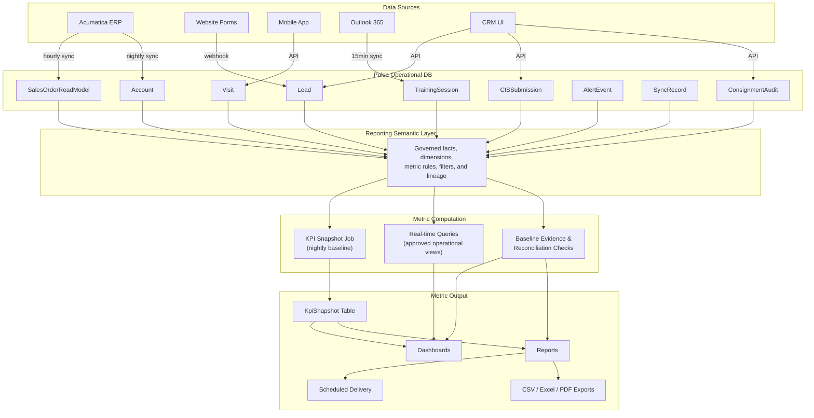

# Metric Definition Register

## Document Control
| Field | Value |
|-------|-------|
| Module | Reports & Analytics |
| Document Type | Register |
| Document | Metric Definition Register (KPI Formulas, Lineage, and Validation Rules) |
| Version | 1.2 |
| Status | Working Baseline |
| Owner | Product / Reporting / Architecture / Data |
| Sprint Sequence | Sprint 15, Sprint 20-Sprint 22 |
| Priority | P0 |
| Meeting Traceability | Discovery Zero and Sessions 1, 4, 5, 6, 8, 9, 12 |
| Planning Baseline | `registers/PROJECT_BREAKDOWN_DETAILED.csv` (190 rows / 1,603 story points / 25 sprints) |
| Primary Companion Docs | `prds/REPORTING_REQUIREMENTS_MASTER.md`, `prds/WEB_DASHBOARD_SUPPLEMENT.md`, `source_of_truth/FULL_RELEASE_PLAN.md`, `workbooks/BASELINE_RECONCILIATION_MASTER.xlsx`, `workbooks/SCOPE_TRACEABILITY_WORKBOOK.xlsx`, `workbooks/SPRINT_RELEASE_PLAN.xlsx` |

---

## 1. Purpose

This register defines the governed KPI logic used by Pulse dashboards, reports, exports, scheduled deliveries, and reconciliation packs.

It is the metric dictionary that sits underneath the reporting PRDs, the release plan, and the workbook validation layer. For each metric:
- **Formula**: Exact calculation logic
- **Source**: Which database tables/fields feed the metric
- **Grain**: The lowest level of detail
- **Aggregation**: How it rolls up (territory → region → org)
- **Refresh**: How often the metric is computed
- **Owner**: Which dashboard/report consumes it

---

## 2. Baseline Alignment

This register should not be treated as a standalone analytics note. It is aligned to the current WBS, release ladder, reporting PRDs, and workbook package.

| Artifact | Role in package | Alignment rule |
|-------|-------|-------|
| `registers/PROJECT_BREAKDOWN_DETAILED.csv` | Authoritative delivery baseline | The reduced core baseline now delivers the semantic layer and metric register in Sprint 15, the report builder in Sprint 20, role dashboards in Sprint 21, and executive composition in Sprint 22. |
| `source_of_truth/FULL_RELEASE_PLAN.md` | Release and gate baseline | Metric families become trusted according to the release gates; no executive-trust claim should outrun Release 2 pilot evidence, Release 3 role dashboard proof, and Release 4 hardening gates. |
| `prds/REPORTING_REQUIREMENTS_MASTER.md` | Reporting scope authority | Dashboard families, dimensions, delivery modes, and audience expectations in this register must stay consistent with the reporting PRD. |
| `prds/WEB_DASHBOARD_SUPPLEMENT.md` | KPI implementation detail | Formula detail, freshness expectations, drill-down behavior, and operational usage patterns in this register should align with the web dashboard supplement. |
| `workbooks/BASELINE_RECONCILIATION_MASTER.xlsx` | Package reconciliation workbook | Workbook summaries may report counts, release splits, and planning status, but they should not redefine KPI logic independently of this register. |
| `workbooks/SCOPE_TRACEABILITY_WORKBOOK.xlsx` | PRD-to-WBS traceability workbook | Reporting FRs that depend on governed KPIs should resolve through this register plus the reporting WBS rows, rather than through ad hoc dashboard wording. |
| `workbooks/SPRINT_RELEASE_PLAN.xlsx` | Executive release view | Release windows and go/no-go dates control when metric families can be treated as pilot-ready, production-ready, or still in foundation mode. |

---

## 3. Governance and Release Rules

### 3.1 Core Governance Rules

- Dashboards, saved reports, exports, and scheduled deliveries must resolve through the same governed metric logic.
- Acumatica remains the financial source of truth for posted revenue, invoice, payment, inventory, warehouse, and other posted ERP facts.
- Composite metrics such as Territory Health Score are management signals and must never override the underlying operational or financial source metrics.
- Real-time metrics may power queues and exception views, but executive trust depends on reconciled nightly outputs or approved baseline evidence.
- Any metric promoted to leadership, pilot sign-off, or cross-functional use must have an owner, refresh cadence, source lineage, and reconciliation expectation.

### 3.2 Coverage Labels

These labels should be carried as reporting metadata and reused in UAT, dashboard review, and workbook validation:

- `Baseline`: approved for dashboards, exports, and steering decisions after reconciliation evidence is accepted
- `Pilot`: allowed for pilot dashboards and operational review, but not yet trusted as GA decision-grade output
- `Derived`: calculated or composite management metric derived from other approved metrics
- `Future`: discussed in discovery or design, but not committed as part of the current release baseline

### 3.3 Release Activation Model

| Metric Family | First Trusted Release | Why |
|-------|-------|-------|
| Lead & Pipeline | Release 2 | Internal pilot must trust routing, SLA, discovery, conversion, and stage-cycle metrics before lead-to-activation can be approved. |
| Revenue & Customer | Release 2 for internal pilot, Release 3 for broader external trust | New-account and first-order metrics are needed in the internal pilot; broader revenue, invoice, and dealer-facing visibility mature in later releases. |
| Finance & CIS | Release 2 | Finance queue visibility and first-order readiness are required for internal pilot flow approval. |
| Notifications & Communication | Release 2 | Alerting metrics must exist early enough to validate SLA, handoff, and escalation behavior during internal pilot. |
| Integration Health | Release 1 | Sync success, freshness, and error signals are foundation controls and must exist before broader build trust. |
| Territory & Field Activity | Release 3 | Field execution, visit cadence, and territory health become trustworthy once territory, mobile, and activity taxonomies are stabilized. |
| Training | Release 3 | Training dashboards and compliance metrics depend on the stronger training model and field capture layer. |
| Consignment | Release 3 | Audit, discrepancy, and PO-clock metrics depend on the consignment scheduler, reconciliation model, and exception workflows. |
| Dealer Portal | Release 3 | Dealer adoption and portal order metrics should not be trusted before dealer rollout and commerce pilot are active. |
| Executive Rollups / Composite Metrics | Release 4 hardening | Leadership-facing composites are safest once lower-level metrics are already reconciled and accepted in pilot. |

---

## 4. Lead & Pipeline Metrics

### MET-001: Lead Conversion Rate

| Field | Value |
|-------|-------|
| **Formula** | `COUNT(leads WHERE status = 'customer_active') / COUNT(leads WHERE createdAt IN period) × 100` |
| **Definition** | Percentage of leads created in a period that reached Customer Active status |
| **Source tables** | `Lead.status`, `Lead.createdAt`, `Lead.convertedAt` |
| **Grain** | Per lead |
| **Dimensions** | Period, source, region, territory, owner, affinity group |
| **Aggregation** | Territory → Region → Org (weighted by lead count) |
| **Refresh** | KPI snapshot nightly; real-time on dashboard via query |
| **Target** | 35-45% (configurable per team) |
| **Consumers** | Executive Dashboard, Pipeline Dashboard, TM Dashboard |

### MET-002: Average Lead Cycle Time

| Field | Value |
|-------|-------|
| **Formula** | `AVG(convertedAt - createdAt)` in business days, for leads that converted in period |
| **Definition** | Average number of business days from lead creation to Customer Active |
| **Source tables** | `Lead.createdAt`, `Lead.convertedAt` |
| **Grain** | Per lead |
| **Dimensions** | Period, source, territory, affinity group, truck count band |
| **Aggregation** | Territory → Region → Org (simple average) |
| **Refresh** | Nightly |
| **Target** | ≤30 business days |
| **Consumers** | Executive Dashboard, Pipeline Dashboard |

### MET-003: Pipeline Value

| Field | Value |
|-------|-------|
| **Formula** | `SUM(Lead.estimatedRevenue) WHERE status NOT IN ('customer_active', 'lost', 'disqualified')` |
| **Definition** | Total estimated annual revenue of all active (unconverted) leads |
| **Source tables** | `Lead.estimatedRevenue`, `Lead.status` |
| **Grain** | Per lead |
| **Dimensions** | Stage, territory, owner, source, affinity group |
| **Aggregation** | Stage → Territory → Region → Org |
| **Refresh** | Real-time (query) |
| **Consumers** | Pipeline Dashboard, Executive Dashboard |

### MET-004: SLA Breach Count

| Field | Value |
|-------|-------|
| **Formula** | `COUNT(leads WHERE slaBreached = true AND breachDate IN period)` |
| **Definition** | Number of leads that exceeded their SLA threshold in the period |
| **Source tables** | `Lead.slaBreached`, `Lead.slaBreachedAt` |
| **Grain** | Per lead |
| **Dimensions** | Period, owner, territory, stage at breach |
| **Aggregation** | Owner → Territory → Region → Org |
| **Refresh** | SLA check job every 15 min |
| **Target** | 0 (any breach is a failure) |
| **Consumers** | Pipeline Dashboard, Leadership Alerts |

### MET-005: SLA Compliance Rate

| Field | Value |
|-------|-------|
| **Formula** | `COUNT(leads WHERE slaBreached = false AND createdAt IN period) / COUNT(leads WHERE createdAt IN period) × 100` |
| **Definition** | Percentage of leads that were handled within SLA |
| **Source tables** | `Lead.slaBreached`, `Lead.createdAt` |
| **Grain** | Per lead |
| **Dimensions** | Period, owner, territory |
| **Aggregation** | Territory → Region → Org |
| **Refresh** | Nightly |
| **Target** | ≥95% |
| **Consumers** | Executive Dashboard |

### MET-006: Leads by Stage

| Field | Value |
|-------|-------|
| **Formula** | `COUNT(leads) GROUP BY status WHERE status NOT IN ('customer_active', 'lost', 'disqualified')` |
| **Definition** | Count of active leads per pipeline stage |
| **Source tables** | `Lead.status` |
| **Grain** | Per lead |
| **Dimensions** | Stage, territory, owner, source |
| **Aggregation** | Territory → Region → Org |
| **Refresh** | Real-time (query) |
| **Consumers** | Pipeline Dashboard (Kanban view) |

### MET-007: Lead Source Attribution

| Field | Value |
|-------|-------|
| **Formula** | `COUNT(leads) GROUP BY source, sourceSite WHERE createdAt IN period` |
| **Definition** | Lead volume by source channel and branded site |
| **Source tables** | `Lead.source`, `Lead.sourceSite`, `Lead.createdAt` |
| **Grain** | Per lead |
| **Dimensions** | Period, source, sourceSite, territory |
| **Aggregation** | Site → Source → Org |
| **Refresh** | Nightly |
| **Consumers** | Marketing Dashboard, Executive Dashboard |

### MET-008: Average Stage Duration

| Field | Value |
|-------|-------|
| **Formula** | `AVG(exitedAt - enteredAt)` per stage, in business days |
| **Definition** | Average time a lead spends in each pipeline stage |
| **Source tables** | `LeadStageHistory.stage`, `LeadStageHistory.enteredAt`, `LeadStageHistory.exitedAt` |
| **Grain** | Per stage transition |
| **Dimensions** | Stage, period, territory, source |
| **Aggregation** | Territory → Region → Org |
| **Refresh** | Nightly |
| **Consumers** | Pipeline Analytics |

---

## 5. Revenue & Customer Metrics

### MET-010: Revenue (YTD / MTD / QTD)

| Field | Value |
|-------|-------|
| **Formula** | `SUM(SalesOrderReadModel.totalAmount) WHERE orderDate IN period AND status IN ('completed', 'shipped')` |
| **Definition** | Total order revenue in period |
| **Source tables** | `SalesOrderReadModel.totalAmount`, `SalesOrderReadModel.orderDate`, `SalesOrderReadModel.status` |
| **Grain** | Per order |
| **Dimensions** | Period (YTD/QTD/MTD), territory, customer, price class, product category |
| **Aggregation** | Customer → Territory → Region → Org |
| **Refresh** | Order sync hourly; KPI snapshot nightly |
| **Consumers** | Executive Dashboard, Territory Dashboard, RD Rollup |

### MET-011: Revenue vs Target

| Field | Value |
|-------|-------|
| **Formula** | `(actual revenue / target revenue) × 100` per territory per period |
| **Definition** | Revenue attainment percentage against target |
| **Source tables** | `KpiSnapshot` (revenue), `TerritoryTarget` (target) |
| **Grain** | Per territory per month |
| **Dimensions** | Period, territory, region |
| **Aggregation** | Territory → Region → Org (sum/sum) |
| **Refresh** | Nightly |
| **Consumers** | Executive Dashboard, Territory Dashboard |

### MET-012: Active Customer Count

| Field | Value |
|-------|-------|
| **Formula** | `COUNT(accounts WHERE status = 'active' AND lastOrderDate >= (now - 180 days))` |
| **Definition** | Customers with at least one order in the last 180 days |
| **Source tables** | `Account.status`, latest `SalesOrderReadModel.orderDate` per account |
| **Grain** | Per account |
| **Dimensions** | Territory, region, affinity group, price class |
| **Aggregation** | Territory → Region → Org |
| **Refresh** | Nightly |
| **Consumers** | Executive Dashboard, Territory Dashboard |

### MET-013: At-Risk Customer Count

| Field | Value |
|-------|-------|
| **Formula** | `COUNT(accounts WHERE status = 'active' AND daysSinceLastOrder >= 60 AND daysSinceLastOrder < 180)` |
| **Definition** | Active customers with no order in 60-180 days |
| **Source tables** | `Account.status`, computed `daysSinceLastOrder` |
| **Grain** | Per account |
| **Dimensions** | Territory, region, days-since-order band (60-90, 90-120, 120-180) |
| **Aggregation** | Territory → Region → Org |
| **Refresh** | Nightly |
| **Target** | <5% of active customers |
| **Consumers** | Executive Dashboard, TM Dashboard, At-Risk Alerts |

### MET-014: Churned Customer Count

| Field | Value |
|-------|-------|
| **Formula** | `COUNT(accounts WHERE status = 'active' AND daysSinceLastOrder >= 180)` |
| **Definition** | Customers with no order in 180+ days (still technically active but operationally churned) |
| **Source tables** | `Account.status`, computed `daysSinceLastOrder` |
| **Grain** | Per account |
| **Dimensions** | Territory, region |
| **Refresh** | Nightly |
| **Consumers** | Executive Dashboard, RD Rollup |

### MET-015: Average Order Value

| Field | Value |
|-------|-------|
| **Formula** | `AVG(SalesOrderReadModel.totalAmount) WHERE orderDate IN period` |
| **Source tables** | `SalesOrderReadModel.totalAmount`, `SalesOrderReadModel.orderDate` |
| **Grain** | Per order |
| **Dimensions** | Period, territory, customer, price class |
| **Aggregation** | Customer → Territory → Region → Org |
| **Refresh** | Nightly |
| **Consumers** | Executive Dashboard, Territory Dashboard |

### MET-016: New Customer Count

| Field | Value |
|-------|-------|
| **Formula** | `COUNT(accounts WHERE firstOrderDate IN period)` |
| **Definition** | Customers whose first-ever order falls within the period |
| **Source tables** | `Account.firstOrderDate` |
| **Grain** | Per account |
| **Dimensions** | Period, territory, source (from original lead), affinity group |
| **Aggregation** | Territory → Region → Org |
| **Refresh** | Nightly |
| **Consumers** | Executive Dashboard |

### MET-017: Revenue by Price Class

| Field | Value |
|-------|-------|
| **Formula** | `SUM(SalesOrderReadModel.totalAmount) GROUP BY account.priceClass WHERE orderDate IN period` |
| **Source tables** | `SalesOrderReadModel`, `Account.priceClass` |
| **Grain** | Per order |
| **Dimensions** | Period, price class, currency |
| **Aggregation** | Price class → Org |
| **Refresh** | Nightly |
| **Consumers** | Finance Dashboard, Pricing Admin |

---

## 6. Training Metrics

### MET-020: Training Compliance Rate

| Field | Value |
|-------|-------|
| **Formula** | `COUNT(accounts WHERE trainingCompliant = true) / COUNT(accounts WHERE status = 'active' AND requiresTraining = true) × 100` |
| **Definition** | Percentage of active customers meeting their training requirements |
| **Source tables** | `Account.trainingCompliant`, `TrainingCompletion`, `TrainingRequirement` |
| **Grain** | Per account |
| **Dimensions** | Territory, region, training type, affinity group |
| **Aggregation** | Territory → Region → Org |
| **Refresh** | Nightly |
| **Target** | ≥90% |
| **Consumers** | Training Dashboard, Territory Dashboard, Executive Dashboard |

### MET-021: Sessions Delivered (Count)

| Field | Value |
|-------|-------|
| **Formula** | `COUNT(TrainingSession WHERE status = 'completed' AND completedDate IN period)` |
| **Source tables** | `TrainingSession.status`, `TrainingSession.completedDate` |
| **Grain** | Per session |
| **Dimensions** | Period, type, trainer, territory, customer |
| **Aggregation** | Trainer → Territory → Region → Org |
| **Refresh** | Nightly |
| **Consumers** | Training Dashboard, Trainer Performance |

### MET-022: No-Show Rate

| Field | Value |
|-------|-------|
| **Formula** | `COUNT(TrainingSession WHERE status = 'no_show') / COUNT(TrainingSession WHERE scheduledDate IN period) × 100` |
| **Source tables** | `TrainingSession.status`, `TrainingSession.scheduledDate` |
| **Grain** | Per session |
| **Dimensions** | Period, customer, territory, training type |
| **Aggregation** | Territory → Region → Org |
| **Refresh** | Nightly |
| **Target** | <10% |
| **Consumers** | Training Dashboard |

### MET-023: Certifications Expiring

| Field | Value |
|-------|-------|
| **Formula** | `COUNT(Certification WHERE status = 'active' AND expiresAt BETWEEN now AND now + 30 days)` |
| **Source tables** | `Certification.status`, `Certification.expiresAt` |
| **Grain** | Per certification |
| **Dimensions** | Expiry window (7d, 14d, 30d), territory, customer |
| **Aggregation** | Territory → Region → Org |
| **Refresh** | Nightly |
| **Consumers** | Training Dashboard, TM Dashboard, Alerts |

### MET-024: Training Hours Delivered

| Field | Value |
|-------|-------|
| **Formula** | `SUM(TrainingSession.actualDuration / 60) WHERE status = 'completed' AND completedDate IN period` |
| **Source tables** | `TrainingSession.actualDuration`, `TrainingSession.completedDate` |
| **Grain** | Per session |
| **Dimensions** | Period, trainer, territory, training type |
| **Aggregation** | Trainer → Territory → Region → Org |
| **Refresh** | Nightly |
| **Consumers** | Training ROI Dashboard |

---

## 7. Consignment Metrics

### MET-030: Consignment Audit Compliance

| Field | Value |
|-------|-------|
| **Formula** | `COUNT(ConsignmentAudit WHERE status = 'completed' AND completedAt <= dueDate) / COUNT(ConsignmentAudit WHERE dueDate IN period) × 100` |
| **Definition** | Percentage of audits completed on time |
| **Source tables** | `ConsignmentAudit.status`, `ConsignmentAudit.completedAt`, `ConsignmentAudit.dueDate` |
| **Grain** | Per audit |
| **Dimensions** | Period, territory, cycle type (ROSE/BLUE/PURPLE/SAND) |
| **Aggregation** | Territory → Region → Org |
| **Refresh** | Nightly |
| **Target** | ≥95% |
| **Consumers** | Consignment Dashboard, Executive Dashboard |

### MET-031: Overdue Audits

| Field | Value |
|-------|-------|
| **Formula** | `COUNT(ConsignmentAudit WHERE status IN ('scheduled', 'in_progress') AND dueDate < now)` |
| **Source tables** | `ConsignmentAudit.status`, `ConsignmentAudit.dueDate` |
| **Grain** | Per audit |
| **Dimensions** | Territory, days overdue band (1-7, 8-14, 15+) |
| **Aggregation** | Territory → Region → Org |
| **Refresh** | Real-time (query) |
| **Target** | 0 |
| **Consumers** | Consignment Dashboard, TM Dashboard, Alerts |

### MET-032: Discrepancy Rate

| Field | Value |
|-------|-------|
| **Formula** | `COUNT(ConsignmentAuditLine WHERE scannedQuantity != expectedQuantity) / COUNT(ConsignmentAuditLine WHERE auditId IN completed audits in period) × 100` |
| **Definition** | Percentage of audit line items with quantity discrepancies |
| **Source tables** | `ConsignmentAuditLine.scannedQuantity`, `ConsignmentAuditLine.expectedQuantity` |
| **Grain** | Per audit line |
| **Dimensions** | Period, territory, customer, SKU |
| **Aggregation** | Customer → Territory → Region → Org |
| **Refresh** | Nightly |
| **Target** | <5% |
| **Consumers** | Consignment Dashboard, Ops Dashboard |

### MET-033: PO Clock Compliance

| Field | Value |
|-------|-------|
| **Formula** | `COUNT(POFollowUp WHERE resolvedAt <= deadlineAt) / COUNT(POFollowUp WHERE createdAt IN period) × 100` |
| **Definition** | Percentage of PO follow-ups resolved within 5-business-day window |
| **Source tables** | `POFollowUp.resolvedAt`, `POFollowUp.deadlineAt` |
| **Grain** | Per PO follow-up |
| **Dimensions** | Period, territory |
| **Aggregation** | Territory → Region → Org |
| **Refresh** | Nightly |
| **Target** | 100% |
| **Consumers** | Consignment Dashboard, Ops Dashboard |

### MET-034: Total Consignment Value at Risk

| Field | Value |
|-------|-------|
| **Formula** | `SUM(ABS(discrepancyQuantity × unitCost))` for unresolved discrepancy cases |
| **Source tables** | `DiscrepancyCase`, `ConsignmentAuditLine` |
| **Grain** | Per discrepancy line |
| **Dimensions** | Territory, customer |
| **Aggregation** | Customer → Territory → Region → Org |
| **Refresh** | Real-time (query) |
| **Consumers** | Consignment Dashboard, Finance Dashboard |

---

## 8. Territory & Field Activity Metrics

### MET-040: Customer Coverage Rate

| Field | Value |
|-------|-------|
| **Formula** | `COUNT(DISTINCT Visit.accountId WHERE visitDate IN last N days) / COUNT(accounts WHERE status = 'active' AND territoryId = X) × 100` |
| **Definition** | Percentage of active customers visited in period |
| **Source tables** | `Visit.accountId`, `Visit.visitDate`, `Account.status`, `Account.territoryId` |
| **Grain** | Per account |
| **Dimensions** | Period (30d/60d/90d), territory |
| **Aggregation** | Territory → Region → Org |
| **Refresh** | Nightly |
| **Target** | ≥80% in 90 days |
| **Consumers** | TM Dashboard, RD Rollup, Territory Dashboard |

### MET-041: Visits Per Week

| Field | Value |
|-------|-------|
| **Formula** | `COUNT(Visit WHERE tmId = X AND visitDate IN period) / weeks_in_period` |
| **Source tables** | `Visit.tmId`, `Visit.visitDate` |
| **Grain** | Per visit |
| **Dimensions** | Period, TM, territory |
| **Aggregation** | TM → Territory → Region |
| **Refresh** | Nightly |
| **Target** | ≥12 visits/week |
| **Consumers** | TM Dashboard, RD Rollup |

### MET-042: Average Visit Duration

| Field | Value |
|-------|-------|
| **Formula** | `AVG(checkOutAt - checkInAt)` in minutes |
| **Source tables** | `Visit.checkInAt`, `Visit.checkOutAt` |
| **Grain** | Per visit |
| **Dimensions** | Period, TM, territory, visit purpose |
| **Aggregation** | TM → Territory → Region |
| **Refresh** | Nightly |
| **Consumers** | TM Dashboard |

### MET-043: Days Since Last Visit

| Field | Value |
|-------|-------|
| **Formula** | `now - MAX(Visit.visitDate) WHERE accountId = X` per customer |
| **Source tables** | `Visit.visitDate`, `Visit.accountId` |
| **Grain** | Per account |
| **Dimensions** | Territory, days-since band (0-30, 31-60, 61-90, 91+) |
| **Refresh** | Nightly |
| **Target** | ≤60 days for active customers |
| **Consumers** | TM Dashboard, Route Suggestions |

### MET-044: Territory Health Score

| Field | Value |
|-------|-------|
| **Formula** | Weighted composite: `(revenue_vs_target × 0.30) + (customer_retention × 0.20) + (training_compliance × 0.15) + (consignment_compliance × 0.15) + (coverage_rate × 0.10) + (pipeline_value_vs_target × 0.10)` |
| **Definition** | 0-100 composite score representing overall territory health |
| **Source tables** | Derived from MET-011, MET-012, MET-013, MET-020, MET-030, MET-040, MET-003 |
| **Grain** | Per territory |
| **Dimensions** | Period, territory, region |
| **Aggregation** | Territory → Region (weighted avg by customer count) → Org |
| **Refresh** | Nightly (KPI snapshot) |
| **Consumers** | Executive Dashboard, RD Rollup, Territory Comparison |

---

## 9. Dealer Portal Metrics

### MET-050: Portal Adoption Rate

| Field | Value |
|-------|-------|
| **Formula** | `COUNT(accounts WHERE portalEnabled = true AND lastPortalLogin >= now - 30 days) / COUNT(accounts WHERE portalEnabled = true) × 100` |
| **Source tables** | `Account.portalEnabled`, `User.lastLoginAt` (for portal users) |
| **Grain** | Per account |
| **Dimensions** | Territory, region, dealer group |
| **Refresh** | Nightly |
| **Target** | ≥70% |
| **Consumers** | Executive Dashboard, Portal Analytics |

### MET-051: Portal Order Rate

| Field | Value |
|-------|-------|
| **Formula** | `COUNT(SalesOrderReadModel WHERE source = 'portal' AND orderDate IN period) / COUNT(SalesOrderReadModel WHERE orderDate IN period) × 100` |
| **Definition** | Percentage of orders placed through portal vs phone/email |
| **Source tables** | `SalesOrderReadModel.source`, `SalesOrderReadModel.orderDate` |
| **Grain** | Per order |
| **Dimensions** | Period, territory, dealer group |
| **Refresh** | Nightly |
| **Target** | ≥50% (growing over time) |
| **Consumers** | Executive Dashboard, Portal Analytics |

### MET-052: Cart Abandonment Rate

| Field | Value |
|-------|-------|
| **Formula** | `COUNT(carts with items AND no order within 48h) / COUNT(carts with items added in period) × 100` |
| **Source tables** | `Cart`, `SalesOrderReadModel` |
| **Grain** | Per cart session |
| **Dimensions** | Period, dealer group |
| **Refresh** | Nightly |
| **Consumers** | Portal Analytics |

---

## 10. Notification & Communication Metrics

### MET-060: Alert Acknowledgment Time

| Field | Value |
|-------|-------|
| **Formula** | `AVG(acknowledgedAt - sentAt)` in minutes, per alert type |
| **Source tables** | `AlertEvent.sentAt`, `AlertEvent.acknowledgedAt` |
| **Grain** | Per alert event |
| **Dimensions** | Alert type, recipient role, channel |
| **Refresh** | Nightly |
| **Consumers** | Communication Dashboard |

### MET-061: Email Delivery Rate

| Field | Value |
|-------|-------|
| **Formula** | `COUNT(emails WHERE status = 'delivered') / COUNT(emails WHERE sentAt IN period) × 100` |
| **Source tables** | `CommunicationLog.status`, `CommunicationLog.sentAt` |
| **Grain** | Per email |
| **Dimensions** | Period, template, recipient type |
| **Refresh** | Nightly |
| **Target** | ≥98% |
| **Consumers** | Communication Dashboard |

### MET-062: Escalation Count

| Field | Value |
|-------|-------|
| **Formula** | `COUNT(AlertEvent WHERE escalationLevel > 1 AND escalatedAt IN period)` |
| **Source tables** | `AlertEvent.escalationLevel`, `AlertEvent.escalatedAt` |
| **Grain** | Per alert event |
| **Dimensions** | Period, alert type, original recipient |
| **Refresh** | Nightly |
| **Target** | Decreasing trend |
| **Consumers** | Communication Dashboard, Leadership |

---

## 11. Integration Health Metrics

### MET-070: Sync Success Rate

| Field | Value |
|-------|-------|
| **Formula** | `COUNT(SyncRecord WHERE status IN ('COMPLETED', 'COMPLETED_WITH_ERRORS')) / COUNT(SyncRecord WHERE startedAt IN period) × 100` |
| **Source tables** | `SyncRecord.status`, `SyncRecord.startedAt` |
| **Grain** | Per sync run |
| **Dimensions** | Period, sync type |
| **Refresh** | Real-time (query) |
| **Target** | ≥99% |
| **Consumers** | Admin Dashboard, Integration Health |

### MET-071: Sync Error Rate

| Field | Value |
|-------|-------|
| **Formula** | `SUM(SyncRecord.recordsErrored) / SUM(SyncRecord.recordsProcessed) × 100` for period |
| **Source tables** | `SyncRecord.recordsErrored`, `SyncRecord.recordsProcessed` |
| **Grain** | Per sync run |
| **Dimensions** | Period, sync type |
| **Refresh** | Real-time (query) |
| **Target** | <1% |
| **Consumers** | Admin Dashboard |

### MET-072: Sync Freshness

| Field | Value |
|-------|-------|
| **Formula** | `now - MAX(SyncRecord.completedAt) WHERE syncType = X AND status = 'COMPLETED'` |
| **Definition** | Time since last successful sync per type |
| **Source tables** | `SyncRecord.completedAt`, `SyncRecord.syncType` |
| **Grain** | Per sync type |
| **Refresh** | Real-time (query) |
| **Target** | <2× scheduled interval |
| **Consumers** | Admin Dashboard, Integration Health Alerts |

---

## 12. Finance & CIS Metrics

### MET-080: CIS Processing Time

| Field | Value |
|-------|-------|
| **Formula** | `AVG(decisionAt - submittedAt)` in business hours |
| **Definition** | Average time from CIS submission to finance decision |
| **Source tables** | `CISSubmission.submittedAt`, `FinanceReview.decisionAt` |
| **Grain** | Per CIS |
| **Dimensions** | Period, decision outcome, reviewer |
| **Aggregation** | Reviewer → Finance Team → Org |
| **Refresh** | Nightly |
| **Target** | ≤48 business hours |
| **Consumers** | Finance Dashboard, Executive Dashboard |

### MET-081: Credit Approval Rate

| Field | Value |
|-------|-------|
| **Formula** | `COUNT(FinanceReview WHERE decision = 'approved') / COUNT(FinanceReview WHERE decisionAt IN period) × 100` |
| **Source tables** | `FinanceReview.decision`, `FinanceReview.decisionAt` |
| **Grain** | Per CIS |
| **Dimensions** | Period, credit line band, requested terms |
| **Refresh** | Nightly |
| **Consumers** | Finance Dashboard |

### MET-082: Average Approved Credit Line

| Field | Value |
|-------|-------|
| **Formula** | `AVG(FinanceReview.approvedCreditLine) WHERE decision = 'approved' AND decisionAt IN period` |
| **Source tables** | `FinanceReview.approvedCreditLine` |
| **Grain** | Per CIS |
| **Dimensions** | Period, price class, affinity group |
| **Refresh** | Nightly |
| **Consumers** | Finance Dashboard |

---

## 13. Data Lineage Diagram



---

## 14. KPI Snapshot Strategy

The `kpi.snapshot` job runs nightly at 1 AM and computes approved metrics for the previous day on top of the governed reporting semantic layer. Snapshot outputs form the nightly baseline used for dashboard trust, scheduled delivery, and reconciliation evidence. Real-time metrics can still power exception queues and operational widgets, but they should resolve through the same approved metric rules and dimensions.

Results are stored in the `KpiSnapshot` table:

```prisma
model KpiSnapshot {
  id          String   @id @default(uuid())
  metricCode  String   // "MET-001", "MET-010", etc.
  coverageLabel String // "baseline", "pilot", "derived", "future"
  scopeType   String   // "org", "region", "territory", "customer"
  scopeId     String?  // null for org-level; territoryId, regionId, etc.
  period      String   // "2026-03-25" (daily), "2026-03" (monthly), "2026-Q1" (quarterly)
  periodType  String   // "daily", "monthly", "quarterly", "ytd"
  value       Float
  target      Float?
  sourceSystem String? // "crm", "erp", "mixed"
  reconciliationRule String? // baseline query pack or validation rule identifier
  metadata    Json?    // Additional context (dimension breakdowns)
  computedAt  DateTime
  createdAt   DateTime @default(now())

  @@unique([metricCode, scopeType, scopeId, period, periodType])
  @@index([metricCode, period])
  @@index([scopeType, scopeId, period])
}
```

**Dashboard query pattern:**
```sql
-- Get latest territory health score for all territories
SELECT ks.scopeId AS territoryId, ks.value, ks.target
FROM KpiSnapshot ks
WHERE ks.metricCode = 'MET-044'
  AND ks.scopeType = 'territory'
  AND ks.periodType = 'monthly'
  AND ks.period = '2026-03'
ORDER BY ks.value DESC;
```

---

## 15. Workbook Alignment and Validation Use

| Workbook / Artifact | How it aligns with this register |
|-------|-------|
| `workbooks/BASELINE_RECONCILIATION_MASTER.xlsx` | Reconciles planning counts, release windows, and traceability status. It should reference this register as the governed KPI dictionary rather than redefining formulas. |
| `workbooks/SCOPE_TRACEABILITY_WORKBOOK.xlsx` | Traces structured reporting FRs to the WBS. Reporting FRs involving dashboards, KPI trust, and exports should use this register as the metric-definition anchor. |
| `workbooks/SPRINT_RELEASE_PLAN.xlsx` | Provides executive dates and gates. It determines when metric families can move from foundation work to trusted pilot usage. |
| `workbooks/Dynamic_AQS_Sprint_Release_Plan.xlsx` | Carries the detailed sprint ladder that schedules the reporting semantic layer, metric register publication, dashboard routing, and reconciliation tasks. |
| `registers/RAID_LOG_INITIAL.csv` | Risks like KPI divergence and reporting trust should cite this register as a mitigation artifact, especially RAID-022. |

---

## 16. Metric Registry Summary

| Code | Metric | Category | Refresh | Primary Consumer |
|------|--------|----------|---------|-----------------|
| MET-001 | Lead Conversion Rate | Lead & Pipeline | Nightly | Executive Dashboard |
| MET-002 | Average Lead Cycle Time | Lead & Pipeline | Nightly | Executive Dashboard |
| MET-003 | Pipeline Value | Lead & Pipeline | Real-time | Pipeline Dashboard |
| MET-004 | SLA Breach Count | Lead & Pipeline | 15 min | Pipeline Dashboard |
| MET-005 | SLA Compliance Rate | Lead & Pipeline | Nightly | Executive Dashboard |
| MET-006 | Leads by Stage | Lead & Pipeline | Real-time | Pipeline Dashboard |
| MET-007 | Lead Source Attribution | Lead & Pipeline | Nightly | Marketing Dashboard |
| MET-008 | Average Stage Duration | Lead & Pipeline | Nightly | Pipeline Analytics |
| MET-010 | Revenue (YTD/MTD/QTD) | Revenue & Customer | Nightly | Executive Dashboard |
| MET-011 | Revenue vs Target | Revenue & Customer | Nightly | Executive Dashboard |
| MET-012 | Active Customer Count | Revenue & Customer | Nightly | Executive Dashboard |
| MET-013 | At-Risk Customer Count | Revenue & Customer | Nightly | TM Dashboard |
| MET-014 | Churned Customer Count | Revenue & Customer | Nightly | Executive Dashboard |
| MET-015 | Average Order Value | Revenue & Customer | Nightly | Executive Dashboard |
| MET-016 | New Customer Count | Revenue & Customer | Nightly | Executive Dashboard |
| MET-017 | Revenue by Price Class | Revenue & Customer | Nightly | Finance Dashboard |
| MET-020 | Training Compliance Rate | Training | Nightly | Training Dashboard |
| MET-021 | Sessions Delivered | Training | Nightly | Training Dashboard |
| MET-022 | No-Show Rate | Training | Nightly | Training Dashboard |
| MET-023 | Certifications Expiring | Training | Nightly | Training Dashboard |
| MET-024 | Training Hours Delivered | Training | Nightly | Training ROI |
| MET-030 | Consignment Audit Compliance | Consignment | Nightly | Consignment Dashboard |
| MET-031 | Overdue Audits | Consignment | Real-time | Consignment Dashboard |
| MET-032 | Discrepancy Rate | Consignment | Nightly | Consignment Dashboard |
| MET-033 | PO Clock Compliance | Consignment | Nightly | Ops Dashboard |
| MET-034 | Consignment Value at Risk | Consignment | Real-time | Finance Dashboard |
| MET-040 | Customer Coverage Rate | Territory & Field | Nightly | TM Dashboard |
| MET-041 | Visits Per Week | Territory & Field | Nightly | TM Dashboard |
| MET-042 | Average Visit Duration | Territory & Field | Nightly | TM Dashboard |
| MET-043 | Days Since Last Visit | Territory & Field | Nightly | TM Dashboard |
| MET-044 | Territory Health Score | Territory & Field | Nightly | Executive Dashboard |
| MET-050 | Portal Adoption Rate | Dealer Portal | Nightly | Executive Dashboard |
| MET-051 | Portal Order Rate | Dealer Portal | Nightly | Executive Dashboard |
| MET-052 | Cart Abandonment Rate | Dealer Portal | Nightly | Portal Analytics |
| MET-060 | Alert Acknowledgment Time | Notifications | Nightly | Communication Dashboard |
| MET-061 | Email Delivery Rate | Notifications | Nightly | Communication Dashboard |
| MET-062 | Escalation Count | Notifications | Nightly | Leadership |
| MET-070 | Sync Success Rate | Integration | Real-time | Admin Dashboard |
| MET-071 | Sync Error Rate | Integration | Real-time | Admin Dashboard |
| MET-072 | Sync Freshness | Integration | Real-time | Admin Dashboard |
| MET-080 | CIS Processing Time | Finance | Nightly | Finance Dashboard |
| MET-081 | Credit Approval Rate | Finance | Nightly | Finance Dashboard |
| MET-082 | Average Approved Credit Line | Finance | Nightly | Finance Dashboard |
