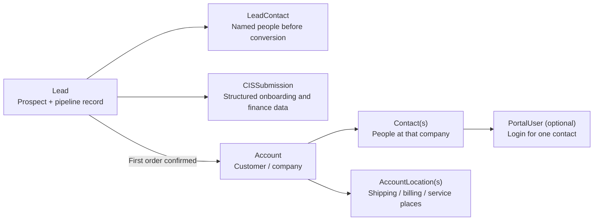

# Lead, Account, Contact, And Portal User CRM Flow

## Purpose

This note explains the simplest correct CRM model for Dynamic AQS so business and engineering use the same language.

## Simple model

## What each thing means

- `Lead`: the prospect and its pipeline lifecycle
- `LeadContact`: pre-conversion people known before the company becomes a customer
- `CISSubmission`: structured company and contact data gathered during onboarding while still a lead
- `Account`: the customer/company after first order is confirmed
- `Contact`: a person at that account
- `PortalUser`: a system login for one specific contact

## Cardinality

- one lead can have multiple lead contacts
- one lead converts to at most one account
- one account can have multiple contacts
- one contact may optionally have one portal user
- one account can have multiple locations

## Business rule

Do not create the customer account early.

The lead remains a lead through:

- discovery
- CIS
- finance approval
- onboarding

Only when first order is confirmed does the system create the account/customer and map the relevant people into account contacts.

## Typical contact roles after conversion

- `Primary`
- `Owner/GM`
- `Ordering`
- `Billing`
- `Accounting/AP`
- `Technical`

## Why this matters

This model prevents three common mistakes:

1. treating the company and the person as the same record
2. creating customer accounts before the business says they are customers
3. flattening all people into one account record instead of proper contacts
