# Project System Component Tree And Cost Baseline

## Document Control
| Field | Value |
|-------|-------|
| Document Type | Source of Truth Planning Baseline |
| Version | 1.0 |
| Status | Active Draft |
| Owner | Program / Architecture / BA |
| Baseline Date | 2026-03-31 |
| Primary Inputs | `registers/PROJECT_BREAKDOWN_DETAILED.csv`, active PRDs, architecture docs, discovery validation |

---

## 1. Purpose

This document gives the project a single tree-style system view that connects:

1. major modules
2. sub-modules / build domains
3. representative build tasks from the live WBS
4. the non-build cost lines that must be budgeted alongside staffing

It is intentionally more readable than the full WBS. The authoritative task register remains:

- `registers/PROJECT_BREAKDOWN_DETAILED.csv`

---

## 2. System Component Diagram

```mermaid
flowchart TD
    A["Dynamic AQS Pulse Platform"] --> B["Foundation and Shared Services"]
    A --> C["Revenue Workflow"]
    A --> D["Commerce and Content"]
    A --> E["Field Operations"]
    A --> F["Insights and Governance"]
    A --> G["Delivery Controls"]
    A --> H["External Systems and Transitional Dependencies"]

    B --> B1["Program Foundation and Solution Architecture"]
    B --> B2["Security Identity Environments and DevOps"]
    B --> B3["Master Data Admin Settings and Configuration"]
    B --> B4["Acumatica Integration and Data Migration"]

    C --> C1["Lead Capture and Lead Management"]
    C --> C2["CIS Credit and Onboarding Workflow"]
    C --> C3["Customer Account Contact and Multi Location"]
    C --> C4["Communication Notifications and Alerts"]

    D --> D1["Dealer Portal Replacement"]
    D --> D2["Pricing and Commercial Rules"]
    D --> D3["Product Management and Dealer Catalog Governance"]
    D --> D4["Digital Assets and Document Handling"]

    E --> E1["Territory Management and Field Routing"]
    E --> E2["Mobile Field App"]
    E --> E3["Training Management"]
    E --> E4["Consignment Management"]

    F --> F1["Reports and Analytics"]
    F --> F2["Executive Dashboard"]
    F --> F3["Commercial CRM Enablement"]

    G --> G1["QA UAT Rollout and Adoption"]

    H --> H1["Acumatica ERP"]
    H --> H2["Microsoft Entra Outlook Graph WebEx Teams"]
    H --> H3["Object Storage CDN SMTP Push Monitoring"]
    H --> H4["Widen Dropbox Shopify Bold and legacy data sources"]
```



---

## 3. Project Tree

### 3.1 Foundation And Shared Services

```text
Dynamic AQS Pulse Platform
├─ Program Foundation and Solution Architecture
│  ├─ Program Governance
│  │  ├─ Establish charter and success metrics
│  │  └─ Define governance cadence and decision rights
│  ├─ Solution Architecture
│  │  ├─ Set CRM, dealer portal, mobile, and Acumatica source-of-truth rules
│  │  ├─ Model canonical lead, account, contact, training, consignment, and reporting entities
│  │  └─ Lock customer-creation trigger and lifecycle boundary
│  └─ Experience Principles
│     ├─ Define web, mobile, and dealer UX standards
│     └─ Define KPI taxonomy, navigation, and naming conventions
├─ Security, Identity, Environments and DevOps
│  ├─ Environments and Delivery
│  │  ├─ Provision dev, test, UAT, and production environments
│  │  └─ Build CI/CD pipeline with environment promotion
│  ├─ Identity and Access
│  │  ├─ Implement internal SSO and dealer identity patterns
│  │  ├─ Configure permission matrix for internal teams and dealer contacts
│  │  └─ Build own, team, subordinate, and all-record scope filters
│  ├─ Security and Compliance
│  │  ├─ Segregate PCI data, tokenization, and redaction controls
│  │  └─ Implement field-level masking for finance-sensitive fields
│  └─ Release Controls
│     ├─ Enable feature flags and cohort targeting
│     └─ Define kill-switch and rollback matrix by module
├─ Master Data, Admin Settings and Configuration
│  ├─ Admin Experience
│  │  ├─ Build CRUD workflows with validation and audit history
│  │  └─ Expose routing, SLA, and stage governance as admin-managed controls
│  ├─ Reference Data Administration
│  │  ├─ Load affinity groups and ownership groups
│  │  ├─ Manage lead sources, brand labels, and dealer branding
│  │  └─ Manage price tiers and customer classes
│  └─ Governance Data Management
│     ├─ Build approval, versioning, and effective-dating workflow
│     └─ Define ownership and stewardship rules for master entities
└─ Acumatica Integration and Data Migration
   ├─ Integration Blueprint
   │  ├─ Specify APIs, events, schedules, and ownership
   │  ├─ Produce signed field-mapping workbooks
   │  └─ Certify sandbox access, auth, endpoint coverage, and queue readiness
   ├─ Integration Resilience
   │  ├─ Define API versioning and compatibility policy
   │  ├─ Implement idempotency and duplicate-event protection
   │  └─ Build replay and poison-message quarantine controls
   └─ Migration Governance
      ├─ Define acceptance thresholds and reconciliation tolerances
      └─ Stage migration waves for customer, product, pricing, consignment, and reporting data
```

### 3.2 Revenue Workflow

```text
Revenue Workflow
├─ Lead Capture and Lead Management
│  ├─ Lead Capture Replacement
│  │  ├─ Publish embeddable branded lead forms
│  │  ├─ Auto-tag source, brand, and campaign metadata
│  │  └─ Provide admin-configurable form builder
│  ├─ Lead Intake Operations
│  │  ├─ Support manual entry, CSV and Excel import
│  │  ├─ Build lead deduplication engine
│  │  └─ Capture private-label attribution and roster imports
│  ├─ Lead Routing
│  │  ├─ Implement service-tech-count routing
│  │  └─ Implement state-based routing and reassignment workflow
│  └─ Lead Operations
│     ├─ Configure the seven confirmed lead stages
│     ├─ Build lead workspace views and discovery flow
│     └─ Enforce 48-hour SLA timers and escalations
├─ CIS, Credit and Onboarding Workflow
│  ├─ CIS Design and Capture
│  │  ├─ Define CIS digital field specification
│  │  ├─ Build CIS e-sign workflow
│  │  └─ Track CIS version history
│  ├─ Credit Workflow
│  │  ├─ Route Net30 and ACH requests to finance
│  │  └─ Separate credit-card collection from CIS data
│  ├─ Onboarding Controls
│  │  ├─ Build finance approval queue
│  │  ├─ Build onboarding checklist and readiness gates
│  │  └─ Add pre-discovery qualification checklist
│  └─ Onboarding Data Flow
│     └─ Auto-populate customer, contact, and billing fields from CIS
├─ Customer, Account, Contact and Multi-Location Management
│  ├─ Customer 360
│  │  ├─ Build Acumatica-aligned customer workspace
│  │  └─ Capture affinity, ownership, brand, class, and lifecycle context
│  ├─ Contact Management
│  │  ├─ Enforce three-contact role model
│  │  └─ Represent customer relationships correctly
│  ├─ Multi-Location Management
│  │  └─ Build parent-child location hierarchy and shared rollups
│  └─ Customer Activation
│     ├─ Propagate Acumatica customer ID and sync status
│     ├─ Build BD-to-TM ownership handoff notification
│     └─ Build credit-card tokenization workflow
└─ Communication, Notifications and Alerts
   ├─ Alert Engine
   │  ├─ Define rule-driven alerts, channels, and acknowledgment states
   │  └─ Add credit-hold delivery to dealer portal users
   ├─ Lead Alerts
   │  └─ Trigger new lead, assignment, and SLA breach notifications
   ├─ Credit and Collections Alerts
   │  └─ Notify on credit approvals, holds, aging, and past-due status
   └─ Communication Hub
      └─ Build unified inbox, timeline linking, and email context
```

### 3.3 Commerce And Content

```text
Commerce and Content
├─ Dealer Portal Replacement for Shopify
│  ├─ Dealer Identity
│  │  ├─ Authenticate dealer users at customer-account level
│  │  └─ Build multi-user company access model
│  ├─ Dealer Catalog
│  │  ├─ Load full catalog with real SKU and variant structure
│  │  └─ Provide search, filters, favorites, compare, and quick order
│  ├─ Dealer Ordering
│  │  ├─ Build cart, re-order, PO capture, and checkout controls
│  │  ├─ Manage multiple shipping addresses and freight options
│  │  ├─ Build server-side cart persistence
│  │  └─ Build six-check checkout validation engine
│  └─ Dealer Pricing
│     └─ Resolve price class, customer class, and discount tier at login and checkout
├─ Pricing and ERP-Dependent Commercial Rules
│  ├─ Pricing Governance
│  │  ├─ Export Bold Commerce pricing for migration mapping
│  │  ├─ Manage price books, tiers, and account pricing rules
│  │  └─ Preserve override audit and effective-dated history
│  ├─ Checkout Resolution
│  │  └─ Handle stale-price and conflicting-price-class exceptions
│  └─ Currency and Tax
│     └─ Support US and Canada currency and tax-exempt handling
├─ Product Management and Dealer Catalog Governance
│  ├─ Dealer Group Model
│  │  └─ Resolve dealer groups from account setup
│  ├─ Product Enrichment
│  │  └─ Turn base ERP items into dealer-facing catalog content
│  ├─ File Governance
│  │  └─ Link images, brochures, spec sheets, and install guides
│  └─ Product Sync
│     └─ Implement sync conflict resolution algorithm
└─ Digital Assets and Document Handling
   ├─ Asset Repository
   │  └─ Build central asset library with metadata, lifecycle, and usage visibility
   ├─ Asset Serving
   │  └─ Provide stable asset links and dealer-group-aware file serving
   ├─ Asset Workflow
   │  └─ Build upload, version, and approval workflow for product and dealer files
   ├─ Asset Sharing
   │  └─ Share assets directly from CRM, portal, and mobile
   └─ Document Workflows
      └─ Store CIS, consignment, onboarding, and account documents in structured repositories
```

### 3.4 Field Operations

```text
Field Operations
├─ Territory Management and Field Routing
│  ├─ Territory Foundation
│  │  └─ Seed ownership matrix for routing and security scopes
│  ├─ Territory Model
│  │  ├─ Build interactive map with states, ownership, and overlays
│  │  ├─ Support Strategic Growth overlays
│  │  └─ Auto-assign regional director and TM workload support
│  ├─ Access Views
│  │  └─ Show TM, RD, VP, and executive scopes with inherited rollups
│  └─ Routing Integration
│     └─ Feed territory logic into lead routing and customer ownership
├─ Mobile Field App
│  ├─ Mobile Foundation
│  │  ├─ Build mobile shell, secure login, and profile management
│  │  └─ Build mobile error-handling framework
│  ├─ Field Dashboard
│  │  └─ Show visits, routes, overdue work, and alerts
│  ├─ Customer Access
│  │  └─ Provide search, account detail, contacts, and recent activity
│  ├─ Route Execution
│  │  └─ Support route planning, optimization, and navigation handoff
│  ├─ Visit Capture
│  │  └─ Provide GPS check-in/out with visit notes
│  └─ Field Tools
│     ├─ Capture voice notes, photos, and follow-up actions
│     └─ Support offline sync, push, signature, and consignment workflows
├─ Training Management
│  ├─ Training Catalog
│  │  └─ Load configurable training categories and delivery types
│  ├─ Training Scheduling
│  │  ├─ Schedule training against customers and calendars
│  │  └─ Synchronize events with Outlook
│  ├─ Completion Tracking
│  │  └─ Track attendance, completion, materials, and follow-up tasks
│  └─ Training Proof
│     ├─ Generate proof letters and history exports
│     └─ Surface yearly hours delivered and customer summaries
└─ Consignment Management
   ├─ Consignment Enrollment
   │  └─ Flag consignment accounts and capture digital agreements
   ├─ Site Setup
   │  ├─ Load active, new, and exited sites with warehouse identifiers
   │  └─ Enforce warehouse naming convention and onboarding checklist
   ├─ Initial Verification
   │  └─ Digitize initial inventory verification form
   ├─ Audit Cycle
   │  ├─ Build TM consignment dashboard
   │  ├─ Schedule audits and track 60-day and 90-day status
   │  └─ Build five-day PO clock timer
   └─ Reconciliation and Follow-Up
      └─ Track discrepancies, PO follow-up, attestation, and exit handling
```

### 3.5 Insights, Governance And Delivery

```text
Insights, Governance and Delivery
├─ Reports and Analytics
│  ├─ Reporting Foundation
│  │  ├─ Build activity categorization taxonomy
│  │  ├─ Build CRM plus ERP semantic layer
│  │  └─ Publish metric definition register
│  ├─ Report Builder
│  │  ├─ Build dynamic report builder and saved views
│  │  └─ Build arbitrary-parameter report UI
│  ├─ Reporting Workspace
│  │  └─ Build role-based reporting home and dashboard routing
│  └─ Priority Reports
│     └─ Deliver site visit, warranty, support, training, and pipeline report families
├─ Executive Dashboard
│  ├─ Executive KPI Framework
│  │  └─ Compose the executive dashboard from governed report components
│  ├─ Funnel Health
│  │  └─ Surface lead funnel status, aging, and conversion signals
│  ├─ Revenue Monitoring
│  │  └─ Show month, prior month, and prior year revenue movement
│  ├─ Training Proof
│  │  └─ Expose training hours and proof summary
│  └─ Consignment Pulse
│     └─ Show active sites, audit status, value at risk, and overdue actions
├─ QA, UAT, Rollout and Adoption
│  ├─ Integration Quality
│  │  └─ Automate contract tests for Acumatica, Outlook, payment, route-provider, and mobile APIs
│  ├─ Release Controls
│  │  ├─ Define kill-switch and rollback matrix by module
│  │  └─ Run gated pilot and rollout cohorts
│  └─ Stabilization
│     └─ Execute UAT, bug-fix, deployment, and hypercare buffers
└─ Commercial CRM Enablement
   ├─ Commercial Boundaries
   │  └─ Define shared foundation and separation points for residential and commercial workflows
   ├─ Commercial Opportunity Management
   │  └─ Build opportunity, project, and stage management
   └─ Commercial Territory and Relationships
      └─ Build county-based coverage, rep-firm hierarchy, and influencer tracking
```

---

## 4. Cost Baseline Structure

## 4.1 Cost Categories To Budget

The project needs four different budget buckets, not one:

| Bucket | What It Covers | Why It Matters |
|-------|----------------|----------------|
| Internal delivery staffing | BA, PM, design, engineering, QA, DevOps | Build cost and sprint burn |
| New platform operating cost | app runtime, database, object storage, CDN, email, monitoring, secrets, backup | Ongoing production cost after launch |
| Retained enterprise system cost | Acumatica, Microsoft 365 / Outlook / Entra, WebEx or Teams, existing Widen where retained | Existing systems that remain in the target operating model |
| Transitional / coexistence cost | Widen coexistence, Dropbox intake, Shopify / Bold export mapping, migration tooling, pilot support | Discovery confirmed that not everything disappears on day one |

---

## 4.2 Internal Staffing Rate Card

Source:

- `workbooks/Dynamic_AQS_WBS_Costing.xlsx`

| Role | Hourly Rate | Monthly Hours | Monthly Cost at 1.0 FTE |
|------|-------------|---------------|--------------------------|
| Team Lead | 35 | 160 | 5,600 |
| DevOps | 30 | 160 | 4,800 |
| Backend Engineer | 30 | 160 | 4,800 |
| Fullstack Engineer | 25 | 160 | 4,000 |
| Frontend Engineer | 25 | 160 | 4,000 |
| Mobile Engineer | 25 | 160 | 4,000 |
| Data / Integration Engineer | 30 | 160 | 4,800 |
| QA Engineer | 22 | 160 | 3,520 |
| Business Analyst | 22 | 160 | 3,520 |
| UI / UX Developer | 22 | 160 | 3,520 |

Reference full-team monthly cost at 1.0 FTE in all ten roles:

- `42,560 / month`

Notes:

- This is a rate-card baseline, not the actual monthly burn for every sprint.
- The actual sprint burn should still be taken from the sprint-based staffing allocations in the costing workbook.

---

## 4.3 Platform And Third-Party Cost Lines

These are the non-staff cost lines that should sit beside staffing in the budget.

| Cost Line | Service Pattern | Discovery / Design Basis | Cost Type | Budget Treatment |
|-----------|-----------------|--------------------------|-----------|------------------|
| Production application runtime | AWS App Runner or ECS / Fargate style web, API, and worker services | architecture recommendation favors managed runtime plus workers | Recurring monthly | New platform opex |
| Non-production environments | smaller dev, test, and UAT runtime stack | discovery and release plan require full environment ladder before pilot | Recurring monthly | New platform opex |
| Managed PostgreSQL | production database plus non-prod instances | PostgreSQL is the operational data store and pg-boss queue backbone | Recurring monthly | New platform opex |
| Object storage | S3-style object storage for assets, generated files, and document repository | digital assets, document workflows, exports, and audit attachments | Recurring monthly and usage | New platform opex |
| CDN and secure asset delivery | CloudFront-style CDN and signed asset delivery | dealer downloads, product assets, and stable file serving | Recurring monthly and usage | New platform opex |
| Archive and backup retention | S3 Glacier or equivalent cold archive | audit-log retention and historical archive requirements | Recurring monthly | New platform opex |
| SMTP / outbound email | SES, SendGrid, or SMTP relay | welcome emails, password reset, CIS links, alerting, report delivery | Usage based | New platform opex |
| Monitoring and error tracking | Sentry plus cloud logging / metrics | production readiness and frontend audit explicitly call for Sentry and operational monitoring | Recurring monthly | New platform opex |
| Secrets management | AWS Secrets Manager or Azure Key Vault equivalent | discovery-backed security supplement requires managed secrets and rotation | Recurring monthly | New platform opex |
| Push notifications | FCM and APNs via CRM notification service | mobile app PRD depends on push for field workflow entry | Usually low direct platform cost, plus setup effort | New platform opex |
| Map / routing provider | Google Maps, Waze handoff, or route-provider service | territory and mobile routing need provider decision | Usage based, vendor dependent | Decision-dependent budget line |
| Payment processor | Moneris, eBiz, Authorize.net, Stripe, Nuvei, or region-based split | CIS card capture and portal payment boundary still depend on final processor decision | Transaction based | Decision-dependent budget line |
| Microsoft 365 / Outlook / Graph | existing tenant, app registration, OAuth approval | training scheduling, calendar sync, and email context | Usually retained enterprise cost | Retained enterprise cost |
| Microsoft Entra ID | internal SSO and role mapping | foundation security PRD makes Entra the primary internal identity provider | Usually retained enterprise cost | Retained enterprise cost |
| Acumatica ERP | existing ERP and sandbox access | remains financial, inventory, warehouse, and pricing execution source of truth | Retained enterprise cost | Retained enterprise cost |
| Widen coexistence | retained for broader DAM use cases if not retired immediately | discovery says do not assume full day-one Widen replacement | Retained until boundary closes | Transitional cost |
| Dropbox intake and curated import | selective migration only | discovery supports replacing file hunts but not bulk blind migration | One-time migration effort | Transitional cost |
| WebEx / Teams / meeting platform | onboarding and training delivery sessions | training PRD explicitly references WebEx and Outlook-linked scheduling | Retained enterprise cost | Retained enterprise cost |

---

## 4.4 Budget Start Points By Release

| Cost Line | Earliest Release To Budget | Why |
|-----------|----------------------------|-----|
| Dev, test, UAT environments | Release 0 | Build readiness requires non-prod infrastructure before feature work scales |
| Production runtime and database | Release 0 | Production environment must exist before pilot hardening and deployment rehearsal |
| Secrets, monitoring, backup | Release 0 | Security and observability are foundational controls |
| SMTP / email | Release 1 | Needed for onboarding, reset flows, and core alerts |
| Outlook / Graph integration overhead | Release 1 | Needed as lead scheduling and training coordination begin |
| S3 / document repository | Release 1 | Needed for CIS packages, onboarding files, and governed document storage |
| CloudFront / secure asset delivery | Release 2 | Starts mattering once portal and asset-serving flows go live to pilot users |
| Push notifications | Release 2 | Mobile pilot depends on push-triggered field entry |
| Map / routing provider | Release 2 | Mobile route execution and field routing depend on it |
| Widen coexistence | Release 2 and beyond | Needed until asset workflows are fully cut over |
| Payment processor | Release 2 or 3 depending on decision | Required when checkout and card/payment workflows move beyond internal alpha |

---

## 4.5 Discovery-Confirmed External Dependencies

These dependencies were clearly reinforced in discovery and should not be forgotten in budget or design reviews:

| Dependency | Why It Exists In Scope | Status |
|------------|------------------------|--------|
| Acumatica | Financial, pricing execution, inventory, warehouse, and posted transaction truth | Confirmed retained system |
| Microsoft Entra ID | Internal SSO and role mapping | Confirmed retained system |
| Outlook / Graph / Microsoft 365 | Calendar and email context sync | Confirmed retained system |
| WebEx or Teams | Training delivery and scheduling flow | Confirmed retained system |
| Widen | Transitional DAM boundary for branded asset behaviors not yet fully replaced | Confirmed transitional dependency |
| Dropbox | Transitional source for curated document and asset intake | Confirmed transitional dependency |
| Map / route provider | Mobile routing and navigation handoff | Confirmed need, vendor still open |
| Push platform | Mobile notifications and field alerts | Confirmed need |
| SMTP / email provider | Identity, alerting, onboarding, and report delivery | Confirmed need |
| Monitoring stack | Production readiness, error triage, and SLA operations | Confirmed need |
| Payment processor | Card / ACH / regional payment handling and checkout boundary | Confirmed need, vendor still open |

---

## 4.6 Important Cost Notes

1. Discovery gave strong confirmation of the cost categories, but not final vendor selections for every line.
2. The biggest still-open vendor decisions are:
   - final runtime stack shape inside AWS or Azure
   - SMTP provider
   - route / maps provider
   - payment processor model for US and Canada
   - Widen coexistence duration
3. This means the cost section is budget-ready at category level, but not yet procurement-quote-ready.
4. If the team wants a final non-staff operating budget, the next step should be a vendor-choice matrix plus sizing assumptions for:
   - monthly active dealer users
   - asset storage volume and CDN egress
   - email volume
   - mobile push volume
   - database size and retention
   - production and non-prod compute topology

---

## 5. Practical Use

Use this document for:

- stakeholder explanation of what the system actually includes
- architecture alignment across modules
- mapping module ownership to delivery teams
- checking whether a new request belongs inside current scope
- building the non-staff budget next to the staffing model

Use the WBS when exact task sequencing or sprint assignment is needed.
