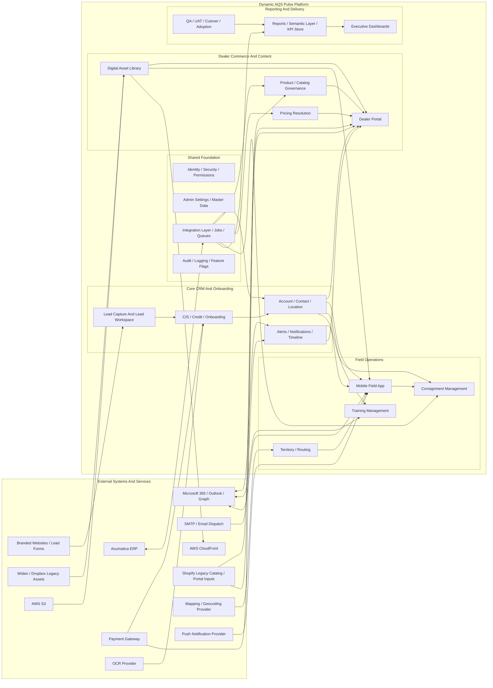
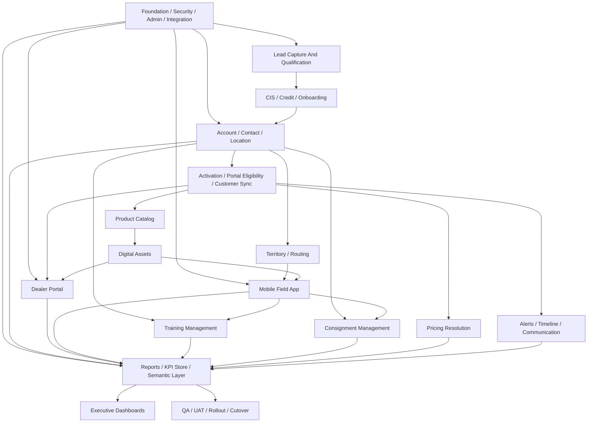

# System Component Diagram And Integration View

## Document Control
| Field | Value |
|-------|-------|
| Document Type | Source of Truth Architecture View |
| Version | 1.0 |
| Status | Active Draft |
| Owner | Architecture / BA / Program |
| Baseline Date | 2026-04-01 |
| Primary Inputs | `registers/PROJECT_BREAKDOWN_DETAILED.csv`, `workbooks/Dynamic_AQS_WBS_Costing.xlsx`, active PRDs, integration register |

---

## 1. Purpose

This document gives the team a clean system-component view of Pulse that is easier to use during design and development than the full WBS.

It focuses on:

1. internal product components
2. how those components interact with each other
3. external systems and services
4. the main source-of-truth boundaries, especially around Acumatica

For the full module tree and cost framing, use:

- `source_of_truth/PROJECT_SYSTEM_COMPONENT_TREE_AND_COST_BASELINE.md`

For the detailed build plan, use:

- `registers/PROJECT_BREAKDOWN_DETAILED.csv`

---

## 2. System Context Diagram

---

## 3. Internal Component Interaction Diagram

---

## 4. External Integration Responsibilities

| External System / Service | Main Purpose In Pulse | Direction | Main Owning Components |
|---|---|---|---|
| Acumatica ERP | Customer, pricing, product, order, invoice, shipment, payment, warehouse, consignment movement truth | Bi-directional with governed boundaries | Integration Layer, Account, Product, Pricing, Consignment, Reports |
| Microsoft 365 / Outlook / Graph | Calendar sync, email context, event visibility, workflow-linked communication | Bi-directional | Alerts, Training, Mobile |
| SMTP / Email Dispatch | Alert delivery, confirmations, reminders, scheduled reports | Outbound | Alerts, Reports |
| Payment Gateway | Tokenized payment-method capture and regional payment routing | Bi-directional token flow | CIS, Account Activation, Dealer Portal |
| Widen / Dropbox | Legacy digital-asset migration and coexistence inputs | Inbound / transitional | Digital Assets |
| AWS S3 | Private object storage for approved assets | Internal platform dependency | Digital Assets |
| AWS CloudFront | Signed asset delivery and cache control | Outbound delivery | Digital Assets, Dealer Portal, Mobile |
| Shopify | Legacy catalog, portal, and migration reference inputs | Inbound / transitional | Dealer Portal, Product |
| Mapping / Geocoding Provider | Routing, map overlays, distance and visit planning | Bi-directional lookup | Territory, Mobile |
| OCR Provider | Extract structured data from forms and uploaded documents when required | Inbound processing | CIS, Documents |
| Push Notification Provider | Mobile push delivery | Outbound | Mobile, Alerts |

---

## 5. Source-Of-Truth Boundaries

- `Pulse` owns workflow, user experience, visibility, alerts, role-based access, and cross-module operational context.
- `Acumatica` remains the source of truth for financial, inventory, warehouse, invoicing, shipment, payment settlement, and formal product/pricing master data.
- `Pulse reporting` should ingest all relevant sales and operational facts, then segment residential versus future commercial views without changing ERP truth.
- `Digital assets` move toward Pulse-managed delivery, but Widen and Dropbox remain migration inputs until the replacement is fully complete.
- `Payment processing` should stay tokenized and hosted; raw card data must not become a CRM responsibility.

---

## 6. Development Guidance

- Build the platform in dependency order: foundation, integration, lead/onboarding, account model, dealer commerce, field operations, then reporting and launch controls.
- Keep internal modules loosely coupled through governed APIs, jobs, and queues rather than hidden direct dependencies.
- Treat Acumatica-facing integrations as first-class components with replay, audit, idempotency, and reconciliation controls.
- Treat dealer portal, mobile, and reporting as downstream consumers of the same shared customer, product, pricing, alert, and activity foundations.
